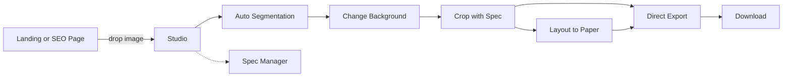
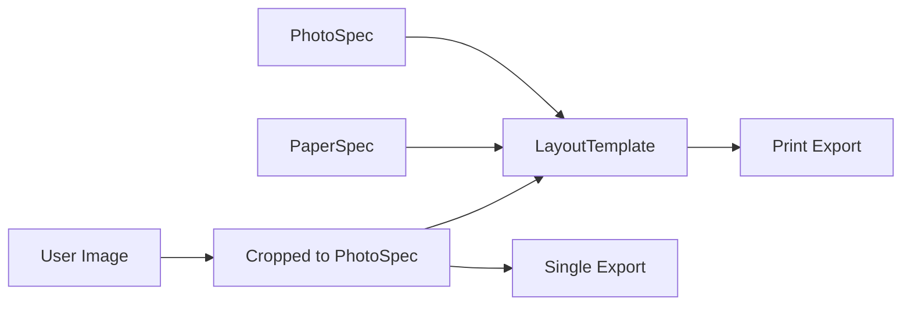

# 产品需求文档 — Pixfit · 像配（证件照工作台）

> 本文档定义产品的 What 与 Why。技术实现细节见 [TECH_DESIGN.md](./TECH_DESIGN.md)；项目进度与未决问题见 [PLAN.md](./PLAN.md)。

---

## 1. 文档信息

| 项       | 内容              |
| -------- | ----------------- |
| 文档版本 | 0.1 (Draft)       |
| 创建日期 | 2026-05-11        |
| 状态     | 草案 / 待评审     |
| 维护者   | TBD               |
| 产品名   | **Pixfit · 像配** |
| 域名     | `pix-fit.com`     |

### 变更记录

| 日期       | 版本 | 变更摘要 |
| ---------- | ---- | -------- |
| 2026-05-11 | 0.1  | 初稿     |

---

## 2. 产品概述

### 2.1 一句话定位

> **浏览器内、一站式、隐私优先的在线证件照工作台。** 一张照片，覆盖换底色、裁剪、排版、压缩、导出全流程。

### 2.2 核心价值主张

1. **连贯的工作流**：用户脑子里没有"换底色工具"和"排版工具"，只有"我要打一张能用的证件照"。我们把所有步骤连成一个统一画布。
2. **隐私优先**：所有图像处理在浏览器内完成，照片不离开用户设备。
3. **覆盖主流场景**：从国内一寸/二寸、身份证，到美国签证、申根、日韩等主流签证；从证件照到打印排版到压缩到 KB。
4. **美观易用 + 完全免费 + 无水印 + 无登录**。

### 2.3 目标用户

| 用户群                             | 比例预估 | 核心需求                         |
| ---------------------------------- | -------- | -------------------------------- |
| 出境签证申请者                     | 35%      | 各国官方尺寸、白底/蓝底、KB 限制 |
| 国内考试/报名                      | 30%      | 一寸/二寸、严格的 KB 与像素范围  |
| 日常证件办理（驾照、护照、社保等） | 20%      | 一寸/二寸、护照尺寸、洗印排版    |
| 设计师/学生（透明背景需求）        | 10%      | 抠图 + 透明 PNG 导出             |
| 其他                               | 5%       | —                                |

### 2.4 典型痛点（来自竞品调研与社区反馈）

- **工具割裂**：换底色用 A 站、排版用 B 站、压缩用 C 站，反复上传同一张照片。
- **国际化弱**：国内工具不熟悉海外签证标准，海外工具不知道国内一寸/二寸。
- **难看 + 套路**：国内同类工具多数 UI 老旧、强加水印、引导付费。
- **隐私焦虑**：用户照片上传到不知名服务器，担心二次使用。
- **细节难控**：报名照常要求"30KB 以内、413×579 像素"，手动调极费时。

### 2.5 竞品速览

| 竞品                    | 优点               | 不足                           |
| ----------------------- | ------------------ | ------------------------------ |
| remove.bg               | 抠图质量高、品牌强 | 单一功能、付费、不懂证件照尺寸 |
| 证件照 365 / 智能证件照 | 国内尺寸全         | UI 老旧、收费严格、有水印      |
| PhotoAID                | 国际化、签证场景全 | 国内尺寸少、不支持中文         |
| Adobe Express           | 设计感强           | 学习成本高、非专用工具         |

**差异化定位**：把"国内严谨的尺寸 + 国际广覆盖 + 现代美观 UI + 完全免费 + 隐私优先" 这五点同时做到的产品，目前空缺。

---

## 3. 产品目标与成功指标

### 3.1 业务目标（上线后 6 个月）

| 指标               | 目标值  |
| ------------------ | ------- |
| 月活用户（MAU）    | 10,000+ |
| 单次会话停留时长   | ≥ 90s   |
| 上传 → 导出 转化率 | ≥ 30%   |
| 自然搜索流量占比   | ≥ 50%   |

### 3.2 用户体验目标

- **首次使用**：3 分钟内完成"上传 → 选尺寸 → 换底色 → 导出"全流程
- **二次使用**：1 分钟内完成同样流程（模型已缓存、配置已记住）
- **失败率**：抠图失败率 < 1%

### 3.3 质量与性能目标

| 指标                         | 目标                                  |
| ---------------------------- | ------------------------------------- |
| 抠图冷启动（含模型首次下载） | < 2.5s（4G 网络，中端笔记本）         |
| 单张抠图推理                 | < 800ms（WebGPU） / < 2s（WASM 回退） |
| 首屏 LCP                     | < 2.0s                                |
| Lighthouse Performance       | ≥ 90                                  |
| Lighthouse Accessibility     | ≥ 95                                  |
| 首屏 JS bundle               | ≤ 200KB（gzipped）                    |

---

## 4. 用户故事

### 4.1 张同学 · 美国签证申请

> 我是出国留学的张同学，**我想**用一张手机自拍快速得到符合美国 DS-160 要求的证件照（51×51mm、白底、≤ 240KB），**以便**直接在 CEAC 网站提交。

### 4.2 李女士 · 申根签证申请

> 我是即将去欧洲旅游的李女士，**我想**得到符合申根标准的 35×45mm 白底照片，**以便**贴在签证申请表上。

### 4.3 王同学 · 国内考研报名

> 我是准备考研的王同学，**我想**生成一张 150×210 像素、≤ 30KB 的报名照，**以便**通过研招网严格的格式校验。

### 4.4 陈先生 · 需要洗印多张

> 我是需要办港澳通行证的陈先生，**我想**把照片排版到一张 6 寸相纸上（一次洗印 16 张一寸），**以便**节省冲印成本，多份备用。

### 4.5 林设计师 · 透明背景

> 我是平面设计师，**我想**得到一张人像的透明背景 PNG，**以便**放进我正在做的海报设计稿。

### 4.6 周女士 · 手机用户

> 我是用 iPhone 的周女士，**我想**直接在手机上拍照、抠图、生成证件照、保存到相册，**以便**不用打开电脑就完成整个流程。

### 4.7 吴先生 · 多人多场景

> 我是经常出国的吴先生，**我想**保存我常用的几套自定义规格（例如某不常见国家的签证尺寸），**以便**下次直接调用而不必重新查资料。

---

## 5. 功能需求（V1 全部 P0）

> 所有功能在首个公开版本（V1）中都为 P0。复杂度高的项排在后置里程碑中实现，但仍属于 V1 范围。

### 5.1 上传与导入

**功能描述**：用户提供原始照片作为后续处理的输入。

**输入方式**：

- 拖拽到上传区域（桌面端）
- 点击选择文件（桌面 / 移动）
- 复制粘贴（桌面端 Ctrl/Cmd + V）
- 调用摄像头拍照（移动端 / 支持的浏览器）
- 从示例图库选择（用于演示与测试）

**支持格式**：JPG / JPEG / PNG / WebP / HEIC / HEIF

**约束与处理**：

- 单文件大小 ≤ 20 MB（超出提示）
- 像素长边 > 4000px：客户端预压缩到 4000px（保持比例）
- 读取 EXIF orientation，自动旋转修正
- HEIC：用 `heic2any` 动态导入（按需加载，不拖累首屏）
- 拒绝非图像 MIME，做内容嗅探防伪装

**反馈**：

- 上传中显示进度环
- 解析失败提示具体原因（格式不支持 / 文件损坏 / 过大）

### 5.2 抠图引擎

**功能描述**：从上传图片中分离前景人像与背景。

**技术选型**：

- 主模型：**MODNet**（人像专用；M9 起默认 FP16 ~13 MB，INT8 ~6.6 MB 作为带宽 fallback，通过 `NEXT_PUBLIC_SEG_MODEL=modnet-int8` 切换）
- 运行时：**ONNX Runtime Web**（WebGPU 优先，WASM 回退）
- 后续：可选"高清精修"模式（BiRefNet portrait V1.1，license 友好但体积 >100 MB，仅作为按需精修）

**关键行为**：

- 进入 Studio 即静默预热（下载 + 初始化模型），不阻塞 UI
- 模型缓存到 Cache API + IndexedDB，二次访问 0 等待
- 推理在 Web Worker 中执行，主线程零阻塞
- 提供进度提示：`下载中 12.4 / 6.2 MB → 初始化 → 推理中`
- 失败重试最多 2 次；执行环境降级：WebGPU 失败 → WASM
- 失败兜底（V1.1）：提供"上传到服务端处理"按钮（Cloudflare Workers AI）

**输出**：单通道 mask（0–255 灰度）+ 原图，组合得到透明背景图。

### 5.3 换底色

**功能描述**：把抠图后的人像合成到不同背景上。

**色板**：

- 标准白（`#FFFFFF`）
- 标准蓝（`#438EDB`，签证常用）
- 标准红（`#D9342B`，国内常用）
- 浅灰（`#F5F5F5`）
- 透明（导出为带 alpha 通道的 PNG）

**自定义颜色**：

- 颜色选择器（HSV / RGB / HEX）
- 最近使用的 8 个颜色快捷
- 渐变背景（V1.1，单色优先）

**预览**：左右对比拖动滑块（before / after）。

**性能**：实时切换底色 < 50ms（OffscreenCanvas + `globalCompositeOperation`）。

### 5.4 照片规格库 + 智能裁剪

**功能描述**：用户选择一种照片规格（如"美国签证"），裁剪框自动按该规格的比例和构图规则呈现。

#### 5.4.1 数据模型

照片规格用 `PhotoSpec` 类型表示，详细 schema 见 §9.1。

#### 5.4.2 内置规格分组

参考竞品 + 实际使用场景，按以下分组组织：

- **中国证件 (cn-id)**：标准 1 寸、小 1 寸、大 1 寸、标准 2 寸、大 2 寸、二代身份证、中国护照
- **中国相纸常用 (cn-paper)**：小皮夹照、大皮夹照
- **通行证 (travel-permit)**：港澳通行证、台湾通行证
- **海外签证 (visa)**：美国、申根、英国、加拿大、澳大利亚、新西兰、日本、韩国、新加坡、马来西亚、越南（贴纸/落地）、泰国（贴纸/落地）、俄罗斯
- **考试报名 (exam)**：公务员、计算机等级、研究生考试
- **自定义 (custom)**：用户创建的规格

完整内置清单见 §9.1.3。

#### 5.4.3 智能裁剪行为

- **裁剪框约束**：选定规格后，裁剪框宽高比固定为规格的 `width_mm / height_mm`
- **自动居中**：调用人脸/关键点检测（MediaPipe Tasks Vision），按规格的 `composition` 规则把头部置于合理位置
- **手动微调**：拖动 / 缩放 / 旋转（90° 步进）
- **参考线**：实时显示头顶线、下颌线、眼线、肩线（如规格定义了对应规则）
- **合规警告**：若用户手动调整后偏离规格范围 > ±5%，提示警告（但不强制阻止导出）

#### 5.4.4 输出

导出时按规格的 `width_px × height_px` 精确重采样（高质量 Lanczos / Pica）。

### 5.5 相纸规格库

**功能描述**：用户选择打印用的相纸尺寸，作为排版的画布。

#### 5.5.1 数据模型

相纸规格用 `PaperSpec` 类型表示，详细 schema 见 §9.2。

#### 5.5.2 内置规格

参考国内常用洗印规格（截图来源），首版内置 7 种：

| 名称  | 别名 | 物理尺寸   | 像素 (300 DPI) |
| ----- | ---- | ---------- | -------------- |
| 5 寸  | 3R   | 127×89 mm  | 1500×1050      |
| 6 寸  | 4R   | 152×102 mm | 1800×1200      |
| 7 寸  | 5R   | 178×127 mm | 2100×1500      |
| 8 寸  | 6R   | 203×152 mm | 2400×1800      |
| 10 寸 | 8R   | 254×203 mm | 3000×2400      |
| A4    | —    | 210×297 mm | 2480×3508      |
| A5    | —    | 148×210 mm | 1748×2480      |

### 5.6 排版模板

**功能描述**：把多张同规格或不同规格的照片，按预设方案排列到一张相纸上。

#### 5.6.1 数据模型

排版模板用 `LayoutTemplate` 类型表示，详细 schema 见 §9.3。本质：`Paper × { PhotoSpec × Count }[] × Arrangement`。

#### 5.6.2 首版内置模板（≥ 12 个）

| 模板名               | 相纸 | 内容                              |
| -------------------- | ---- | --------------------------------- |
| 8 张 1 寸            | 5R   | 8 × 标准 1 寸                     |
| 9 张身份证照         | 5R   | 9 × 二代身份证                    |
| 4 张护照照片         | 5R   | 4 × 中国护照                      |
| 4 张大 2 寸          | 5R   | 4 × 大 2 寸                       |
| 16 张 1 寸           | 6R   | 16 × 标准 1 寸                    |
| 8 张 2 寸            | 6R   | 8 × 标准 2 寸                     |
| 1 寸 + 2 寸混排（A） | 5R   | 4 × 1 寸 + 2 × 2 寸               |
| 1 寸 + 2 寸混排（B） | 6R   | 8 × 1 寸 + 2 × 2 寸               |
| 1 寸 + 2 寸混排（C） | 6R   | 6 × 1 寸 + 4 × 2 寸               |
| 2 张小皮夹照         | 5R   | 2 × 小皮夹照                      |
| 2 张大皮夹照         | 6R   | 2 × 大皮夹照                      |
| A4 最大化（兜底）    | A4   | 自动按选中的 PhotoSpec 最大化排布 |

#### 5.6.3 排版设置项

- **冲印 DPI**：默认 300，可选 300 / 350 / 600
- **相纸底色**：白色 / 浅灰 / 自定义（影响打印后边缘观感）
- **照片间分隔**：灰线（默认开，便于剪裁）
- **裁切线**：可选开关，显示在四角的裁切标记
- **四周留白**：mm 单位，默认 2mm
- **照片间距**：mm 单位，默认 2mm

#### 5.6.4 自定义排版

- 入口：排版面板"+ 添加自定义排版"
- 用户操作：选 PhotoSpec → 选数量 → 选相纸 → 自动布局 → 可拖拽手动微调
- 保存：作为用户自定义 `LayoutTemplate` 持久化到 localStorage

#### 5.6.5 导出

- 单张图像：JPG（默认）/ PNG（保留底色）
- 矢量 PDF：包含裁切线（适合送到冲印店）
- 文件命名：`layout_{templateName}_{paperName}_{date}.{ext}`

### 5.7 规格管理

**功能描述**：用户可统一管理三类规格（照片 / 相纸 / 排版模板）。

#### 5.7.1 入口

Studio 顶部 → 规格 → 弹窗"规格管理"。三个 tab：照片规格、相纸规格、排版模板。

#### 5.7.2 行为

| 操作 | 内置规格                    | 用户规格 |
| ---- | --------------------------- | -------- |
| 查看 | ✓                           | ✓        |
| 编辑 | ✗（锁定，提供"另存为副本"） | ✓        |
| 删除 | ✗                           | ✓        |
| 复制 | ✓（创建用户副本）           | ✓        |

#### 5.7.3 持久化

- 存储：`localStorage['id-photo-tool:specs:v1']`
- 数据：仅存"用户自定义"项；内置项始终从代码读
- schema 版本号字段 `version` 用于未来迁移
- **导出 JSON**：备份当前所有自定义规格（不含图片）
- **导入 JSON**：从备份恢复，schema 校验（zod），id 冲突自动重命名

#### 5.7.4 反向校验

删除 PhotoSpec / PaperSpec 前，检查所有 LayoutTemplate 的依赖：

- 若有依赖，弹出确认对话框列出受影响项
- 用户确认后：删除 spec + 把相关 LayoutTemplate 标记为"失效"（不删除，但禁用）

### 5.8 导出

**功能描述**：将处理结果保存为文件。

#### 5.8.1 单张导出

| 格式          | 用途             | 默认设置     |
| ------------- | ---------------- | ------------ |
| PNG（透明）   | 设计稿、嵌入文档 | 无损         |
| PNG（带底色） | 高质量打印       | 无损         |
| JPG           | 通用、文件小     | quality 0.92 |
| WebP（可选）  | 进阶用户         | quality 0.85 |

#### 5.8.2 压缩到指定 KB

- 用户输入目标大小（KB）
- 系统自动二分调整 JPG quality + 像素重采样，逼近目标
- 命中区间 `target × [0.95, 1.05]` 即返回
- 最多迭代 8 轮，失败给出最接近的结果 + 提示

详细算法见 [TECH_DESIGN.md §6.5](./TECH_DESIGN.md)。

#### 5.8.3 排版相纸导出

- JPG / PNG / PDF（含矢量裁切线）
- DPI 由 LayoutTemplate 设置项决定

#### 5.8.4 文件命名规范

- 单张：`{photoSpecId}_{widthPx}x{heightPx}_{YYYYMMDD}.{ext}`
- 压缩版：`{photoSpecId}_{widthPx}x{heightPx}_{targetKB}KB_{YYYYMMDD}.{ext}`
- 排版：`layout_{templateId}_{paperId}_{YYYYMMDD}.{ext}`

### 5.9 历史会话

- **撤销 / 重做**：会话内（关闭页面前）有效，最多 50 步
- **页面关闭即清空**：原图与中间结果不持久化
- **规格持久化**：仅"用户自定义的规格 / 模板"存进 localStorage

### 5.10 国际化

#### 5.10.1 首版语言

- 简体中文（zh）— 默认
- 繁体中文（zh-Hant）
- 英文（en）

#### 5.10.2 行为

- 首次访问根据 `Accept-Language` 自动选择
- 用户切换后存 cookie，下次按 cookie
- URL 前缀：`/zh`、`/zh-Hant`、`/en`
- 中文简繁**人工写两份**（不用 OpenCC 等自动转换库，词汇本地化）

#### 5.10.3 文案管理

- 按 namespace 拆分：`common`、`studio`、`specs`、`tools`、`size-pages`
- 每个 spec 的 `name` / `description` 字段在数据层就是 i18n 多语言 object

### 5.11 SEO 着陆页

#### 5.11.1 工具着陆页（`/tools/*`）

每个工具一个独立 URL，针对长尾搜索词。共用 Studio 内核组件，仅差异化标题、H1、首屏引导文案、默认开启的 tab。

| URL                        | 关键词中文          | 关键词英文               |
| -------------------------- | ------------------- | ------------------------ |
| `/tools/remove-background` | 证件照换底色 / 抠图 | photo background remover |
| `/tools/change-background` | 证件照换底色        | change photo background  |
| `/tools/transparent`       | 透明背景 PNG        | transparent background   |
| `/tools/crop`              | 证件照裁剪          | photo crop               |
| `/tools/resize`            | 证件照调整尺寸      | photo resize             |
| `/tools/compress`          | 证件照压缩 KB       | photo compress           |
| `/tools/print-layout`      | 证件照排版打印      | photo print layout       |
| `/tools/make`              | 证件照制作          | id photo maker           |

#### 5.11.2 尺寸专题页（`/size/[slug]`）

每个内置 PhotoSpec 一个 URL，针对"美国签证照片尺寸"类长尾词。

页面内容：

- 该规格的物理尺寸 + 像素 + DPI + 背景色要求
- 官方文档链接
- 拍摄注意事项
- "立即制作" 按钮 → 跳转 Studio 并预选该规格

#### 5.11.3 SEO 技术

- 静态生成（`generateStaticParams`）
- 动态 metadata（`generateMetadata`）
- JSON-LD 结构化数据（`SoftwareApplication` / `FAQPage`）
- 每个 locale 独立 URL，互相 `hreflang` 关联

### 5.12 可访问性（A11y）

- 所有交互元素键盘可达（Tab / Enter / Space）
- 关键控件配 ARIA 标签
- 色板符合 WCAG AA 对比度
- 屏幕阅读器友好（screen reader 朗读关键状态变化）
- 焦点可见（focus ring 明显）
- 表单错误用 `aria-invalid` + `aria-describedby`

---

## 6. 非功能需求

### 6.1 隐私

- **明示**：首页 + 上传区 + 隐私政策页明确声明"图片不离开浏览器"
- **资源本地化**：所有第三方资源（模型、字体、CDN）走自己的 CDN，避免依赖国外不稳定服务
- **零追踪**：不收集 PII、不使用 cookie 追踪
- **隐私政策页**：清晰说明数据流向

### 6.2 性能

详见 §3.3。

### 6.3 兼容性

| 浏览器           | 支持版本                |
| ---------------- | ----------------------- |
| Chrome / Edge    | 最近 2 个稳定版（112+） |
| Safari (Desktop) | 16.4+                   |
| Safari (iOS)     | 16.4+                   |
| Firefox          | 115+                    |
| IE               | ✗ 不支持                |

特性降级：

- WebGPU 不支持 → 自动 WASM
- OffscreenCanvas 不支持 → 主线程 Canvas（性能下降但可用）
- HEIC 不支持的旧浏览器 → 提示用户在 macOS 系统/相册中先转 JPG

### 6.4 离线

- 模型缓存后**可离线使用**核心功能（无 PWA 时也可，缓存的代码 + 模型即可）
- V1.1 提供 PWA manifest + service worker，正式支持离线安装

### 6.5 合规

- GDPR / CCPA 友好（无追踪、无 PII）
- 使用条款（ToS）声明：用户须对上传内容合法性负责，不得上传他人照片

---

## 7. 信息架构与路由

### 7.1 用户旅程图



### 7.2 路由地图

```text
/                              首页
/studio                        主工作台
/tools/remove-background       工具着陆页
/tools/change-background
/tools/transparent
/tools/crop
/tools/resize
/tools/compress
/tools/print-layout
/tools/make
/size/[slug]                   尺寸专题（按 PhotoSpec 生成）
/about                         关于
/privacy                       隐私政策
/terms                         使用条款

// i18n 前缀
/zh/...
/zh-Hant/...
/en/...
```

### 7.3 Studio 工作台布局

```text
┌────────────────────────────────────────────────────────────────────┐
│ Logo   背景  尺寸  排版  导出           [中/En]  规格 ▾   下载    │ ← 顶栏
├──────┬──────────────────────────────────────────┬──────────────────┤
│      │                                          │                  │
│ 缩略 │            画 布 (Canvas)                 │  右侧属性面板     │
│ 图/  │     [实时预览，所有改动即时反映]            │  跟随顶栏 tab     │
│ 历史 │                                          │                  │
│      │                                          │                  │
├──────┴──────────────────────────────────────────┴──────────────────┤
│   ↶ 撤销  ↷ 重做     缩放 [100%]              重置  重新上传        │
└────────────────────────────────────────────────────────────────────┘
```

---

## 8. 视觉与交互设计原则

### 8.1 配色（翡翠绿主调 · Emerald）

| 角色          | Token            | 颜色                        |
| ------------- | ---------------- | --------------------------- |
| 主行动色      | `--primary`      | `#10B981`（emerald-500）    |
| 主行动色 - 深 | `--primary-dk`   | `#059669`（emerald-600）    |
| 主行动色 - 浅 | `--primary-soft` | `#D1FAE5`（emerald-100）    |
| 强调色        | `--accent`       | `#F59E0B`（amber-500）      |
| 页面背景      | `--bg`           | `#FAFAF9`（stone-50，暖白） |
| 卡片表面      | `--surface`      | `#FFFFFF`                   |
| 主文本        | `--text`         | `#1C1917`（stone-900）      |
| 次要文本      | `--text-mute`    | `#57534E`（stone-600）      |
| 边框          | `--border`       | `#E7E5E4`（stone-200）      |
| 成功          | `--success`      | `#10B981`（与主色同源）     |
| 警告          | `--warning`      | `#F59E0B`                   |
| 错误          | `--danger`       | `#EF4444`                   |

> 整体走"翡翠绿 + 暖灰白 + 琥珀点缀"路线，传达**清新、专业、可信赖**的气质，与"匹配规格"这一精确感的核心功能形成温度上的平衡。

### 8.2 字体

| 用途 | 字体                       |
| ---- | -------------------------- |
| 英文 | Inter (variable)           |
| 中文 | PingFang SC / Noto Sans SC |
| 代码 | JetBrains Mono             |

字重：标题 600–700，正文 400–500。

### 8.3 间距与圆角

- 间距系统：4 / 8 / 12 / 16 / 24 / 32 / 48 / 64
- 圆角：卡片 / 按钮 12px，输入框 8px，画布容器 16px
- 阴影：柔和双层（`shadow-sm` + `ring-1 ring-black/5`）

### 8.4 动效

- 所有过渡 200–300ms，缓动 `cubic-bezier(0.4, 0, 0.2, 1)`
- Hover / focus / active 状态都要有反馈
- 加载用进度环（不用旋转 spinner）

### 8.5 反例（禁止事项）

- ✗ 多色渐变 banner
- ✗ 中文使用宋体或楷体当装饰
- ✗ 五颜六色的按钮拼图
- ✗ 卡通插画 / emoji 满天飞
- ✗ 居中布满的"营销话术 + 大箭头"

### 8.6 组件库

- shadcn/ui（核心 UI 组件）
- Lucide React（图标，统一线性风格）
- 国旗：emoji（轻量 + 国际化友好）

---

## 9. 数据与配置 schema

### 9.0 数据模型概览



三层数据模型：

- **PhotoSpec**：成品照片规格（尺寸 + 像素 + DPI + 背景要求 + 文件要求 + 构图规则）
- **PaperSpec**：打印用相纸规格（尺寸 + 像素 + DPI）
- **LayoutTemplate**：排版模板（PaperSpec + 多个 PhotoSpec×Count + 排布策略 + 视觉设置）

### 9.1 PhotoSpec（照片规格）

#### 9.1.1 TypeScript 类型

```ts
type PhotoSpec = {
  id: string // 'cn-1inch' | 'us-visa' | ...
  builtin: boolean // 内置不可删
  category:
    | 'cn-id' // 中国证件
    | 'cn-paper' // 中国相纸常用
    | 'visa' // 海外签证
    | 'travel-permit' // 通行证
    | 'exam' // 考试报名
    | 'custom' // 用户自定义
  region?: string // 'CN' | 'US' | 'EU' | 'JP' | ...
  name: { zh: string; 'zh-Hant': string; en: string }
  description?: { zh: string; 'zh-Hant': string; en: string }

  // 物理与像素
  width_mm: number
  height_mm: number
  dpi: number // 300 / 350 / 600
  width_px?: number // 派生
  height_px?: number // 派生

  // 背景色推荐
  background?: { recommended: string; allowed?: string[] }

  // 文件输出规则（报名照常用）
  fileRules?: {
    maxKB?: number
    minKB?: number
    formats?: Array<'jpg' | 'png'>
    pixelRange?: { wMin: number; wMax: number; hMin: number; hMax: number }
  }

  // 头部构图规则
  composition?: {
    headHeightRatio?: [number, number]
    eyeLineFromTop?: [number, number]
  }

  reference?: string // 官方来源链接
}
```

#### 9.1.2 字段说明

- `id`：稳定标识符，建议 `region-purpose` 格式（如 `cn-1inch`、`us-visa`）
- `width_px / height_px`：可省略，由 `width_mm * dpi / 25.4` 自动派生
- `composition` 字段在裁剪页面用于画参考线和合规检查
- `fileRules.pixelRange` 用于压缩导出时判断是否需要重采样

#### 9.1.3 首版内置 PhotoSpec 清单

**中国证件 (cn-id)：**

| id               | 名称       | 物理尺寸 | 像素    | DPI |
| ---------------- | ---------- | -------- | ------- | --- |
| `cn-1inch`       | 标准 1 寸  | 25×35 mm | 295×413 | 300 |
| `cn-1inch-small` | 小 1 寸    | 22×32 mm | 260×378 | 300 |
| `cn-1inch-large` | 大 1 寸    | 33×48 mm | 390×567 | 300 |
| `cn-2inch`       | 标准 2 寸  | 35×49 mm | 413×579 | 300 |
| `cn-2inch-large` | 大 2 寸    | 35×53 mm | 413×626 | 300 |
| `cn-id-card`     | 二代身份证 | 26×32 mm | 358×441 | 350 |
| `cn-passport`    | 中国护照   | 33×48 mm | 390×567 | 300 |

**中国相纸常用 (cn-paper)：**

| id                | 名称     | 物理尺寸  | 像素     | DPI |
| ----------------- | -------- | --------- | -------- | --- |
| `cn-wallet-small` | 小皮夹照 | 63×89 mm  | 748×1050 | 300 |
| `cn-wallet-large` | 大皮夹照 | 76×102 mm | 898×1200 | 300 |

**通行证 (travel-permit)：**

| id                | 名称       | 物理尺寸 | DPI |
| ----------------- | ---------- | -------- | --- |
| `permit-hk-macao` | 港澳通行证 | 33×48 mm | 300 |
| `permit-taiwan`   | 台湾通行证 | 33×48 mm | 300 |

**海外签证 (visa)：**

| id                | 名称             | 物理尺寸 | 像素    | DPI | 背景 |
| ----------------- | ---------------- | -------- | ------- | --- | ---- |
| `us-visa`         | 美国签证         | 51×51 mm | 600×600 | 300 | 白   |
| `schengen`        | 欧洲申根签证     | 35×45 mm | 413×531 | 300 | 白   |
| `uk-visa`         | 英国签证         | 35×45 mm | 413×531 | 300 | 浅灰 |
| `ca-visa`         | 加拿大签证       | 35×45 mm | 413×531 | 300 | 白   |
| `au-visa`         | 澳大利亚签证     | 35×45 mm | 413×531 | 300 | 白   |
| `nz-visa`         | 新西兰签证       | 35×45 mm | 413×531 | 300 | 白   |
| `jp-visa`         | 日本签证         | 45×45 mm | 531×531 | 300 | 白   |
| `kr-visa`         | 韩国签证         | 35×45 mm | 413×531 | 300 | 白   |
| `sg-visa`         | 新加坡签证       | 35×45 mm | 413×531 | 300 | 白   |
| `my-visa`         | 马来西亚签证     | 35×50 mm | 413×590 | 300 | 白   |
| `vn-visa-sticker` | 越南签证（贴纸） | 40×60 mm | 472×708 | 300 | 白   |
| `vn-visa-arrival` | 越南落地签证     | 40×60 mm | 472×708 | 300 | 白   |
| `th-visa-sticker` | 泰国签证（贴纸） | 35×45 mm | 413×531 | 300 | 白   |
| `th-visa-arrival` | 泰国落地签证     | 40×60 mm | 472×708 | 300 | 白   |
| `ru-visa`         | 俄罗斯签证       | 35×45 mm | 413×531 | 300 | 白   |

**考试报名 (exam)：**

| id                 | 名称                 | 像素    | KB 范围  |
| ------------------ | -------------------- | ------- | -------- |
| `exam-cn-civil`    | 国家公务员考试报名照 | 295×413 | 21–30 KB |
| `exam-cn-ncre`     | 计算机等级考试       | 144×192 | ≤ 20 KB  |
| `exam-cn-postgrad` | 研究生考试报名照     | 150×210 | ≤ 30 KB  |

合计：**≈ 28 条**。后续根据用户反馈扩展。

### 9.2 PaperSpec（相纸规格）

#### 9.2.1 TypeScript 类型

```ts
type PaperSpec = {
  id: string // '5R' | '6R' | 'A4' | ...
  builtin: boolean
  name: { zh: string; 'zh-Hant': string; en: string }
  alias?: string // '5寸/3R'
  width_mm: number
  height_mm: number
  dpi: number // 默认 300
  width_px?: number
  height_px?: number
}
```

#### 9.2.2 首版内置 PaperSpec

见 §5.5.2 表格。

### 9.3 LayoutTemplate（排版模板）

#### 9.3.1 TypeScript 类型

```ts
type LayoutTemplate = {
  id: string // '8x1inch-on-5R'
  builtin: boolean
  paperId: PaperSpec['id']
  name: { zh: string; 'zh-Hant': string; en: string }
  items: Array<{
    photoSpecId: PhotoSpec['id']
    count: number
  }>
  arrangement: { kind: 'auto-grid' } | { kind: 'manual'; cells: Cell[] }
  settings?: {
    backgroundColor?: string
    showSeparator?: boolean
    separatorColor?: string
    margin_mm?: number
    gap_mm?: number
    showCutGuides?: boolean
  }
}

type Cell = {
  photoSpecId: PhotoSpec['id']
  x_mm: number
  y_mm: number
  rotation?: 0 | 90 | 180 | 270
}
```

#### 9.3.2 首版内置 LayoutTemplate

见 §5.6.2 表格。

### 9.4 用户自定义的持久化

#### 9.4.1 存储位置与格式

- 位置：`localStorage`
- Key：`id-photo-tool:specs:v1`
- 数据形态：

```ts
{
  version: 1,
  photoSpecs: PhotoSpec[],         // 仅 builtin: false
  paperSpecs: PaperSpec[],         // 仅 builtin: false
  layoutTemplates: LayoutTemplate[] // 仅 builtin: false
}
```

#### 9.4.2 启动合并策略

```text
on app start:
  builtin = import('@/data/photo-specs').BUILTIN_PHOTO_SPECS
  user    = JSON.parse(localStorage.getItem(KEY)) ?? {}
  merged  = [...builtin, ...user.photoSpecs]
  // id 冲突时用户优先（允许用户覆盖内置默认值）
```

#### 9.4.3 导入 / 导出

- 导出：下载 `id-photo-tool-specs-{date}.json`
- 导入：弹文件选择 → zod 校验 → 显示 diff → 用户确认 → 写入

#### 9.4.4 版本迁移

`version` 字段用于未来 schema 变更：

```ts
function migrate(raw: unknown): SpecsV1 {
  const data = raw as { version: number }
  if (data.version === 1) return data as SpecsV1
  if (data.version === 0) return migrateV0toV1(data)
  throw new Error(`Unsupported specs version: ${data.version}`)
}
```

---

## 10. 度量与统计

### 10.1 统计平台

- **主**：Cloudflare Web Analytics（无 cookie、自动 PV）
- **辅**：Umami（自托管，捕获自定义事件）

### 10.2 自定义事件清单

| 事件名                  | 触发时机         | 属性                                                                   |
| ----------------------- | ---------------- | ---------------------------------------------------------------------- |
| `upload`                | 用户成功上传图片 | `{ source: 'drop' \| 'click' \| 'paste' \| 'camera', format, sizeKB }` |
| `bg_change`             | 切换底色         | `{ color, isCustom }`                                                  |
| `photo_spec_select`     | 选择照片规格     | `{ id, category }`                                                     |
| `paper_spec_select`     | 选择相纸规格     | `{ id }`                                                               |
| `layout_select`         | 选择排版模板     | `{ id }`                                                               |
| `spec_custom_create`    | 创建自定义规格   | `{ kind: 'photo' \| 'paper' \| 'layout' }`                             |
| `export`                | 导出文件         | `{ format, kind: 'single' \| 'layout' \| 'compressed', sizeKB }`       |
| `compress`              | 触发压缩到 KB    | `{ targetKB, resultKB, success }`                                      |
| `language_switch`       | 切换语言         | `{ from, to }`                                                         |
| `segmentation_complete` | 抠图完成         | `{ duration_ms, backend: 'webgpu' \| 'wasm' }`                         |
| `segmentation_failed`   | 抠图失败         | `{ reason, backend }`                                                  |

### 10.3 隐私保护

- 不收集图片内容、不收集用户 IP（CF Analytics 已脱敏）
- 不收集设备指纹
- 所有事件 payload 不含 PII

---

## 11. 里程碑与版本规划

> 每个里程碑的细节交付物在 [PLAN.md](./PLAN.md) 中跟踪。

| 里程碑 | 主题                | 主要交付                                                                  |
| ------ | ------------------- | ------------------------------------------------------------------------- |
| M1     | 项目骨架            | Next.js 15 + Tailwind v4 + shadcn + next-intl + 首页静态版 + 设计系统组件 |
| M2     | 抠图核心            | MODNet + ORT Web + Worker + 预热缓存；上传 → 抠图 → 透明背景              |
| M3     | 换底色              | 色板 + 自定义色 + 透明 + 对比预览；导出透明 PNG / 实底 JPG                |
| M4     | 照片规格 + 智能裁剪 | 三层数据模型代码化；内置 PhotoSpec；BlazeFace 居中；参考线                |
| M5     | 导出 + 压缩         | 单张多格式；压缩到 KB 算法；文件命名规范                                  |
| M6     | 相纸 + 排版         | PaperSpec + LayoutTemplate；内置 12 个模板；混排；JPG/PNG/PDF 导出        |
| M7     | 规格管理            | 用户增删改 + localStorage + JSON 导入导出 + 反向校验                      |
| M8     | SEO + 移动端 + 打磨 | `/tools/*` 与 `/size/*` 着陆页；移动端布局；动画；Lighthouse 调优；上线   |

预计开发周期：8–12 周（单人 / 兼职节奏）。

---

## 12. 风险与边界

| 风险                           | 影响         | 缓解策略                                           |
| ------------------------------ | ------------ | -------------------------------------------------- |
| MODNet 商用 license 限制       | 法律风险     | 上线前核实；备选 U²-Netp（Apache）或 RMBG-2.0      |
| 国内访问 huggingface CDN 不稳  | 抠图失败     | 模型完全自托管到 Cloudflare R2                     |
| iOS Safari WebGPU 支持参差     | 性能下降     | 自动降级 WASM；提供"低性能模式"提示                |
| 用户上传他人照片               | 法律风险     | ToS 明示责任；不存储不传输                         |
| 规格官方数据可能过时           | 用户损失     | 每个规格标注最后核对日期；用户可自定义兜底         |
| localStorage 容量限制 / 跨设备 | 用户数据丢失 | 显式提示；提供导出 JSON 备份                       |
| HEIC 解码性能差                | 长等待       | 大文件提示用户先转 JPG                             |
| 中国大陆域名/CDN 备案          | 上线阻碍     | 优先 Cloudflare Pages 全球分发；必要时申请国内备案 |

---

## 13. 未来扩展（V2+）

| 阶段 | 主题       | 描述                                                                |
| ---- | ---------- | ------------------------------------------------------------------- |
| V1.1 | 高清精修   | 懒加载 RMBG-1.4 / BiRefNet，提供"高清模式"按钮，cross-fade 升级结果 |
| V1.2 | PWA 离线   | manifest + service worker，支持装到桌面/主屏                        |
| V1.3 | 服务端兜底 | Cloudflare Workers AI `@cf/bria/rmbg-1.4`，作为客户端失败的兜底选项 |
| V2.0 | AI 增强    | 谨慎引入：肤色微调、衣领修补、过曝补偿（须不违反签证规则）          |
| V2.0 | 批量处理   | 上传文件夹 / 多张同时抠图与排版                                     |
| V2.0 | 浏览器扩展 | 截屏直接抠图                                                        |
| V3.0 | 账户体系   | 可选登录、跨设备同步规格、保存历史作品                              |

---

## 14. 附录

### 14.1 术语表

| 术语   | 含义                                            |
| ------ | ----------------------------------------------- |
| 抠图   | 把人像从背景中分离的过程，输出 mask             |
| Mask   | 单通道（0–255）灰度图，标识每像素属于前景的概率 |
| DPI    | Dots Per Inch，每英寸像素数；冲印分辨率指标     |
| WebGPU | 浏览器的下一代图形/计算 API，比 WebGL 快 5–10×  |
| ONNX   | 跨框架的开放神经网络模型格式                    |
| 排版   | 把多张照片组合到一张相纸上                      |
| 皮夹照 | 钱包大小的人像照（中国常见洗印规格）            |

### 14.2 关键参考资料

- 美国签证照片要求：<https://travel.state.gov/content/travel/en/passports/how-apply/photos.html>
- 申根签证照片要求：欧盟 1182/2010 法规
- 中国二代身份证标准：GA 461-2004
- MODNet 论文：<https://arxiv.org/abs/2011.11961>
- RMBG-1.4：<https://huggingface.co/briaai/RMBG-1.4>
- ONNX Runtime Web：<https://onnxruntime.ai/docs/get-started/with-javascript/web.html>

### 14.3 命名相关待决项

- 产品最终名（中文 + 英文 + 域名）
- Logo 与品牌主色
- 微信/X (Twitter) 账号

详见 [PLAN.md](./PLAN.md) "未决问题清单"。

---

> 文档结束。下一份请见 [TECH_DESIGN.md](./TECH_DESIGN.md)。
