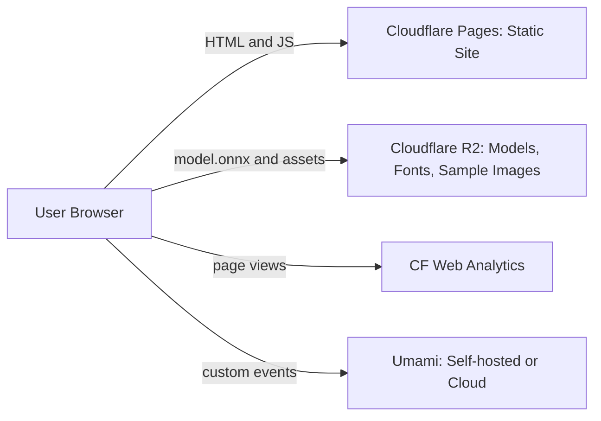
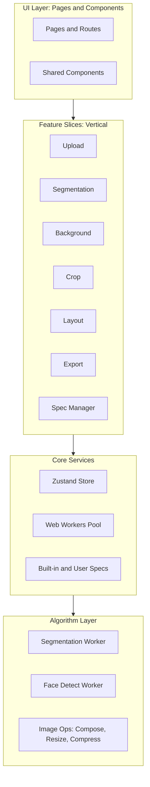
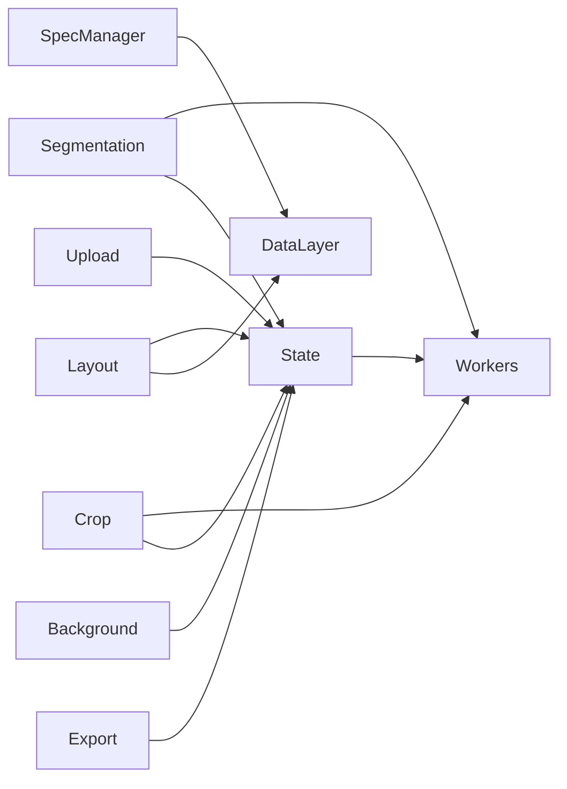
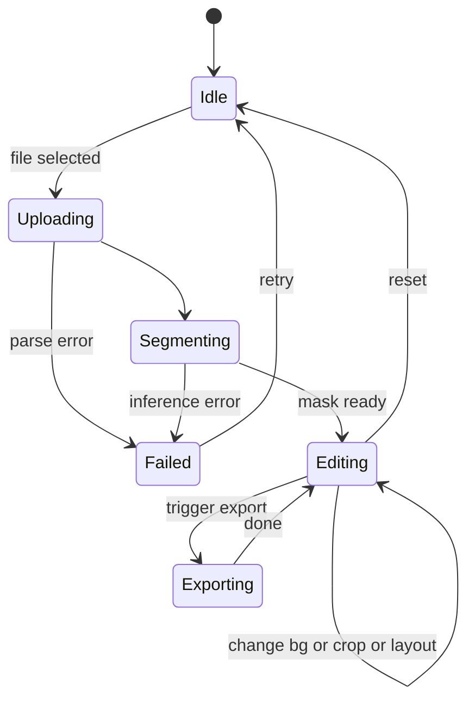
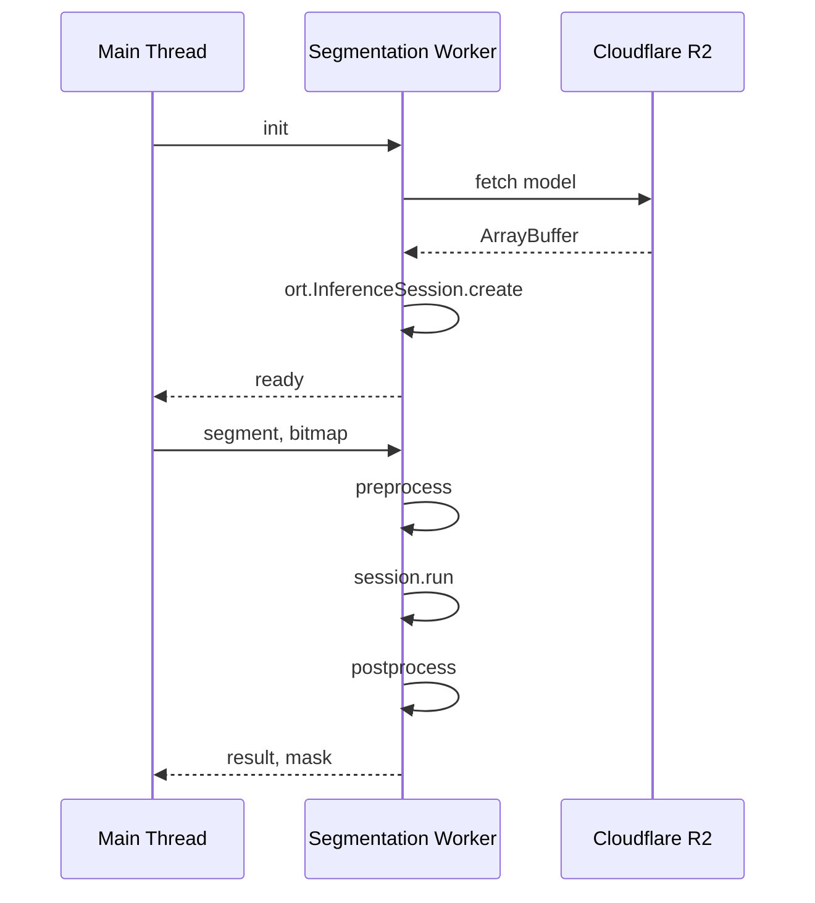

# 技术架构与详细设计 — Pixfit · 像配

> 本文档定义产品的 How。需求与产品定义见 [PRD.md](./PRD.md)；项目进度见 [PLAN.md](./PLAN.md)。

---

## 1. 文档信息

| 项            | 内容          |
| ------------- | ------------- |
| 版本          | 0.1 (Draft)   |
| 创建日期      | 2026-05-11    |
| 状态          | 草案 / 待评审 |
| 维护者        | TBD           |
| 关联 PRD 版本 | 0.1           |

### 变更记录

| 日期       | 版本 | 变更摘要 |
| ---------- | ---- | -------- |
| 2026-05-11 | 0.1  | 初稿     |

### 与 PRD 的关系

PRD 定义"做什么 / 为什么"，本文定义"怎么做"。任何 PRD 的需求都应在本文找到对应的实现方案；本文出现的新技术决策若改变了 PRD 的承诺，应同步回写 PRD。

---

## 2. 技术总览

### 2.1 核心技术决策表

| 维度       | 选型                         | 决策理由                                                |
| ---------- | ---------------------------- | ------------------------------------------------------- |
| 框架       | Next.js 15 (App Router)      | RSC + 静态导出 + SEO + 现代 DX                          |
| 语言       | TypeScript (strict)          | 类型安全、IDE 支持、AI 协作友好                         |
| 样式       | Tailwind CSS v4              | 速度、约束、一致性                                      |
| UI         | shadcn/ui + Lucide React     | 可定制、不锁定、统一风格                                |
| i18n       | next-intl                    | App Router 原生支持，最现代                             |
| 抠图运行时 | onnxruntime-web              | WebGPU + WASM 双后端                                    |
| 抠图模型   | MODNet (ONNX, FP16 默认)     | 人像专用；FP16 ~13 MB（INT8 ~6.6 MB 作为带宽 fallback） |
| 人脸检测   | MediaPipe Tasks Vision       | 轻量、官方维护                                          |
| 图像处理   | Canvas API + Pica            | 浏览器原生 + 锐利缩放                                   |
| PDF 生成   | jsPDF                        | 浏览器内 PDF，支持矢量裁切线                            |
| 状态管理   | Zustand + zundo              | 极简、TS 友好、原生 undo/redo                           |
| 持久化     | localStorage + JSON 导入导出 | 隐私 + 无后端                                           |
| 部署       | Cloudflare Pages             | 全球 CDN + 免费 + 国内可用                              |
| 模型 CDN   | Cloudflare R2                | 流量便宜、国内访问稳                                    |
| 统计       | CF Web Analytics + Umami     | 无 cookie + 自定义事件                                  |
| 包管理     | pnpm                         | 快、节省磁盘                                            |
| 测试       | Vitest + Playwright          | 单元 + E2E + 视觉回归                                   |

### 2.2 关键约束

- **完全在浏览器内处理**：图片不离开用户设备
- **首屏 JS ≤ 200KB (gzipped)**：抠图模型按需懒加载
- **国内访问可用**：CDN、域名、第三方资源都不依赖被墙服务
- **零服务器成本**（V1）：纯静态托管 + 客户端推理

### 2.3 部署架构图



---

## 3. 系统架构

### 3.1 分层架构



### 3.2 关键边界

- **UI 层**：渲染与交互。无业务逻辑，无算法。
- **Feature 层**：按业务功能垂直切片。每个 feature 包含自己的 hooks / components / utils，自包含。
- **Core 层**：跨 feature 共享的状态、Worker 池、数据层。
- **Algorithm 层**：纯函数或 Worker，无 UI 依赖，可独立测试。

### 3.3 模块依赖图（简化）



---

## 4. 目录结构

完整 `src/` 文件树（含简要说明）：

```text
src/
├── app/                                # Next.js App Router
│   ├── [locale]/                       # i18n 路由前缀
│   │   ├── page.tsx                    # 首页
│   │   ├── studio/
│   │   │   └── page.tsx                # 主工作台
│   │   ├── tools/
│   │   │   ├── remove-background/page.tsx
│   │   │   ├── change-background/page.tsx
│   │   │   ├── transparent/page.tsx
│   │   │   ├── crop/page.tsx
│   │   │   ├── resize/page.tsx
│   │   │   ├── compress/page.tsx
│   │   │   ├── print-layout/page.tsx
│   │   │   └── make/page.tsx
│   │   ├── size/
│   │   │   └── [slug]/page.tsx         # 尺寸专题（SSG）
│   │   ├── about/page.tsx
│   │   ├── privacy/page.tsx
│   │   ├── terms/page.tsx
│   │   └── layout.tsx
│   ├── api/                            # 极少量 API
│   │   └── analytics/route.ts          # 事件转发（可选）
│   ├── globals.css
│   └── layout.tsx                      # 根 layout
│
├── components/                         # 跨 feature 共享 UI
│   ├── ui/                             # shadcn/ui 生成
│   │   ├── button.tsx
│   │   ├── dialog.tsx
│   │   ├── tabs.tsx
│   │   └── ...
│   ├── header.tsx
│   ├── footer.tsx
│   ├── language-switcher.tsx
│   ├── upload-dropzone.tsx
│   └── progress-ring.tsx
│
├── features/                           # 按功能切片
│   ├── upload/
│   │   ├── use-upload.ts
│   │   ├── parse-image.ts              # EXIF + HEIC + 预压缩
│   │   └── index.ts
│   ├── segmentation/
│   │   ├── use-segmentation.ts         # React hook
│   │   ├── segmentation.worker.ts      # Worker entry
│   │   ├── model-loader.ts             # 缓存 + R2 拉取
│   │   ├── preprocess.ts               # 预处理（resize + normalize）
│   │   ├── postprocess.ts              # 后处理（mask 还原）
│   │   └── index.ts
│   ├── background/
│   │   ├── compose.ts                  # mask + bg → output
│   │   ├── color-palette.tsx
│   │   └── index.ts
│   ├── crop/
│   │   ├── face-detect.ts              # MediaPipe wrapper
│   │   ├── auto-center.ts              # 智能居中算法
│   │   ├── crop-frame.tsx              # 可拖拽裁剪框
│   │   ├── guideline.tsx               # 头顶线、眼线等
│   │   └── index.ts
│   ├── layout/
│   │   ├── packer.ts                   # 自动排版算法
│   │   ├── manual-arrange.ts           # 手动模式
│   │   ├── render-paper.ts             # 渲染到 Canvas
│   │   ├── pdf-export.ts               # jsPDF 输出
│   │   └── index.ts
│   ├── export/
│   │   ├── compress-to-kb.ts           # 二分迭代压缩
│   │   ├── encode.ts                   # JPG/PNG/WebP 编码
│   │   ├── filename.ts                 # 命名规范
│   │   ├── download.ts                 # 触发下载
│   │   └── index.ts
│   ├── spec-manager/
│   │   ├── storage.ts                  # localStorage 读写
│   │   ├── import-export.ts            # JSON 导入导出
│   │   ├── validator.ts                # zod schema
│   │   ├── spec-dialog.tsx
│   │   └── index.ts
│   └── i18n/
│       ├── middleware.ts               # 路由 + 重定向
│       ├── config.ts
│       └── index.ts
│
├── lib/                                # 通用工具
│   ├── image/
│   │   ├── canvas.ts                   # OffscreenCanvas 封装
│   │   ├── resize.ts                   # Pica 封装
│   │   └── color.ts                    # HSV/RGB/HEX
│   ├── unit.ts                         # mm / inch / px 互转
│   ├── analytics.ts                    # 事件上报
│   ├── env.ts                          # 环境变量统一入口
│   └── cn.ts                           # className 合并工具
│
├── stores/                             # Zustand
│   ├── studio-store.ts                 # Studio 主状态
│   └── spec-store.ts                   # 规格库状态
│
├── workers/                            # 跨 feature Worker（如有）
│
├── data/                               # 内置规格清单
│   ├── photo-specs.ts                  # BUILTIN_PHOTO_SPECS
│   ├── paper-specs.ts                  # BUILTIN_PAPER_SPECS
│   └── layout-templates.ts             # BUILTIN_LAYOUT_TEMPLATES
│
├── types/
│   ├── spec.ts                         # PhotoSpec / PaperSpec / LayoutTemplate
│   ├── layout.ts
│   └── studio.ts                       # StudioState 等
│
└── messages/                           # i18n 文案
    ├── zh/
    │   ├── common.json
    │   ├── studio.json
    │   ├── specs.json
    │   └── tools.json
    ├── zh-Hant/
    └── en/

public/
├── models/                             # 兜底：模型也放这（主要走 R2）
├── samples/                            # 示例图
├── icons/
└── favicon.ico

docs/
├── PRD.md
├── TECH_DESIGN.md
└── PLAN.md
```

---

## 5. 模块详细设计

### 5.1 上传模块 `features/upload/`

#### 5.1.1 职责

接收用户输入的图片文件，解析为标准化的 `ImageBitmap` + 元数据，交给后续模块。

#### 5.1.2 公开接口

```ts
type UploadResult = {
  bitmap: ImageBitmap
  width: number
  height: number
  format: 'jpeg' | 'png' | 'webp' | 'heic'
  originalSize: number // bytes
  fileName: string
}

function useUpload(): {
  upload: (file: File) => Promise<UploadResult>
  progress: number // 0-1
  error: Error | null
}
```

#### 5.1.3 实现要点

- **格式判断**：`file.type` + 文件头嗅探（防止扩展名伪装）
- **HEIC**：动态 `import('heic2any')`，按需加载（首屏不打包）
- **EXIF**：用 `exifr` 读 `Orientation`，Canvas 旋转修正
- **预压缩**：长边 > 4000px 时下采样到 4000，保持比例（用 Pica 高质量）
- **错误处理**：每一步抛具体错误码，UI 显示对应文案

#### 5.1.4 边界

- 不做抠图、不修改像素内容（除旋转和必要下采样）
- 不持久化文件

### 5.2 抠图模块 `features/segmentation/`

#### 5.2.1 职责

输入 `ImageBitmap`，输出 mask（前景透明度图）。

#### 5.2.2 公开接口

```ts
function useSegmentation(): {
  warmup: () => Promise<void> // 静默预热
  segment: (bitmap: ImageBitmap) => Promise<SegmentResult>
  state: SegmentationState
  progress: ProgressInfo | null
}

type SegmentResult = {
  mask: ImageBitmap // 与原图等尺寸的单通道（实现上是 RGBA，但只用 A 通道）
  durationMs: number
  backend: 'webgpu' | 'wasm'
}

type SegmentationState = 'idle' | 'loading-model' | 'ready' | 'inferring' | 'error'
```

#### 5.2.3 Worker 协议

详见 §6.2。

#### 5.2.4 模型加载策略

```ts
// model-loader.ts
async function loadModel(): Promise<ArrayBuffer> {
  const cache = await caches.open('id-photo-models-v1')
  const cached = await cache.match(MODEL_URL)
  if (cached) return cached.arrayBuffer()

  const res = await fetch(MODEL_URL, { cache: 'force-cache' })
  cache.put(MODEL_URL, res.clone()) // 写缓存，下次直接命中
  return res.arrayBuffer()
}
```

- `MODEL_URL` 指向 R2：`https://cdn.pix-fit.com/models/modnet.q.onnx`
- 响应头：`Cache-Control: public, max-age=31536000, immutable`
- SRI（V1.1）：用 hash 校验防止 CDN 篡改

#### 5.2.5 执行后端选择

```ts
const providers = [hasWebGPU() ? 'webgpu' : null, 'wasm'].filter(Boolean) as string[]

const session = await ort.InferenceSession.create(buffer, {
  executionProviders: providers,
  graphOptimizationLevel: 'all',
})
```

#### 5.2.6 失败重试 / 降级

```ts
async function safeSegment(bitmap: ImageBitmap, attempt = 0): Promise<SegmentResult> {
  try {
    return await segmentOnce(bitmap)
  } catch (err) {
    if (attempt < 2) return safeSegment(bitmap, attempt + 1)
    if (currentBackend === 'webgpu') {
      await reinitWith('wasm')
      return safeSegment(bitmap, 0)
    }
    throw err
  }
}
```

### 5.3 换底色模块 `features/background/`

#### 5.3.1 职责

把 mask + 原图 + 目标背景色合成为最终图。

#### 5.3.2 核心算法

```ts
function composite(
  orig: ImageBitmap,
  mask: ImageBitmap,
  bg: { kind: 'color'; value: string } | { kind: 'transparent' },
): ImageBitmap {
  const { width: w, height: h } = orig
  const canvas = new OffscreenCanvas(w, h)
  const ctx = canvas.getContext('2d')!

  if (bg.kind === 'color') {
    ctx.fillStyle = bg.value
    ctx.fillRect(0, 0, w, h)
  }

  // 在临时画布把原图按 mask 抠出
  const tmp = new OffscreenCanvas(w, h)
  const tctx = tmp.getContext('2d')!
  tctx.drawImage(orig, 0, 0)
  tctx.globalCompositeOperation = 'destination-in'
  tctx.drawImage(mask, 0, 0)

  ctx.drawImage(tmp, 0, 0)
  return canvas.transferToImageBitmap()
}
```

#### 5.3.3 实时切换

- 缓存 `composite` 的中间产物（`tmp` 画布的内容）
- 切换底色只重画背景层 + 贴中间产物，时间 < 30ms

### 5.4 智能裁剪 + 规格库 `features/crop/`

#### 5.4.1 人脸检测

使用 MediaPipe Tasks Vision 的 `FaceDetector`：

```ts
import { FaceDetector, FilesetResolver } from '@mediapipe/tasks-vision'

async function initFaceDetector() {
  const vision = await FilesetResolver.forVisionTasks('/mediapipe/wasm')
  return FaceDetector.createFromOptions(vision, {
    baseOptions: { modelAssetPath: '/models/blaze_face_short_range.tflite' },
    runningMode: 'IMAGE',
  })
}
```

#### 5.4.2 自动居中算法

```ts
function autoCenter(bitmap: ImageBitmap, spec: PhotoSpec, face: FaceDetectionResult): CropFrame {
  const aspect = spec.width_mm / spec.height_mm
  const [chinY, foreheadY] = estimateHeadVerticalSpan(face.keypoints)
  const headHeight = foreheadY - chinY
  const headCenterX = face.bbox.x + face.bbox.width / 2

  // 头部高度占比目标（取规格规则的中位）
  const targetHeadRatio = spec.composition?.headHeightRatio
    ? avg(spec.composition.headHeightRatio)
    : 0.6

  const frameHeight = headHeight / targetHeadRatio
  const frameWidth = frameHeight * aspect

  // 头顶位置：眼线距顶部 ~ 0.35 frameHeight（典型签证规则）
  const eyeFromTopRatio = spec.composition?.eyeLineFromTop
    ? avg(spec.composition.eyeLineFromTop)
    : 0.35
  const eyeY = (chinY + foreheadY) / 2
  const frameTop = eyeY - frameHeight * eyeFromTopRatio
  const frameLeft = headCenterX - frameWidth / 2

  return clampToImage({ x: frameLeft, y: frameTop, w: frameWidth, h: frameHeight }, bitmap)
}
```

#### 5.4.3 参考线渲染

裁剪框上方叠加 SVG / Canvas 参考线：

- 顶部红线：头顶（headTop）
- 中部红线：眼线（eyeLine）
- 底部红线：下颌（chin）
- 用户手动拖动时实时刷新

#### 5.4.4 合规检查

```ts
function checkCompliance(frame: CropFrame, face: FaceDetectionResult, spec: PhotoSpec) {
  const warnings: string[] = []
  if (spec.composition?.headHeightRatio) {
    const ratio = computeHeadRatio(frame, face)
    if (ratio < spec.composition.headHeightRatio[0] * 0.95) warnings.push('头部偏小')
    if (ratio > spec.composition.headHeightRatio[1] * 1.05) warnings.push('头部偏大')
  }
  return warnings
}
```

### 5.5 相纸排版 `features/layout/`

#### 5.5.1 自动排版（auto-grid）

详细伪代码见 §6.4。

#### 5.5.2 混排排版

```ts
function packMixed(paper: PaperSpec, items: { spec: PhotoSpec; count: number }[], opts) {
  // 策略：按面积从大到小先放主项，然后用剩余空间放小项
  const sorted = items.sort(
    (a, b) => b.spec.width_mm * b.spec.height_mm - a.spec.width_mm * a.spec.height_mm,
  )

  const cells: Cell[] = []
  const region = { x: opts.margin_mm, y: opts.margin_mm, w: usableW, h: usableH }

  for (const item of sorted) {
    const placed = placeInRegion(region, item.spec, item.count, opts)
    cells.push(...placed.cells)
    region.y = placed.bottomY + opts.gap_mm
    region.h -= placed.height + opts.gap_mm
  }
  return cells
}
```

#### 5.5.3 渲染到 Canvas

```ts
function renderLayout(template: LayoutTemplate, paper: PaperSpec, photoBitmap: ImageBitmap) {
  const dpi = template.settings?.dpi ?? paper.dpi
  const canvas = new OffscreenCanvas(mmToPx(paper.width_mm, dpi), mmToPx(paper.height_mm, dpi))
  const ctx = canvas.getContext('2d')!
  ctx.fillStyle = template.settings?.backgroundColor ?? '#FFFFFF'
  ctx.fillRect(0, 0, canvas.width, canvas.height)

  for (const cell of resolveCells(template)) {
    const x = mmToPx(cell.x_mm, dpi)
    const y = mmToPx(cell.y_mm, dpi)
    const spec = getPhotoSpec(cell.photoSpecId)
    const w = mmToPx(spec.width_mm, dpi)
    const h = mmToPx(spec.height_mm, dpi)
    ctx.drawImage(photoBitmap, x, y, w, h)
    if (template.settings?.showSeparator) drawSeparator(ctx, x, y, w, h)
  }

  if (template.settings?.showCutGuides) drawCutGuides(ctx, paper, dpi)
  return canvas.transferToImageBitmap()
}
```

#### 5.5.4 PDF 导出

```ts
async function exportPDF(template: LayoutTemplate, paper: PaperSpec, photoBlob: Blob) {
  const doc = new jsPDF({
    unit: 'mm',
    format: [paper.width_mm, paper.height_mm],
    orientation: paper.width_mm > paper.height_mm ? 'landscape' : 'portrait',
  })
  const dataUrl = await blobToDataURL(photoBlob)
  for (const cell of resolveCells(template)) {
    const spec = getPhotoSpec(cell.photoSpecId)
    doc.addImage(dataUrl, 'JPEG', cell.x_mm, cell.y_mm, spec.width_mm, spec.height_mm)
  }
  if (template.settings?.showCutGuides) drawPDFCutGuides(doc, paper)
  doc.save(filename)
}
```

### 5.6 导出 + 压缩 `features/export/`

#### 5.6.1 单张导出

```ts
async function exportSingle(canvas: HTMLCanvasElement, opts: ExportOptions): Promise<Blob> {
  switch (opts.format) {
    case 'png':
      return canvas.convertToBlob({ type: 'image/png' })
    case 'jpg':
      return canvas.convertToBlob({ type: 'image/jpeg', quality: opts.quality ?? 0.92 })
    case 'webp':
      return canvas.convertToBlob({ type: 'image/webp', quality: opts.quality ?? 0.85 })
  }
}
```

#### 5.6.2 压缩到指定 KB

详见 §6.5。

#### 5.6.3 命名

```ts
function buildFilename(spec: PhotoSpec, opts: { kind: 'single' | 'compressed' | 'layout'; ... }) {
  const date = formatDate(new Date(), 'YYYYMMDD')
  switch (opts.kind) {
    case 'single':
      return `${spec.id}_${spec.width_px}x${spec.height_px}_${date}.${opts.ext}`
    case 'compressed':
      return `${spec.id}_${spec.width_px}x${spec.height_px}_${opts.targetKB}KB_${date}.${opts.ext}`
    case 'layout':
      return `layout_${opts.templateId}_${opts.paperId}_${date}.${opts.ext}`
  }
}
```

### 5.7 规格管理 `features/spec-manager/`

#### 5.7.1 zod schema

```ts
import { z } from 'zod'

const PhotoSpecSchema = z.object({
  id: z.string().min(1),
  builtin: z.boolean(),
  category: z.enum(['cn-id', 'cn-paper', 'visa', 'travel-permit', 'exam', 'custom']),
  name: z.object({ zh: z.string(), 'zh-Hant': z.string(), en: z.string() }),
  width_mm: z.number().positive(),
  height_mm: z.number().positive(),
  dpi: z.number().int().positive(),
  // ... 其他字段
})
```

#### 5.7.2 加载与合并

```ts
function loadSpecs(): SpecsState {
  const builtin = {
    photoSpecs: BUILTIN_PHOTO_SPECS,
    paperSpecs: BUILTIN_PAPER_SPECS,
    layoutTemplates: BUILTIN_LAYOUT_TEMPLATES,
  }
  const raw = localStorage.getItem(STORAGE_KEY)
  if (!raw) return builtin

  const parsed = SpecsV1Schema.safeParse(JSON.parse(raw))
  if (!parsed.success) {
    console.warn('Corrupted user specs, fallback to builtin')
    return builtin
  }

  return {
    photoSpecs: mergeById([...builtin.photoSpecs, ...parsed.data.photoSpecs]),
    paperSpecs: mergeById([...builtin.paperSpecs, ...parsed.data.paperSpecs]),
    layoutTemplates: mergeById([...builtin.layoutTemplates, ...parsed.data.layoutTemplates]),
  }
}
```

#### 5.7.3 反向校验

删除 PhotoSpec 之前：

```ts
function findDependents(specId: string, templates: LayoutTemplate[]): LayoutTemplate[] {
  return templates.filter((t) => t.items.some((i) => i.photoSpecId === specId))
}
```

### 5.8 国际化 `features/i18n/`

#### 5.8.1 next-intl 配置

```ts
// i18n/config.ts
export const locales = ['zh', 'zh-Hant', 'en'] as const
export const defaultLocale = 'zh'
```

#### 5.8.2 Middleware

```ts
// middleware.ts
import createMiddleware from 'next-intl/middleware'

export default createMiddleware({
  locales: ['zh', 'zh-Hant', 'en'],
  defaultLocale: 'zh',
  localeDetection: true, // 读 Accept-Language
  localePrefix: 'always', // /zh/, /en/
})

export const config = {
  matcher: ['/((?!api|_next|.*\\..*).*)'],
}
```

#### 5.8.3 简繁分离

不用 OpenCC，因为：

1. UI 用词在台湾、香港、新加坡有差异
2. 自动转换无法保证术语准确

文案文件人工维护两套：

```text
messages/zh/specs.json:
  { "us-visa": { "name": "美国签证", "desc": "..." } }

messages/zh-Hant/specs.json:
  { "us-visa": { "name": "美國簽證", "desc": "..." } }
```

提供 CI lint 脚本检查所有 locale 的 key 是否一致。

### 5.9 SEO 着陆页

#### 5.9.1 动态 metadata

```ts
// app/[locale]/size/[slug]/page.tsx
export async function generateMetadata({ params }: { params: { locale: string; slug: string } }) {
  const spec = getPhotoSpecById(params.slug)
  if (!spec) return notFound()
  return {
    title: `${spec.name[params.locale]} 尺寸 · ${spec.width_mm}×${spec.height_mm}mm`,
    description: spec.description?.[params.locale],
    alternates: {
      languages: {
        zh: `/zh/size/${params.slug}`,
        'zh-Hant': `/zh-Hant/size/${params.slug}`,
        en: `/en/size/${params.slug}`,
      },
    },
  }
}
```

#### 5.9.2 静态生成

```ts
export async function generateStaticParams() {
  return BUILTIN_PHOTO_SPECS.flatMap((spec) =>
    ['zh', 'zh-Hant', 'en'].map((locale) => ({ locale, slug: spec.id })),
  )
}
```

#### 5.9.3 JSON-LD

```tsx
<script
  type="application/ld+json"
  dangerouslySetInnerHTML={{
    __html: JSON.stringify({
      '@context': 'https://schema.org',
      '@type': 'SoftwareApplication',
      name: 'Pixfit',
      applicationCategory: 'PhotographyApplication',
      offers: { '@type': 'Offer', price: '0' },
    }),
  }}
/>
```

---

## 6. 关键算法与数据流

### 6.1 全局状态机



### 6.2 抠图 Worker 协议

#### 请求 / 响应类型

```ts
type WorkerRequest =
  | { type: 'init'; id: string }
  | { type: 'segment'; id: string; bitmap: ImageBitmap }

type WorkerResponse =
  | { type: 'ready'; id: string }
  | {
      type: 'progress'
      id: string
      phase: 'download' | 'init' | 'infer'
      loaded?: number
      total?: number
    }
  | {
      type: 'result'
      id: string
      mask: ArrayBuffer
      w: number
      h: number
      backend: 'webgpu' | 'wasm'
    }
  | { type: 'error'; id: string; reason: string }
```

#### 时序图



### 6.3 抠图推理流程伪代码

```ts
// segmentation.worker.ts
import * as ort from 'onnxruntime-web/webgpu'

let session: ort.InferenceSession | null = null

self.onmessage = async (e: MessageEvent<WorkerRequest>) => {
  const { type, id } = e.data
  try {
    if (type === 'init') {
      postProgress(id, 'download')
      const buf = await fetchModel()
      postProgress(id, 'init')
      session = await ort.InferenceSession.create(buf, {
        executionProviders: ['webgpu', 'wasm'],
        graphOptimizationLevel: 'all',
      })
      self.postMessage({ type: 'ready', id })
      return
    }

    if (type === 'segment') {
      if (!session) throw new Error('Session not initialized')
      postProgress(id, 'infer')

      const input = await preprocess(e.data.bitmap) // 512×512, normalized
      const out = await session.run({ input })
      const mask = await postprocess(out, e.data.bitmap.width, e.data.bitmap.height)

      self.postMessage(
        {
          type: 'result',
          id,
          mask: mask.buffer,
          w: mask.width,
          h: mask.height,
          backend: detectBackend(session),
        },
        [mask.buffer],
      )
    }
  } catch (err) {
    self.postMessage({ type: 'error', id, reason: (err as Error).message })
  }
}
```

### 6.4 自动排版算法

```ts
function packAutoGrid(
  paper: PaperSpec,
  photo: PhotoSpec,
  opts: { margin_mm: number; gap_mm: number },
): { cols: number; rows: number; total: number; rotated: boolean } {
  const usableW = paper.width_mm - 2 * opts.margin_mm
  const usableH = paper.height_mm - 2 * opts.margin_mm

  const tryFit = (w: number, h: number) => {
    const cols = Math.floor((usableW + opts.gap_mm) / (w + opts.gap_mm))
    const rows = Math.floor((usableH + opts.gap_mm) / (h + opts.gap_mm))
    return { cols: Math.max(0, cols), rows: Math.max(0, rows), total: Math.max(0, cols * rows) }
  }

  const normal = tryFit(photo.width_mm, photo.height_mm)
  const rotated = tryFit(photo.height_mm, photo.width_mm)

  if (normal.total >= rotated.total) {
    return { ...normal, rotated: false }
  }
  return { ...rotated, rotated: true }
}

// 给定要放 N 张时，返回每张的位置
function gridCells(
  paper: PaperSpec,
  photo: PhotoSpec,
  count: number,
  opts: { margin_mm: number; gap_mm: number },
): Cell[] {
  const grid = packAutoGrid(paper, photo, opts)
  const cellW = grid.rotated ? photo.height_mm : photo.width_mm
  const cellH = grid.rotated ? photo.width_mm : photo.height_mm

  const cells: Cell[] = []
  for (let i = 0; i < Math.min(count, grid.total); i++) {
    const c = i % grid.cols
    const r = Math.floor(i / grid.cols)
    cells.push({
      photoSpecId: photo.id,
      x_mm: opts.margin_mm + c * (cellW + opts.gap_mm),
      y_mm: opts.margin_mm + r * (cellH + opts.gap_mm),
      rotation: grid.rotated ? 90 : 0,
    })
  }
  return cells
}
```

### 6.5 压缩到指定 KB

```ts
async function compressToKB(
  bitmap: ImageBitmap,
  targetKB: number,
  opts: { format: 'jpg' | 'webp'; maxAttempts?: number } = { format: 'jpg' },
): Promise<{ blob: Blob; quality: number; scale: number; finalKB: number }> {
  const maxAttempts = opts.maxAttempts ?? 8
  let scale = 1
  let best: { blob: Blob; quality: number; scale: number; kb: number } | null = null

  for (let attempt = 0; attempt < maxAttempts; attempt++) {
    let lo = 0.3,
      hi = 0.95
    let blob: Blob | null = null
    let q = 0.85

    for (let i = 0; i < 6; i++) {
      q = (lo + hi) / 2
      blob = await encode(bitmap, scale, q, opts.format)
      const kb = blob.size / 1024
      if (!best || Math.abs(kb - targetKB) < Math.abs(best.kb - targetKB)) {
        best = { blob, quality: q, scale, kb }
      }
      if (kb > targetKB * 1.05) hi = q
      else if (kb < targetKB * 0.95) lo = q
      else return { blob, quality: q, scale, finalKB: kb }
    }

    // 这一轮二分仍未命中，尝试缩小像素
    scale *= 0.95
    if (scale < 0.3) break
  }

  if (!best) throw new Error('Compression failed')
  return { blob: best.blob, quality: best.quality, scale: best.scale, finalKB: best.kb }
}

async function encode(
  bitmap: ImageBitmap,
  scale: number,
  quality: number,
  format: 'jpg' | 'webp',
): Promise<Blob> {
  const w = Math.round(bitmap.width * scale)
  const h = Math.round(bitmap.height * scale)
  const canvas = new OffscreenCanvas(w, h)
  const ctx = canvas.getContext('2d')!
  ctx.drawImage(bitmap, 0, 0, w, h)
  return canvas.convertToBlob({
    type: format === 'jpg' ? 'image/jpeg' : 'image/webp',
    quality,
  })
}
```

---

## 7. 性能策略

### 7.1 首屏 Bundle 控制

- 路由级 code split（Next.js 自动）
- shadcn 组件按需 import，不要 barrel re-export 全部
- Tailwind v4 Lightning CSS，去掉运行时 JS
- 第三方库懒加载：HEIC、jsPDF、ONNX Runtime 都不进首屏
- 目标：首屏 JS（首页）≤ 200KB gzipped

### 7.2 抠图懒加载

- 进入 `/studio` 才动态 import Worker
- Worker 内部再 import `onnxruntime-web`
- 模型文件单独 fetch（不打包）

### 7.3 WebGPU vs WASM

```ts
function hasWebGPU(): boolean {
  return typeof navigator !== 'undefined' && 'gpu' in navigator
}
```

WASM 启用 SIMD + 多线程需要 HTTP 头：

```
Cross-Origin-Embedder-Policy: require-corp
Cross-Origin-Opener-Policy: same-origin
```

在 `_headers`（Cloudflare Pages）中配置。

### 7.4 大图处理

- 上传时 > 4000px 长边 → 预压缩到 4000px
- 抠图前再下采样到 1024 长边（mask 用回原尺寸放大）
- 排版时按相纸 DPI 计算最大有效像素，避免超大 Canvas

### 7.5 RAF 节流

- 色彩拖动、裁剪框拖动用 `requestAnimationFrame` 合并
- 重计算用 `useDeferredValue` / `startTransition`

### 7.6 性能预算

| 指标                 | 预算     |
| -------------------- | -------- |
| 首屏 JS (gzipped)    | ≤ 200 KB |
| LCP                  | < 2.0 s  |
| TBT                  | < 200 ms |
| CLS                  | < 0.05   |
| 抠图首次（含下载）   | < 2.5 s  |
| 抠图二次（缓存命中） | < 800 ms |

---

## 8. 隐私与安全

### 8.1 资源本地化

- 模型 → R2 自托管
- 字体 → 自托管（不用 Google Fonts）
- MediaPipe wasm → 复制到 `public/mediapipe/`

### 8.2 CSP

```http
Content-Security-Policy:
  default-src 'self';
  img-src 'self' data: blob:;
  script-src 'self' 'wasm-unsafe-eval';
  worker-src 'self' blob:;
  connect-src 'self' https://cdn.pix-fit.com https://analytics.pix-fit.com;
  style-src 'self' 'unsafe-inline';
  font-src 'self';
```

### 8.3 SRI / 完整性

模型文件 SHA-256 hash 内嵌在代码：

```ts
const MODEL_HASH = 'abc123...'
async function loadModel() {
  const buf = await fetchModelBuffer()
  const hash = await sha256(buf)
  if (hash !== MODEL_HASH) throw new Error('Model integrity check failed')
  return buf
}
```

### 8.4 用户数据

- 不上传图片
- 不收集 PII
- localStorage 仅存"用户自定义规格"，可一键清空

---

## 9. 国际化实现细节

### 9.1 翻译键命名规范

```text
common.button.upload
common.button.download
studio.tab.background
studio.bg.transparent
specs.cn-1inch.name
specs.cn-1inch.description
tools.remove-background.title
size-page.head.title
```

### 9.2 数字与单位

- 用 `Intl.NumberFormat` 处理千分位
- 文件大小用 `Intl.NumberFormat({ style: 'unit', unit: 'kilobyte' })`
- 物理尺寸默认按 locale：中文默认毫米，英文默认毫米（国际标准）

### 9.3 词库 lint

CI 脚本：

```ts
// scripts/i18n-lint.ts
const baseKeys = collectKeys('messages/zh')
for (const locale of ['zh-Hant', 'en']) {
  const keys = collectKeys(`messages/${locale}`)
  const missing = baseKeys.filter((k) => !keys.includes(k))
  const extra = keys.filter((k) => !baseKeys.includes(k))
  if (missing.length || extra.length) {
    console.error(`Locale ${locale}: missing=${missing}, extra=${extra}`)
    process.exit(1)
  }
}
```

---

## 10. 部署与 CI/CD

### 10.1 Cloudflare Pages 配置

```toml
# wrangler.toml （可选，用于 Pages Functions）
name = "id-photo-tool"
compatibility_date = "2026-01-01"

[build]
command = "pnpm install && pnpm build"
publish = ".vercel/output/static"
```

构建命令：

```bash
pnpm install --frozen-lockfile
pnpm build              # next build
# next.config.ts: output: 'export' 启用纯静态导出
```

### 10.2 R2 存储

公开桶 + 自定义域名（`cdn.pix-fit.com`）：

```
/models/modnet.q.onnx                  (~6 MB)
/models/blaze_face_short_range.tflite  (~225 KB)
/fonts/Inter-VariableFont.woff2
/fonts/NotoSansSC-VariableFont.woff2
/samples/sample-1.jpg
```

响应头：

```
Cache-Control: public, max-age=31536000, immutable
Access-Control-Allow-Origin: *
```

### 10.3 环境变量

| 变量                        | 用途                      | 示例                            |
| --------------------------- | ------------------------- | ------------------------------- |
| `NEXT_PUBLIC_R2_BASE`       | 资源 CDN 前缀             | `https://cdn.pix-fit.com`       |
| `NEXT_PUBLIC_ANALYTICS_URL` | Umami / CF Analytics 端点 | `https://analytics.pix-fit.com` |
| `NEXT_PUBLIC_ANALYTICS_ID`  | Umami site ID             | `xxxx-xxxx`                     |

### 10.4 CI / GitHub Actions

`.github/workflows/ci.yml` 大致流程：

```yaml
name: CI
on: [push, pull_request]
jobs:
  test:
    runs-on: ubuntu-latest
    steps:
      - uses: actions/checkout@v4
      - uses: pnpm/action-setup@v3
      - run: pnpm install --frozen-lockfile
      - run: pnpm typecheck
      - run: pnpm lint
      - run: pnpm test # vitest
      - run: pnpm build
      - run: pnpm exec playwright install --with-deps chromium
      - run: pnpm test:e2e # smoke E2E
```

部署：Cloudflare Pages 自动监听 main 分支 push，自动构建。

### 10.5 域名与 DNS

- 主域：`pix-fit.com`
- 资源 CDN 子域：`cdn.pix-fit.com`
- 统计子域：`analytics.pix-fit.com`
- 国内备案：可选，看流量增长后再决定

---

## 11. 度量与监控

### 11.1 PV 与 UV

Cloudflare Web Analytics 自动上报，无需代码。

### 11.2 自定义事件

```ts
// lib/analytics.ts
export function track(event: string, props?: Record<string, unknown>) {
  if (typeof window === 'undefined') return
  ;(window as any).umami?.track(event, props)
}
```

事件清单见 PRD §10.2。

### 11.3 性能监控

```ts
// app/web-vitals.ts
import { onCLS, onINP, onLCP } from 'web-vitals'

onCLS((metric) => track('web_vitals', { name: 'CLS', value: metric.value }))
onINP((metric) => track('web_vitals', { name: 'INP', value: metric.value }))
onLCP((metric) => track('web_vitals', { name: 'LCP', value: metric.value }))
```

### 11.4 错误监控（V1.1）

V1 用 console.error + 自定义 `track('error', ...)`。V1.1 可接入 Sentry（看预算）。

---

## 12. 测试策略

### 12.1 测试金字塔

```text
    /\
   /  \  E2E (Playwright)         - 关键用户流程
  /----\
 / Unit \  组件 (Testing Library) - 关键交互组件
/--------\
| Logic  |  纯函数 (Vitest)       - 算法、工具
```

### 12.2 单元测试覆盖

| 模块                                 | 重点测试                             |
| ------------------------------------ | ------------------------------------ |
| `lib/unit.ts`                        | mm/inch/px 互转的边界值              |
| `features/layout/packer.ts`          | 不同尺寸/相纸的容量计算              |
| `features/export/compress-to-kb.ts`  | 命中目标 / 失败兜底                  |
| `features/spec-manager/validator.ts` | zod schema 校验                      |
| `features/crop/auto-center.ts`       | 不同 spec / face position 的居中结果 |

### 12.3 E2E 关键流程

```ts
// tests/e2e/full-flow.spec.ts
test('upload → segment → bg → crop → export', async ({ page }) => {
  await page.goto('/')
  await page.setInputFiles('input[type=file]', 'tests/fixtures/portrait.jpg')
  await expect(page).toHaveURL(/\/studio/)
  await page.waitForSelector('[data-state=segmentation-done]', { timeout: 10_000 })
  await page.click('button[data-color=white]')
  await page.click('button[data-spec=us-visa]')
  await page.click('button[data-action=export]')
  // ...assert download triggered
})
```

### 12.4 视觉回归

Playwright screenshot diff，关键页面 / 关键状态各拍一张基线图。

### 12.5 模型基准

每次模型升级跑一遍固定样本（10 张），记录：

- 平均推理耗时
- mask IoU 与参考 mask 对比
- 关键边缘像素准确率

存到 `tests/benchmarks/results.json` 进 git 版本管理。

---

## 13. 演进路线（V2+）

详见 PRD §13。本节补充技术侧的演进策略：

### 13.1 V1.1 高清精修

- 懒加载 BiRefNet portrait（MIT，~100 MB FP16）作为可选"高质量精修"按钮
- RMBG-1.4 / 2.0 **暂不考虑**（CC BY-NC 4.0，商用需 BRIA 付费协议）
- 在 Studio 工作台增加"高清模式"开关
- 用 cross-fade 替换原 mask，避免视觉跳变

### 13.2 V1.2 PWA

- `manifest.json` + Service Worker
- 预缓存：核心 JS + CSS + 模型
- 离线状态用 Background Sync 检测

### 13.3 V1.3 服务端兜底

- Cloudflare Pages Functions 暴露 `/api/segment`
- 后端调 `env.AI.run('@cf/bria/rmbg-1.4', { image })`
- 仅在客户端连续失败时弹出"上传到服务端处理"选项
- 用户明确同意后才上传

### 13.4 V2.0 AI 增强（须谨慎）

- 肤色 / 曝光修正：用 ONNX 模型在本地做
- **不做**：自动美颜、瘦脸、磨皮（违反签证规则）
- 在 UI 上明确标注每个功能是否符合签证标准

---

## 14. 附录

### 14.1 关键依赖版本（首版锁定）

| 依赖                    | 版本     |
| ----------------------- | -------- |
| next                    | ^15.0.0  |
| react / react-dom       | ^19.0.0  |
| typescript              | ^5.6.0   |
| tailwindcss             | ^4.0.0   |
| next-intl               | ^3.20.0  |
| zustand                 | ^5.0.0   |
| zundo                   | ^2.2.0   |
| onnxruntime-web         | ^1.20.0  |
| @mediapipe/tasks-vision | ^0.10.20 |
| pica                    | ^9.0.1   |
| jspdf                   | ^2.5.2   |
| heic2any                | ^0.0.4   |
| exifr                   | ^7.1.3   |
| zod                     | ^3.23.0  |
| lucide-react            | ^0.460.0 |
| vitest                  | ^2.1.0   |
| @playwright/test        | ^1.49.0  |

> 实际版本以 M1 初始化时 `pnpm add` 拉取的为准；锁定在 `pnpm-lock.yaml`。

### 14.2 第三方资源 License

| 资源            | License    | 备注                                                                                                            |
| --------------- | ---------- | --------------------------------------------------------------------------------------------------------------- |
| MODNet 权重     | Apache 2.0 | M9 复核：上游 `ZHKKKe/MODNet` 仓库 LICENSE 为 Apache 2.0；`Xenova/modnet` ONNX 镜像同 license。可商用，无需备选 |
| MediaPipe Tasks | Apache 2.0 | 可商用                                                                                                          |
| Inter 字体      | OFL 1.1    | 可商用                                                                                                          |
| Noto Sans SC    | OFL 1.1    | 可商用                                                                                                          |
| Lucide Icons    | ISC        | 可商用                                                                                                          |
| shadcn/ui       | MIT        | 可商用                                                                                                          |

### 14.3 性能基线参考机型

| 机型                              | 等级     | 预期抠图耗时（WebGPU） |
| --------------------------------- | -------- | ---------------------- |
| M1 MacBook Pro                    | 高端     | ~200 ms                |
| 中端 Windows 笔记本（RTX 3050）   | 中端     | ~300 ms                |
| iPhone 13 (Safari 16+)            | 中端移动 | ~500 ms（WASM 回退）   |
| Pixel 6 (Chrome)                  | 中端移动 | ~400 ms                |
| 低端 Android（Snapdragon 6 系列） | 低端     | ~1.5 s（WASM）         |

### 14.4 开发者本地环境

```bash
node --version    # >= 20.18
pnpm --version    # >= 9
```

启动：

```bash
pnpm install
pnpm dev
```

构建并预览：

```bash
pnpm build
pnpm start
```

---

> 文档结束。项目进度跟踪见 [PLAN.md](./PLAN.md)。
