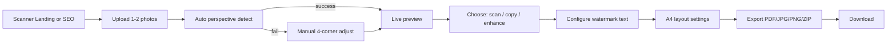

# 产品需求文档 — Pixfit Scanner（证件扫描件 / 复印件生成器）

> 子产品定位。主产品 PRD 见 [../PRD.md](../PRD.md)。
> 本文档定义子产品的 What 与 Why。执行计划见 [./PLAN.md](./PLAN.md)。

---

## 1. 文档信息

| 项       | 内容                                                |
| -------- | --------------------------------------------------- |
| 文档版本 | 0.1 (Draft)                                         |
| 创建日期 | 2026-05-14                                          |
| 状态     | 草案 / 待评审                                       |
| 维护者   | TBD                                                 |
| 子产品名 | **Pixfit Scanner** · 暂译「像扫」（中文待定）       |
| 路由     | `/[locale]/scanner` + `/[locale]/scanner/[docType]` |
| 母产品   | Pixfit · 像配（`pix-fit.com`）                      |
| 上游 PRD | [../PRD.md](../PRD.md)                              |

### 变更记录

| 日期       | 版本 | 变更摘要 |
| ---------- | ---- | -------- |
| 2026-05-14 | 0.1  | 初稿     |

---

## 2. 产品概述

### 2.1 一句话定位

> **浏览器内、纯前端、隐私优先的证件扫描件 / 复印件生成器。** 上传手机拍的彩色身份证 / 护照 / 驾驶证照片，一键生成符合官方网申标准的 PDF 扫描件或黑白复印件，带强制防滥用水印。

### 2.2 与母产品 Pixfit 的关系

| 维度         | Pixfit Studio（母）                         | Pixfit Scanner（子）                         |
| ------------ | ------------------------------------------- | -------------------------------------------- |
| 处理对象     | **人像照片**（自拍 / 半身像）               | **证件文档**（身份证 / 护照 / 驾照实物拍摄） |
| 核心 verb    | 抠图 + 裁剪 + 排版                          | 透视校正 + 二值化 + PDF                      |
| 典型搜索词   | 证件照、签证照、报名照                      | 扫描件、复印件、PDF 生成                     |
| 输出形态     | 单张 PNG / JPG（透明背景 / 实底）           | 多页 PDF / JPG（A4 含双面 + 水印）           |
| 共享技术栈   | jsPDF / Canvas / i18n / Zustand / shadcn UI | 同上 + 新增 OpenCV.js（按需懒加载）          |
| 关键技术差异 | MODNet ONNX 抠图                            | OpenCV.js 透视校正 + Canny 边缘检测          |

**战略意义**：用户群 80%+ 重叠（办签证 / 求职 / 入职 / 网上办事的人**同时**需要这两件事），形成内部 SEO 互联与产品矩阵第一步。**两个模块严格解耦**（独立路由 / 独立 store / 独立 i18n namespace），不污染主 Studio 的代码路径。

### 2.3 目标用户

| 用户群          | 占比预估 | 核心场景                                        |
| --------------- | -------- | ----------------------------------------------- |
| 求职 / 入职新人 | 30%      | HR 要"身份证扫描件 PDF"；网申系统不接受手机拍照 |
| 网上办事者      | 25%      | 政务 / 银行 / 房屋租赁要"扫描件 + 水印"         |
| 出国签证申请人  | 20%      | 大使馆要求扫描件而非翻拍                        |
| 学生 / 考试报名 | 15%      | 报名系统要 PDF 复印件                           |
| 法务 / 合同     | 10%      | 合同附件要扫描件 + 防滥用水印                   |

### 2.4 典型痛点

- **没有扫描仪**：家里 / 出差时只有手机
- **手机拍照不被接受**：网申系统校验"是否扫描件"（颜色、清晰度、透视）
- **手动 PS 工作量大**：透视校正 + 拼 A4 + 加水印对非技术用户门槛高
- **隐私焦虑**：身份证照片上传到不知名网站太危险
- **担心滥用**：把"无水印扫描件"发给陌生人后被冒名办卡 / 借贷

### 2.5 竞品速览

| 竞品                     | 优点                       | 不足                                       |
| ------------------------ | -------------------------- | ------------------------------------------ |
| 国内多家"证件扫描生成器" | 功能齐全、UI 简洁          | 大多收费、有的会上传图片到服务器、广告多   |
| CamScanner / Office Lens | 通用扫描品类老牌、识别力强 | 偏文档类，不针对证件、要装 APP             |
| Adobe Scan               | 输出质量高                 | 要登录、订阅、安装                         |
| 在线 PDF 拼合工具        | 免费                       | 不做透视校正、不做复印效果、需用户自己排版 |

**Pixfit Scanner 差异化**：

1. **零安装、零上传、零登录**（同 Pixfit 主体的隐私优先血统）
2. **垂直证件场景**：内置身份证 / 护照 / 驾照等比例与排版预设
3. **多语言 SEO**：海内外用户都覆盖
4. **强制水印 = 道德兜底**：拒绝做"反诈骗灰产工具"

---

## 3. 产品目标与成功指标

### 3.1 业务目标（上线后 3 个月）

| 指标                      | 目标值                 |
| ------------------------- | ---------------------- |
| 模块月活                  | ≥ 主 Studio MAU 的 30% |
| 从首页 → Scanner 的导流率 | ≥ 8%                   |
| Scanner 内的导出转化率    | ≥ 25%                  |
| 自然搜索"扫描件 / 复印件" | 进入前 5 页（中文）    |

### 3.2 用户体验目标

- **首次使用**：上传 → 透视校正 → 选输出 → 下载 PDF，**3 步内完成**
- **关键操作 ≤ 5 秒**：透视校正 + 实时预览
- **失败率 < 2%**：自动透视检测失败时必须有手动 4 角拖拽 fallback

### 3.3 质量与性能目标

| 指标                             | 目标                                 |
| -------------------------------- | ------------------------------------ |
| OpenCV.js 懒加载下载 + 解析      | < 3.5s（4G 网络）                    |
| 单张证件透视校正 + 输出预览      | < 1.5s（中端 PC） / < 3s（中端手机） |
| PDF 输出（A4 含双面 + 水印）     | < 800ms                              |
| 首屏 LCP（`/scanner` 着陆页）    | < 2.0s（不加载 OpenCV.js）           |
| Lighthouse Performance           | ≥ 90                                 |
| 首屏 JS bundle（不含 OpenCV.js） | ≤ 220 KB gzipped                     |

---

## 4. 用户故事

### 4.1 求职者 · 张同学

> **我是**应届毕业生张同学，**我想**把手机拍的身份证正反面合成一张 A4 PDF 扫描件，**以便**满足校招系统"必须上传扫描件"的要求，**不希望**把照片上传到陌生网站。

### 4.2 租房者 · 李先生

> **我是**租房刚签合同的李先生，**我想**给中介一张身份证复印件 PDF + "仅供 XX 中介房屋租赁使用 2026-05-14" 水印，**以便**防止照片被滥用办卡借贷。

### 4.3 海外签证 · 王女士

> **我是**申请美签的王女士，**我想**把护照首页拍成扫描件 PDF，**以便**通过 DS-160 上传校验。

### 4.4 学生家长 · 陈先生

> **我是**给孩子报名考试的陈先生，**我想**生成黑白复印件而不是彩色扫描件，**以便**符合考试中心要求的"复印件 + 黑白 + A4"格式。

### 4.5 海外用户 · Maria

> **I am** a foreign user filing taxes online, **I want to** convert my driver's license photo into a properly cropped PDF with watermark, **so that** I can submit it to the tax authority.

### 4.6 隐私敏感用户 · 周女士

> **我是**警惕诈骗的周女士，**我想**确认这个工具不会上传我的身份证到任何服务器，**以便**安心使用。

---

## 5. 功能需求（V1 全部 P0）

### 5.1 上传

**功能描述**：用户提供 1–2 张证件原始照片。

**输入方式**：

- 拖拽到上传区域（桌面端）
- 点击选择文件
- 复制粘贴（桌面端 Ctrl/Cmd + V）
- 调用摄像头拍照（移动端 `capture` 属性）
- 从示例图库（演示用，含"模糊掉的"模板身份证）

**双面模式**：

- 默认：正面 + 背面两个 dropzone（针对身份证 / 驾驶证副本）
- 单面模式：用户切换，仅一个 dropzone（护照首页 / 户口本本人页等）

**支持格式**：JPG / JPEG / PNG / WebP / HEIC / HEIF

**约束**：

- 单文件 ≤ 20 MB
- 像素长边 > 4000px 自动降采样到 4000
- 读 EXIF orientation
- HEIC 用 `heic2any` 按需加载
- MIME / 内容嗅探防伪装

### 5.2 透视校正（核心 ⭐）

**功能描述**：把"手机斜拍出来的歪斜证件"自动拉正为正矩形。

**算法路径**：

1. **自动模式（默认）**：OpenCV.js
   - `cv.Canny` 边缘检测 → `cv.findContours` 轮廓 → 取最大四边形 → `cv.getPerspectiveTransform` + `cv.warpPerspective`
2. **手动模式（兜底）**：自动检测失败 / 用户不满意时
   - 在原图上显示 4 个可拖拽角点，用户调整后即时重新校正

**性能**：自动检测 ≤ 600ms（中端 PC）；OpenCV.js 懒加载（约 6–8 MB wasm，仅在用户首次到 Scanner 且上传图片后才下载）。

**输出**：每张证件一个 ImageBitmap（已拉正），保留原始分辨率。

### 5.3 输出类型

**功能描述**：用户选择最终视觉效果。

| 类型         | 视觉                                   | 实现                                            |
| ------------ | -------------------------------------- | ----------------------------------------------- |
| **扫描件**   | 彩色，明亮干净，模拟扫描仪 300dpi 输出 | 白平衡 + 提亮 + 锐化 + 轻微噪声去除             |
| **复印件**   | 黑白 / 灰度，模拟复印机网点效果        | 灰度 → 自适应阈值（Otsu）→ 可选叠加扫描噪声纹理 |
| **照片增强** | 保留原色，但去除色偏 / 阴影            | 自动 white balance + CLAHE                      |

**实时预览**：用户切换类型 → 右侧预览 ≤ 200ms 内更新。

### 5.4 多证件预设

**功能描述**：内置常见证件的尺寸 / 排版预设，用户选择后裁剪比例和排版逻辑自动匹配。

#### 5.4.1 数据模型 `DocSpec`

```ts
type DocSpec = {
  id: string // 'cn-id-card' | 'cn-passport' | 'us-driver-license' ...
  builtin: boolean
  category:
    | 'id-card' // 各国身份证
    | 'passport' // 护照
    | 'driver-license' // 驾驶证
    | 'travel-permit' // 通行证
    | 'household' // 户口本
    | 'bank-card' // 银行卡
    | 'business-license' // 营业执照
    | 'custom'
  region?: string // 'CN' | 'US' | 'JP' | ...
  name: { 'zh-Hans': string; 'zh-Hant': string; en: string }
  description?: { 'zh-Hans': string; 'zh-Hant': string; en: string }

  // 物理尺寸（用于 A4 排版）
  width_mm: number
  height_mm: number

  // 双面 / 单面
  hasBack: boolean

  // 默认水印模板（不可关闭，但可改文字）
  defaultWatermarkTemplate: string // i18n key, e.g. 'scanner.watermark.idCard.default'

  reference?: string // 官方依据
}
```

#### 5.4.2 首版内置（≥ 8 条）

| id                    | 名称             | 物理尺寸   | 双面 |
| --------------------- | ---------------- | ---------- | ---- |
| `cn-id-card`          | 中国二代身份证   | 85.6×54 mm | ✅   |
| `cn-passport`         | 中国护照（首页） | 88×125 mm  | ❌   |
| `cn-driver-license`   | 中国驾驶证       | 88×60 mm   | ✅   |
| `cn-household`        | 户口本（本人页） | 130×93 mm  | ❌   |
| `cn-bank-card`        | 银行卡           | 85.6×54 mm | ✅   |
| `cn-business-license` | 营业执照（副本） | 210×297 mm | ❌   |
| `permit-hk-macao`     | 港澳通行证       | 88×125 mm  | ❌   |
| `permit-taiwan`       | 台湾通行证       | 88×125 mm  | ❌   |
| `us-driver-license`   | 美国驾照（参考） | 85.6×54 mm | ✅   |

V1.1 扩展：日本マイナンバーカード、韩国 주민등록증、欧盟 ID 等。

### 5.5 A4 排版

**功能描述**：把校正后的证件按选定 DocSpec 物理尺寸排到 A4 纸上。

**布局规则**：

- 默认：双面证件 → 正面在上、背面在下，居中对齐，间距 20mm
- 单面证件 → 单张居中
- 用户可切换"上下" / "左右" / "横向 A4" 布局
- 边距：默认四周 20mm，可调（10–30mm）
- 物理尺寸**严格按 DocSpec 输出**（不缩放，按 mm 渲染到 PDF）

**用户控制**：

- 纸张：A4（默认）/ Letter / 自定义
- 方向：竖向（默认）/ 横向
- 边距 / 间距
- 是否显示证件边框线（黑色 1px）

### 5.6 水印（强制 ⭐）

**功能描述**：所有输出都**必须**带水印（道德 / 法律兜底）。

**水印组成**：

| 字段     | 默认值                            | 用户可改               |
| -------- | --------------------------------- | ---------------------- |
| 文字     | "仅供 [用途] 使用 · {YYYY-MM-DD}" | ✅                     |
| 角度     | -30°                              | ✅                     |
| 透明度   | 0.25                              | ✅ (0.10–0.50)         |
| 颜色     | `#666`                            | ✅                     |
| 字号     | 24px @ 300dpi                     | ✅                     |
| 平铺密度 | 4 行 × 3 列                       | ✅                     |
| 强制开启 | **是**                            | ❌（用户无法完全关闭） |

**预设模板**（多语言）：

- "仅供 XX 使用"（最常见）
- "仅供身份核验"
- "Copy for [Purpose] Only"
- "DO NOT DISTRIBUTE"

**法律备注**：UI 旁明显标注"水印不可完全去除是为防止照片滥用"，并附隐私 / ToS 链接。

### 5.7 印章（V1.5 可选 P1）

**功能描述**：用户在扫描件上叠加红色公章效果。

**v1 决策**：**不做**完整印章库（容易越界变成"伪造公章工具"）。V1 仅支持：

- 上传用户自己的印章 PNG（透明背景）
- 拖动定位
- 红 / 蓝色调（CSS filter）

V2 视用户反馈再决定。

### 5.8 输出格式

| 格式    | 用途              | 默认 |
| ------- | ----------------- | ---- |
| **PDF** | 主推，扫描件标配  | ✅   |
| JPG     | 单张 / 简单分享   |      |
| PNG     | 高质量 / 嵌入文档 |      |
| ZIP     | 多张 JPG 打包     |      |

文件命名：`{docId}_{purpose}_{YYYYMMDD}.{ext}`

### 5.9 历史 / 草稿

**保存内容**：仅配置（DocSpec 选择 / 水印文字 / 输出格式 / 排版设置），**不存图像**。

**存储**：`localStorage['pixfit:scanner:sessions:v1']`，最多保留 10 条，TTL 30 天。

**用途**：用户下次访问 Scanner，"最近使用"快捷恢复配置（仅配置）。

### 5.10 国际化

沿用主 Pixfit 现有 i18n 架构：

- locale：`zh-Hans` / `zh-Hant` / `en`
- 新增 namespace：`Scanner.*`
- DocSpec 名称在数据层即多语言 object
- 水印模板按当前 locale 切换默认文字

### 5.11 SEO 着陆页

#### 5.11.1 主路由

`/[locale]/scanner` — Scanner 工具主页

#### 5.11.2 文档类型着陆页（`/[locale]/scanner/[docType]`）

每个 DocSpec 生成一个独立 SSR 页面，承接长尾搜索：

| URL                            | 中文关键词             | 英文关键词                     |
| ------------------------------ | ---------------------- | ------------------------------ |
| `/scanner/cn-id-card`          | 身份证扫描件生成 / PDF | china id card scanner online   |
| `/scanner/cn-passport`         | 中国护照扫描件生成     | china passport scan online     |
| `/scanner/cn-driver-license`   | 驾驶证扫描件生成       | china driver license scanner   |
| `/scanner/cn-household`        | 户口本扫描件生成       | china hukou scanner            |
| `/scanner/cn-bank-card`        | 银行卡扫描件生成       | bank card scanner online       |
| `/scanner/cn-business-license` | 营业执照扫描件生成     | business license scanner china |
| `/scanner/permit-hk-macao`     | 港澳通行证扫描件生成   | hk-macao permit scanner        |
| `/scanner/permit-taiwan`       | 台湾通行证扫描件生成   | taiwan permit scanner          |

页面内容（沿用 `/sizes/[specId]` SEO 范式）：

- H1：扫描件 PDF 在线生成
- 描述：5–10 句说明
- HowTo JSON-LD（3 步：上传 → 校正 → 下载）
- FAQ JSON-LD（5–7 条常见问题）
- BreadcrumbList JSON-LD
- 沿用 hreflang × canonical

### 5.12 全局导航变化

**Header 顶栏**：在 Logo 右侧新增一个 **「工具」** 下拉（替代当前的 Studio 单链）：

```text
工具 ▾
├ 证件照工作台    (Studio)
├ 证件扫描件      (Scanner)        ← 新
├ 规格库          (/sizes)
└ 排版打印        (/templates)
```

移动端：底部 tab 增加 Scanner 入口（图标：`ScanLine` / `FileText` / `IdCard`）

### 5.13 可访问性

沿用主 Pixfit 标准（WCAG AA）。Scanner 特有：

- 自动透视失败时的"手动调 4 角"步骤必须支持键盘操作（方向键 ±1px / Shift+方向键 ±10px）
- 4 个角点用 ARIA label 区分（"top-left" / "top-right" / ...）

---

## 6. 非功能需求

### 6.1 隐私

- **明示**：Scanner 首页 + 上传区 + 隐私政策页明确"图片不离开浏览器"
- **零网络**：OpenCV.js 加载完成后，整个流程零网络请求（用 DevTools Network 即可校验）
- **本地化资源**：OpenCV.js 自托管到自有 CDN（不用 docs.opencv.org/.../opencv.js）
- **零追踪**：复用主站 Cookie-less 策略

### 6.2 性能

详见 §3.3。**关键约束**：OpenCV.js 不能拖累 `/scanner` 着陆页首屏 LCP——只有用户**点击上传后**才开始下载。

### 6.3 兼容性

同主 Pixfit。**额外注意**：

- OpenCV.js 需要 WASM 支持（Safari ≥ 16.4 OK）
- 不支持 OpenCV.js 的旧浏览器 → 仅显示"手动 4 角拖拽"模式，能用但体验弱

### 6.4 离线

- OpenCV.js 加载后写入 Cache Storage，二次访问 0 等待
- V1.x 集成 PWA 后可彻底离线使用

### 6.5 法律 / 合规

- ToS 显式禁止伪造、欺诈、冒用他人身份的用途
- 水印**强制开启**且**不可完全关闭**（透明度有下限 0.10）
- 隐私政策更新：明确 Scanner 同样不上传任何图像
- 在 Scanner UI 内（不仅 ToS）写一行小字提示："Pixfit 不为伪造文件或欺诈用途负责"

---

## 7. 信息架构

### 7.1 用户旅程



### 7.2 路由地图（在主站之上新增）

```text
/[locale]/scanner                           Scanner 主页
/[locale]/scanner/[docType]                 文档类型 SEO 落地页（按 DocSpec 生成）

# i18n 与主站一致
/zh-Hans/scanner/...
/zh-Hant/scanner/...
/en/scanner/...
```

### 7.3 Scanner 工作台布局

```text
┌────────────────────────────────────────────────────────────────────┐
│ Logo  工具 ▾   …          [中/En]   规格 ▾   下载 → PDF             │ ← 顶栏（全站统一）
├─────────────┬──────────────────────────────────┬───────────────────┤
│             │                                  │                   │
│  上传 1 ▢   │       A4 实时预览 (Canvas)        │  右侧配置面板：   │
│  上传 2 ▢   │     正面 + 背面 + 水印铺底         │  - 证件类型 ▾    │
│             │                                  │  - 输出模式（扫/复/增强）│
│  示例库     │                                  │  - 水印文本/角度  │
│             │                                  │  - 排版方向       │
│             │                                  │  - 边距 / 间距    │
├─────────────┴──────────────────────────────────┴───────────────────┤
│   ↶ 撤销  ↷ 重做     缩放 [100%]              重置  导出 PDF        │
└────────────────────────────────────────────────────────────────────┘
```

---

## 8. 视觉与交互设计

**完全沿用** Pixfit 主 [DESIGN.md](../DESIGN.md)（Emerald 主色、Stone 中性、shadcn/ui、Lucide）。Scanner 不引入新设计 token / 不偏离母品牌视觉语言。

差异：

- Scanner 主图标采用 Lucide `ScanLine`（区别于 Studio 的 `ImageIcon`）
- 上传区配色：保持 `--primary-soft` 描边但 hover 时换成 `--accent`（amber-500）以**视觉区分**"这是另一个工具"

---

## 9. 数据 schema

### 9.1 `DocSpec` 见 §5.4.1

### 9.2 `WatermarkConfig`

```ts
type WatermarkConfig = {
  text: string
  rotationDeg: number // -90 to 90, default -30
  opacity: number // 0.10 to 0.50, default 0.25
  color: string // hex, default '#666666'
  fontSize: number // px @ 300dpi, default 24
  rows: number // tile rows, default 4
  cols: number // tile cols, default 3
}
```

### 9.3 `ScannerSession`（localStorage 持久化的配置）

```ts
type ScannerSession = {
  id: string // uuid
  createdAt: string // ISO
  docSpecId: string
  outputMode: 'scan' | 'copy' | 'enhance'
  paper: 'A4' | 'Letter' | 'custom'
  paperOrientation: 'portrait' | 'landscape'
  margin_mm: number
  gap_mm: number
  watermark: WatermarkConfig
  // 图像本身不存
}
```

### 9.4 持久化

- Key：`pixfit:scanner:sessions:v1`
- 容量：最多 10 条；超出按 LRU 删除
- TTL：30 天
- 与主 Studio 的 `id-photo-tool:specs:v1` **完全独立**，互不影响

---

## 10. 度量与统计

复用主站统计平台（Vercel Web Analytics + Speed Insights）。Scanner 特有事件：

| 事件名                       | 触发时机           | 属性                                           |
| ---------------------------- | ------------------ | ---------------------------------------------- |
| `scanner_upload`             | 用户上传成功       | `{ side: 'front' \| 'back', format, sizeKB }`  |
| `scanner_opencv_loaded`      | OpenCV.js 加载完成 | `{ duration_ms, fromCache: boolean }`          |
| `scanner_auto_perspective`   | 自动透视校正完成   | `{ success: boolean, duration_ms }`            |
| `scanner_manual_perspective` | 用户进入手动模式   | `{ reason: 'auto-failed' \| 'user-override' }` |
| `scanner_output_select`      | 选择输出类型       | `{ mode: 'scan' \| 'copy' \| 'enhance' }`      |
| `scanner_docspec_select`     | 选择证件类型       | `{ id }`                                       |
| `scanner_watermark_edit`     | 编辑水印文字       | —（不发送文字内容，仅计数）                    |
| `scanner_export`             | 导出文件           | `{ format, hasBack: boolean, sizeKB }`         |

**隐私**：与主站一致，不收集图像内容 / 不收集 PII / 不收集 IP。

---

## 11. 里程碑

> 详细任务清单见 [./PLAN.md](./PLAN.md) 与 [./tasks/](./tasks/)。

| 里程碑 | 主题                                | 主要交付                                                                          | 预估 |
| ------ | ----------------------------------- | --------------------------------------------------------------------------------- | ---- |
| **S1** | 路由 + 导航 + 骨架                  | `/[locale]/scanner` 路由 / Header 工具下拉 / Zustand store / i18n namespace 三语  | 3 天 |
| **S2** | 上传 + EXIF + HEIC                  | 双面上传组件 / heic2any 懒加载 / 内置示例图                                       | 2 天 |
| **S3** | OpenCV.js 集成 + 透视校正           | Worker 化 OpenCV / 自动 4 角检测 / 手动 4 角拖拽 fallback                         | 4 天 |
| **S4** | 输出模式 + 实时预览                 | 扫描件 / 复印件 / 照片增强三种 Canvas pipeline / 预览防抖                         | 3 天 |
| **S5** | 水印 + A4 排版 + PDF 导出           | jsPDF mm-based 排版 / 水印渲染 / 强制开启策略                                     | 3 天 |
| **S6** | 多 DocSpec + 多格式导出             | 8 条 builtin DocSpec / JPG / PNG / ZIP / 文件命名                                 | 3 天 |
| **S7** | SEO 落地页 + JSON-LD + sitemap      | `/scanner/[docType]` 三语 8 条 / HowTo / FAQ JSON-LD / Footer 内链 / sitemap 收录 | 3 天 |
| **S8** | 历史 / ToS / 法律提示 / a11y / 上线 | localStorage session / ToS 增补 / 键盘可达 / Lighthouse / 真机回归                | 3 天 |

**预计总工期**：**4–5 周**（单人 / 兼职节奏 ≈ 24 工作日）

---

## 12. 风险与边界

| 风险                                       | 影响                | 缓解策略                                                      |
| ------------------------------------------ | ------------------- | ------------------------------------------------------------- |
| **法律风险**：被滥用做伪造扫描件 / 复印件  | 品牌信誉 / 合规风险 | 强制水印不可关 + ToS 显式禁止 + UI 内警示                     |
| OpenCV.js 包大（6–8 MB），国内 CDN 慢      | LCP 退化 / 用户流失 | 自托管到 Vercel / Cloudflare 静态资源；首屏不加载，按需懒加载 |
| 自动透视检测失败率高（拍摄环境差）         | 用户放弃            | 必须提供"手动 4 角拖拽" fallback；UI 暗示"调不好可以手动调"   |
| iOS Safari OpenCV.js wasm 内存上限触发     | 大图崩溃            | 预压缩长边到 2000–2500px 再喂给 OpenCV                        |
| HEIC 解码慢                                | 用户等很久          | 大文件提示用户先用系统转 JPG                                  |
| 印章功能被滥用伪造公章                     | 严重法律风险        | V1 **不做**完整印章库，仅允许用户上传自己的 PNG               |
| 添加 Scanner 稀释 Pixfit 主关键词 SEO 权重 | 主站 SEO 退化       | 严格独立子路由 / 独立 sitemap section / Footer 限量内链       |
| OpenCV.js 上游版本变化 / API breaking      | 维护成本            | 固定版本（opencv.js@4.10.x）+ 内部封装 wrapper                |

---

## 13. 未来扩展（V2+）

| 阶段 | 主题             | 描述                                                                 |
| ---- | ---------------- | -------------------------------------------------------------------- |
| V2.0 | 多区域证件预设   | 日 / 韩 / 欧盟 / 印度 / 东南亚常用证件                               |
| V2.0 | OCR 字段提取     | 识别身份证号 / 姓名 / 有效期，便于自动填表（仍纯前端，tesseract.js） |
| V2.0 | 印章模板（受限） | 提供 5–10 个**示意**章模板（不可拼接真公章）                         |
| V2.0 | PWA 离线安装     | 同主站 PWA 计划                                                      |
| V2.1 | 签名手写         | 用户在 Canvas 上手写签名 + 叠加到 PDF                                |
| V2.1 | 多页 PDF 合并    | 比如户口本多页扫描                                                   |
| V3.0 | API for 三方接入 | 给第三方系统提供"嵌入式"扫描组件                                     |

---

## 14. 附录

### 14.1 术语表

| 术语      | 含义                                         |
| --------- | -------------------------------------------- |
| 扫描件    | 模拟扫描仪输出的彩色文档图像（俗称"扫件"）   |
| 复印件    | 模拟复印机输出的黑白文档图像                 |
| 透视校正  | 把"斜拍出来的梯形矩形"变换回"正矩形"的过程   |
| Otsu 阈值 | 一种全局自适应二值化算法，常用于复印件效果   |
| CLAHE     | 对比度受限的自适应直方图均衡化（增强算法）   |
| DocSpec   | 文档规格（类比主 Studio 的 PhotoSpec）       |
| 强制水印  | 用户**无法**完全关闭的水印，本产品的道德兜底 |

### 14.2 关键参考资料

- OpenCV.js 透视变换：<https://docs.opencv.org/4.x/dd/d52/tutorial_js_geometric_transformations.html>
- Otsu 阈值原理：<https://en.wikipedia.org/wiki/Otsu%27s_method>
- CamScanner 反编译分析（行业参考）
- 中国二代身份证国标：GA 461-2004
- 港澳台通行证规格：公安部出入境管理局公开文档

### 14.3 命名相关待决项

- Scanner 模块中文最终名（暂"像扫" / "证件扫描" / "Pixfit Docs" 三选一）
- Logo 是否独立设计 / 用现有 Pixfit 标
- 默认水印文字模板的本地化措辞（请法务过一遍）

---

> 文档结束。执行计划见 [./PLAN.md](./PLAN.md)。
