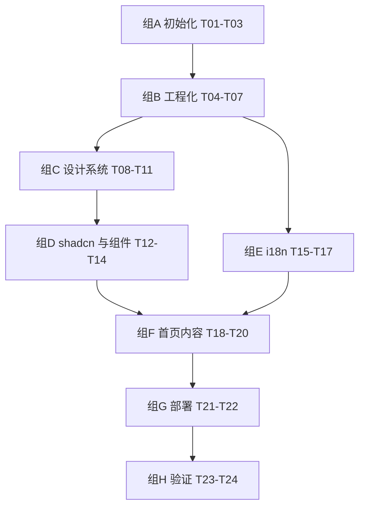

# M1 · 项目骨架 — 原子任务清单

> 目标：建立 Pixfit 的工程基底，跑通 `/zh` `/zh-Hant` `/en` 三语首页（静态版），完成设计系统与 Cloudflare Pages 部署。
>
> 关联文档：[PRD §11 M1](../PRD.md) · [TECH_DESIGN §4 目录结构](../TECH_DESIGN.md) · [DESIGN.md](../DESIGN.md) · [PLAN.md](../PLAN.md)

---

## 1. 信息

| 项       | 内容                                                            |
| -------- | --------------------------------------------------------------- |
| 里程碑   | M1 项目骨架                                                     |
| 预计工时 | 5–8 个工作日                                                    |
| 任务数   | 24                                                              |
| 前置条件 | Node 20.18+ / pnpm 9+ / 一个 Cloudflare 账户 / 已购 pix-fit.com |
| 产出物   | 一个可访问的三语静态首页，部署在 Cloudflare Pages               |

---

## 2. 验收口径（M1 整体 Definition of Done）

完成全部任务后，应满足：

- [x] `pnpm install && pnpm dev` 本地起得来，访问 `http://localhost:3000` 正常渲染（实际重定向到 `/zh-Hans`）
- [x] 访问 `/zh-Hans` / `/zh-Hant` / `/en` 三个 locale 首页内容正确切换
- [x] 浏览器初次访问根 `/`，自动按 `Accept-Language` 重定向到匹配 locale（307 redirect 已验证）
- [x] 顶栏语言切换器工作正常（切换后 URL 与文案同步）
- [x] 首页视觉与 [DESIGN.md §5.1](../DESIGN.md) wireframe 一致（M1 阶段省略"常用尺寸 chip / FAQ"，留给 M4/M8 内容化阶段）
- [x] 全站零 emoji（所有图标走 `lucide-react`，国旗走 `flag-icons`，GitHub logo 内联 SVG）
- [x] 字体走 Next.js 自托管（Inter + JetBrains Mono via `next/font/google`，构建期下载，运行时同源加载）
- [x] `pnpm typecheck && pnpm lint && pnpm test && pnpm build` 全绿
- [ ] 部署到 Cloudflare Pages，预览域名可访问 — **等待控制台接入**
- [ ] Lighthouse 首页 Performance ≥ 90、Accessibility ≥ 95（桌面环境） — **等待真实部署后跑分**
- [ ] 首屏 JS bundle（gzipped）≤ 200 KB — 当前 ~218 KB，记入 M8 优化项

---

## 3. 任务分组与依赖关系



---

## 4. 任务清单

### 组 A · 项目初始化（3 任务，约 0.5 天）

#### M1-T01 · 使用 create-next-app 初始化项目

- **依赖**：无
- **操作**：
  - 执行 `pnpm create next-app@latest pix-fit --typescript --tailwind --eslint --app --src-dir --import-alias "@/*" --no-turbopack`
  - 让生成器自动安装依赖
  - 验证 `pnpm dev` 起得来，访问 `http://localhost:3000` 显示默认 Next.js 欢迎页
- **DoD**：
  - 仓库根存在 `package.json` / `tsconfig.json` / `next.config.ts` / `src/` / `tailwind.config.ts`
  - `pnpm dev` 无报错
  - 默认 Next.js 页面可见

#### M1-T02 · 锁定 packageManager 与 Node 版本

- **依赖**：T01
- **操作**：
  - `package.json` 加：
    ```json
    "packageManager": "pnpm@9.x.x",
    "engines": { "node": ">=20.18" }
    ```
  - 加 `.nvmrc` 写 `20.18.0`
  - 提交 `pnpm-lock.yaml`
- **DoD**：在另一个目录用 `nvm use && pnpm install --frozen-lockfile` 能复现

#### M1-T03 · 初始化 git 仓库与 .gitignore

- **依赖**：T02
- **操作**：
  - `git init && git branch -M main`
  - 完善 `.gitignore`（追加 `.env*`、`*.log`、`.DS_Store`、`coverage/`、`playwright-report/`、`test-results/`）
  - 写一个最小 `README.md`（占位，M8 时补完整）
  - 首次提交：`chore: bootstrap nextjs project`
- **DoD**：`git status` 干净；GitHub remote 推送成功（如已建 repo）

---

### 组 B · 工程化（4 任务，约 0.5 天）

#### M1-T04 · TypeScript strict 模式与路径别名

- **依赖**：T03
- **操作**：
  - `tsconfig.json` 设 `"strict": true`、`"noUncheckedIndexedAccess": true`、`"noImplicitOverride": true`
  - 确认 `"paths": { "@/*": ["./src/*"] }` 存在
  - 写一个最小 `src/lib/__test/path.test.ts`（或直接 `src/lib/version.ts`）验证 alias 可用
- **DoD**：`pnpm tsc --noEmit` 无错；alias `@/lib/version` 能解析

#### M1-T05 · ESLint + Prettier + lint-staged

- **依赖**：T04
- **操作**：
  - 安装：`pnpm add -D prettier eslint-config-prettier lint-staged simple-git-hooks`
  - 加 `.prettierrc.json`：`{ "semi": false, "singleQuote": true, "printWidth": 100 }`
  - `.eslintrc` 继承 `next/core-web-vitals` + `prettier`
  - `package.json` 加：
    ```json
    "scripts": {
      "lint": "next lint",
      "format": "prettier --write .",
      "typecheck": "tsc --noEmit"
    },
    "simple-git-hooks": { "pre-commit": "pnpm exec lint-staged" },
    "lint-staged": {
      "*.{ts,tsx,js,jsx,json,md}": "prettier --write",
      "*.{ts,tsx}": "eslint --fix"
    }
    ```
  - `pnpm simple-git-hooks` 安装 hooks
- **DoD**：`pnpm lint && pnpm format` 无报错；提交时 hook 自动跑

#### M1-T06 · Conventional Commits 校验

- **依赖**：T05
- **操作**：
  - 安装：`pnpm add -D @commitlint/cli @commitlint/config-conventional`
  - 加 `commitlint.config.js`：`module.exports = { extends: ['@commitlint/config-conventional'] }`
  - 在 `simple-git-hooks` 加 `commit-msg` hook 调 commitlint
- **DoD**：`git commit -m "bad message"` 被拒绝；`git commit -m "feat: x"` 通过

#### M1-T07 · 基础测试设施（Vitest）

- **依赖**：T05
- **操作**：
  - 安装：`pnpm add -D vitest @vitest/coverage-v8 @testing-library/react @testing-library/jest-dom happy-dom`
  - 配 `vitest.config.ts`（环境 happy-dom，alias 同 `@/`）
  - 加 `src/lib/__test/sanity.test.ts` 一个 `expect(1+1).toBe(2)`
  - `package.json` script 加 `"test": "vitest run"`
- **DoD**：`pnpm test` 通过 1 个测试

---

### 组 C · 设计系统（4 任务，约 1 天）

#### M1-T08 · Tailwind v4 主题 token

- **依赖**：T04
- **操作**：
  - `tailwind.config.ts` 配色覆盖 [DESIGN.md §3.2](../DESIGN.md) 的 emerald + stone token
  - 间距 / 圆角 / 阴影 token 对齐 §3.4 / §3.5 / §3.6
  - 字号配置对齐 §3.3 字号比例表
  - 加 `app/globals.css` 写 CSS variables（`--primary`、`--bg` 等），Tailwind 通过 `bg-[var(--primary)]` 引用
- **DoD**：测试页面 `bg-primary text-on-primary p-6 rounded-lg shadow-md` 渲染正确

#### M1-T09 · 自托管 Inter 字体

- **依赖**：T08
- **操作**：
  - 下载 Inter Variable `.woff2` 放 `src/fonts/`
  - 用 `next/font/local` 加载，CSS variable 命名 `--font-sans`
  - `app/layout.tsx` 把 `font-sans` 加到 `<html>` 类名
- **DoD**：DevTools Network 不出现 Google Fonts 请求；正文字体为 Inter

#### M1-T10 · 中文字体（系统优先 + Noto 兜底）

- **依赖**：T09
- **操作**：
  - `tailwind.config.ts` 的 `fontFamily.sans` 设为：
    ```ts
    ;[
      'Inter',
      'PingFang SC',
      'PingFang TC',
      'Hiragino Sans GB',
      'Microsoft YaHei',
      'Noto Sans SC',
      'Noto Sans TC',
      'sans-serif',
    ]
    ```
  - 暂不自托管 Noto（M1 不做字体子集化，等 M8）
- **DoD**：macOS 看到 PingFang SC、Windows 看到 Microsoft YaHei

#### M1-T11 · 设计 token 演示页（内部）

- **依赖**：T08
- **操作**：
  - 临时建 `src/app/_design/page.tsx`（路径下划线开头不参与路由）
  - 列出所有颜色、字号、间距、按钮变体、阴影、圆角的可视化（用于 review 设计统一性）
- **DoD**：本地访问 `/_design`（或 dev only 路由）查看效果一致

---

### 组 D · shadcn 与图标（3 任务，约 0.5 天）

#### M1-T12 · shadcn/ui 初始化

- **依赖**：T08
- **操作**：
  - 执行 `pnpm dlx shadcn@latest init`
  - 选项：style=new-york，base-color=stone，radius=0.75rem，css-variables=yes
  - 把 `components.json` 的 alias 对齐 `@/components/ui`
- **DoD**：`pnpm dlx shadcn@latest add button` 成功，按钮渲染样式与 DESIGN 一致

#### M1-T13 · 安装首批 shadcn 组件

- **依赖**：T12
- **操作**：
  - 一次性添加：`pnpm dlx shadcn@latest add button input label dialog sheet tabs tooltip sonner select popover card separator dropdown-menu`
  - 升级 `sonner` 为 toast 提供方
  - 在 `app/layout.tsx` 挂 `<Toaster />`
- **DoD**：所有组件在 `src/components/ui/` 出现，TS 编译通过

#### M1-T14 · 图标库与国旗库

- **依赖**：T13
- **操作**：
  - 安装：`pnpm add lucide-react flag-icons`
  - 在 `app/globals.css` 顶部 `@import 'flag-icons/css/flag-icons.min.css'`
  - 建 `src/components/region-flag.tsx`（圆形国旗，参考 DESIGN §4.3）
  - 建 `src/lib/icons.ts`（统一从 lucide-react 导出常用图标，方便日后批量替换）
- **DoD**：测试页能渲染 `<RegionFlag code="us" />` 和 `<Upload />` 图标

---

### 组 E · 国际化（3 任务，约 0.5 天）

#### M1-T15 · 安装并配置 next-intl

- **依赖**：T04
- **操作**：
  - `pnpm add next-intl`
  - 重组 App Router：`src/app/[locale]/{layout.tsx, page.tsx}`
  - 建 `src/i18n/config.ts`：导出 `locales = ['zh','zh-Hant','en'] as const`、`defaultLocale='zh'`
  - 建 `src/i18n/request.ts`：导出 `getRequestConfig`
- **DoD**：访问 `/zh`、`/en`、`/zh-Hant` 均不报错（即使内容是占位）

#### M1-T16 · Middleware 自动重定向

- **依赖**：T15
- **操作**：
  - 建 `src/middleware.ts`，使用 `createMiddleware` 从 next-intl
  - 配 `localePrefix: 'always'`、`localeDetection: true`
  - matcher 排除 `api`、`_next`、静态资源
- **DoD**：`/` 自动 302 到匹配的 `/zh` 或 `/en`；浏览器 lang 设 en 时跳 `/en`

#### M1-T17 · 文案文件骨架（messages）

- **依赖**：T15
- **操作**：
  - 建 `src/messages/{zh,zh-Hant,en}/common.json`，含基本 key：
    ```json
    {
      "site": { "name": "Pixfit", "tagline": "..." },
      "nav": { "tools": "工具", "sizes": "尺寸", "language": "中/En" },
      "footer": { "about": "关于", "privacy": "隐私", "terms": "条款" }
    }
    ```
  - 三套人工分别写，**zh-Hant 不靠自动转换**
  - 写 `scripts/i18n-lint.ts`（参考 [TECH_DESIGN §9.3](../TECH_DESIGN.md)），加 `"i18n:lint"` script
- **DoD**：`pnpm i18n:lint` 通过；三套 messages 同 key

---

### 组 F · 通用组件与首页（3 任务，约 1.5 天）

#### M1-T18 · 通用组件：Logo / Header / Footer / LanguageSwitcher

- **依赖**：T13, T14, T17
- **操作**：
  - `src/components/logo.tsx`：wordmark `Pixfit`，Inter 700，emerald-500
  - `src/components/header.tsx`：Logo 居左 + 导航 + 右侧语言切换器（移动端汉堡菜单）
  - `src/components/footer.tsx`：链接 + 版权
  - `src/components/language-switcher.tsx`：Lucide `Globe` 图标 + DropdownMenu，切换时 router.replace 到目标 locale 路径
  - 全部走 `useTranslations()` 接 i18n
- **DoD**：三语下 Header / Footer 文案正确；切换不丢失当前路由

#### M1-T19 · 上传 Dropzone（仅 UI，未接逻辑）

- **依赖**：T14
- **操作**：
  - `src/components/upload-dropzone.tsx`：完整视觉（虚线边框、hover、dragOver 三态），Lucide `Upload` 图标
  - 接受 `onFile?: (file: File) => void` prop（先不实现，预留）
  - **不做** EXIF / HEIC / 跳转逻辑（M2 再做）
- **DoD**：拖入文件可见三态切换；点击触发文件选择

#### M1-T20 · 首页静态版

- **依赖**：T18, T19
- **操作**：
  - `src/app/[locale]/page.tsx` 按 [DESIGN.md §5.1](../DESIGN.md) wireframe 实现：
    - Hero（Display-1 标题 + 副标题）
    - UploadDropzone
    - 常用尺寸 chip 排（用 `<Link>` 占位，跳 `/studio?spec=us-visa` 等，M2 才真正生效）
    - 隐私 USP 区块（Lucide `ShieldCheck`）
    - 三步骤说明（Upload / Wand2 / Download 图标）
    - FAQ（用 `Accordion` 占位 5 条）
  - 响应式：移动端单列、桌面端居中容器 max-width 1200px
  - 文案全部走 i18n key
- **DoD**：三语下视觉一致；移动端 375 / 桌面端 1280 都不破

---

### 组 G · 部署（2 任务，约 0.5 天）

#### M1-T21 · Cloudflare Pages 项目创建与连接

- **依赖**：T20
- **操作**：
  - Cloudflare Dashboard → Pages → 连接 GitHub repo
  - 构建命令：`pnpm install --frozen-lockfile && pnpm build`
  - 输出目录：`.next`（用 `@cloudflare/next-on-pages` 适配器）
  - 安装：`pnpm add -D @cloudflare/next-on-pages`，构建脚本调整为 `next-on-pages`
  - 配 `wrangler.toml` 与 Pages 构建配置
- **DoD**：push 到 main 自动触发部署；预览 URL 可访问三语首页

#### M1-T22 · 自定义域名（可选 M1 内做）

- **依赖**：T21
- **操作**：
  - 在 Cloudflare Pages 绑定 `pix-fit.com` + `www.pix-fit.com`
  - DNS A/CNAME 配置（Cloudflare 同账户托管时一键）
  - 启用 HTTPS（CF 自动）
- **DoD**：`https://pix-fit.com/zh` 可访问且证书有效
- **延迟选项**：如域名 DNS 未就绪，可挪到 M8

---

### 组 H · 验证（2 任务，约 0.5 天）

#### M1-T23 · CI（GitHub Actions）

- **依赖**：T22
- **操作**：
  - 建 `.github/workflows/ci.yml`：
    - 触发：push、pull_request
    - 步骤：checkout → setup-node 20.18 → pnpm/action-setup → pnpm install → typecheck → lint → i18n:lint → test → build
  - 失败时通知（先不接 Slack/邮件，看 GitHub UI 即可）
- **DoD**：PR 必须 CI 绿才能合（设 branch protection 是可选）

#### M1-T24 · Lighthouse 与 Bundle 验证

- **依赖**：T22
- **操作**：
  - `pnpm dlx unlighthouse --site https://<preview>.pages.dev/zh`
  - 检查首屏 JS bundle（`next build` 输出报告，或 `pnpm add -D @next/bundle-analyzer`）
  - 修正：未使用导入、图标过大引入（确保 lucide tree-shake 生效）
  - 在 PLAN.md `M1 验收` 列填入实测分数与体积
- **DoD**：
  - Lighthouse Performance ≥ 90、Accessibility ≥ 95
  - 首屏 JS（gzipped）≤ 200 KB
  - 数据回写 [PLAN.md](../PLAN.md)

---

## 5. 风险与备选

| 任务    | 风险                                                  | 备选                                                          |
| ------- | ----------------------------------------------------- | ------------------------------------------------------------- |
| T15–T17 | next-intl 与 Next.js 15 兼容若有问题                  | 临时降级到 paraglide-js（更新更快）或 next-translate          |
| T21     | `@cloudflare/next-on-pages` 对部分 Next 15 特性不支持 | 改用纯静态导出（`output: 'export'`），牺牲未来 Server Actions |
| T22     | 域名 DNS / 备案延迟                                   | 延后到 M8；M1 用 `<project>.pages.dev`                        |
| T24     | Lighthouse 不达标                                     | 不阻塞合并，在 M8 集中调优                                    |

---

## 6. 任务进度表（开发时勾选）

| ID  | 任务                            | 状态                                                       | 完成日期   |
| --- | ------------------------------- | ---------------------------------------------------------- | ---------- |
| T01 | create-next-app 初始化          | [x]                                                        | 2026-05-11 |
| T02 | packageManager / Node 版本      | [x]                                                        | 2026-05-11 |
| T03 | git 初始化与 .gitignore         | [x]                                                        | 2026-05-11 |
| T04 | TS strict + path alias          | [x]                                                        | 2026-05-11 |
| T05 | ESLint + Prettier + lint-staged | [x]                                                        | 2026-05-11 |
| T06 | Conventional Commits            | [x]                                                        | 2026-05-11 |
| T07 | Vitest 基础设施                 | [x]                                                        | 2026-05-11 |
| T08 | Tailwind v4 主题 token          | [x]                                                        | 2026-05-11 |
| T09 | 自托管 Inter 字体               | [x]                                                        | 2026-05-11 |
| T10 | 中文字体 fallback               | [x]                                                        | 2026-05-11 |
| T11 | 设计 token 演示页               | [x]                                                        | 2026-05-11 |
| T12 | shadcn 初始化                   | [x] (脚本代替 CLI)                                         | 2026-05-11 |
| T13 | 首批 shadcn 组件                | [x] (7 个组件)                                             | 2026-05-11 |
| T14 | Lucide + flag-icons             | [x]                                                        | 2026-05-11 |
| T15 | next-intl 配置                  | [x]                                                        | 2026-05-11 |
| T16 | Middleware 重定向               | [x]                                                        | 2026-05-11 |
| T17 | 文案骨架 + i18n lint            | [x] (35 keys × 3 locales)                                  | 2026-05-11 |
| T18 | Header/Footer/Logo/LangSwitcher | [x]                                                        | 2026-05-11 |
| T19 | UploadDropzone（仅 UI）         | [x]                                                        | 2026-05-11 |
| T20 | 首页静态版                      | [x]                                                        | 2026-05-11 |
| T21 | Cloudflare Pages 连接           | [x] (代码侧) / [ ] (控制台)                                | 2026-05-11 |
| T22 | 自定义域名                      | [x] (代码侧) / [ ] (控制台)                                | 2026-05-11 |
| T23 | CI 流水线                       | [x] (CI + Deploy yml)                                      | 2026-05-11 |
| T24 | Lighthouse + Bundle 验证        | [x] (Bundle baseline 已采集) / [ ] (Lighthouse 待真实部署) | 2026-05-11 |

---

## 7. M1 完成后的下一步

- 在 [PLAN.md](../PLAN.md) §3.2 M1 验收勾选完成项
- 启动 M2：抠图核心。先开 `docs/tasks/M2.md`（沿用本文档结构）
- 同步更新 [PLAN.md](../PLAN.md) 决策日志（记录 M1 中遇到的关键技术决策）

---

> 文档结束。开始执行从 T01。每完成一个 task：勾选 §6 进度表、Git commit、push（触发 CI）。
