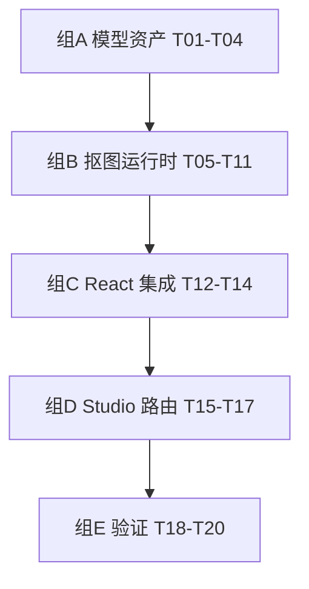

# M2 · 抠图核心 — 原子任务清单

> 目标：把 MODNet 量化 ONNX 模型在浏览器端通过 onnxruntime-web 跑起来，
> 用 Web Worker 隔离推理，并在新建的 `/studio` 路由里完成「上传 → 抠图 → mask 预览」
> 这条最短闭环。换底色 / 裁剪 / 排版均不在 M2 范围（属于 M3+）。
>
> 关联文档：
>
> - [PRD §11 M2](../PRD.md) · [TECH_DESIGN §5.2 抠图模块](../TECH_DESIGN.md) · [TECH_DESIGN §6.2-6.3](../TECH_DESIGN.md)
> - [DESIGN.md §5.2 Studio wireframe](../DESIGN.md)
> - [跨里程碑 TODO](../TODO.md)

---

## 1. 信息

| 项       | 内容                                                                                     |
| -------- | ---------------------------------------------------------------------------------------- |
| 里程碑   | M2 抠图核心                                                                              |
| 预计工时 | 7–12 个工作日（核心难度：模型/Worker 接入与性能调优）                                    |
| 任务数   | 20                                                                                       |
| 前置条件 | M1 项目骨架已合并；Python 3.10+（仅用于离线量化脚本）；Cloudflare R2 可访问（M2-T04 时） |
| 产出物   | 用户上传一张人像 → 跳到 `/studio` → 浏览器内出 mask 预览（透明 PNG）                     |

---

## 2. 验收口径（M2 整体 Definition of Done）

完成全部任务后，应满足：

- [ ] 浏览器（Chrome 最新版桌面 + iOS Safari 17+）首次访问 `/studio`，模型在 ≤ 2.5 s 内冷启动可用（按 5 MB 模型 + 普通家用带宽估算）
- [ ] 二次访问 `/studio` 模型走缓存（Cache API）秒级 ready
- [ ] 一张 1024×1024 的肖像，桌面 Chrome（WebGPU）下推理 ≤ 800 ms；不支持 WebGPU 时 fallback 到 WASM 应 ≤ 3 s
- [ ] 上传 / 抠图 / 错误 / 中断 / 降级五种状态都能正确显示与恢复
- [ ] mask 边缘自然，无明显锯齿；与原图 alpha 合成后头发等细节可辨
- [ ] 所有照片处理仅在客户端（DevTools Network 面板看不到任何图片上传请求）
- [ ] `pnpm typecheck && pnpm lint && pnpm test && pnpm build` 全绿
- [ ] 单元测试覆盖 Worker 协议、预处理 normalize、后处理 mask resize、错误降级路径
- [ ] [`TODO.md`](../TODO.md) 中 M2 段全部勾选完成

---

## 3. 任务分组与依赖关系

---

## 4. 任务清单

### 组 A · 模型资产准备（4 任务，约 1 天）

#### M2-T01 · 选定 MODNet 模型源并确认许可

- **依赖**：无
- **操作**：
  - 调研三个候选：（a）官方 ZHKKKe/MODNet checkpoint、（b）Hugging Face `ZHKKKe/MODNet` ONNX 转换版、（c）`Xenova/modnet`（MIT 兼容子集）
  - 阅读各自 LICENSE，确认可在 MIT 项目中分发与商用
  - 验证模型输入：`[1, 3, 512, 512]`、输出：`[1, 1, 512, 512]`，归一化区间 [-1, 1]
- **DoD**：
  - `docs/PLAN.md` 决策日志登记选用的模型源 + LICENSE 摘要
  - `docs/TECH_DESIGN.md §5.2` 同步 `MODEL_URL` 占位为最终路径

#### M2-T02 · 模型量化（FP32 → INT8）脚本

- **依赖**：T01
- **操作**：
  - 在仓库新建 `scripts/quantize-modnet.py`：用 `onnxruntime.quantization.quantize_dynamic` 把 FP32 模型转为 INT8，目标体积 ≤ 6 MB
  - 校验量化前后单张图的输出余弦相似度 ≥ 0.98（防止精度损失过大）
  - 脚本同时输出原始与量化后的 SHA-256 摘要写入 `scripts/MODEL_HASHES.txt`
- **DoD**：
  - `scripts/quantize-modnet.py` 可被 `python3 scripts/quantize-modnet.py --in modnet.onnx --out modnet.q.onnx` 执行
  - 产出文件大小 ≤ 6 MB
  - 余弦相似度报告打印通过
  - README 增加 "如何更新模型" 小节，引用此脚本

#### M2-T03 · 把模型与 wasm 资源上传到 R2 / 本地 CDN

- **依赖**：T02、Cloudflare 接入完成（见 TODO §1.1）
- **操作**：
  - 创建 R2 bucket `pixfit-assets`（可与 Pages 同账户）
  - 上传 `modnet.q.onnx` 到 `models/modnet.q.onnx`
  - 上传 onnxruntime-web 的 WASM SIMD threaded 资源到 `ort/`（避免走 jsDelivr，命中我们自己 CDN）
  - 设置 R2 → Custom Domain `cdn.pix-fit.com`
  - Cache-Control：`public, max-age=31536000, immutable`
  - CORS：仅允许 `https://pix-fit.com` 与 `http://localhost:3000`
- **DoD**：
  - `curl -I https://cdn.pix-fit.com/models/modnet.q.onnx` 返回 200 + 正确缓存头 + CORS 头
  - 在 `src/lib/env.ts` 中暴露 `MODEL_BASE_URL`，dev 走 `/_local-models/`，prod 走 `https://cdn.pix-fit.com/`

> 备注：T03 依赖 Cloudflare 控制台接入。如果暂未接入，先把模型放到 `public/_local-models/` 做本地开发，正式 CDN 上线时再切。

#### M2-T04 · SRI / integrity 摘要

- **依赖**：T02、T03
- **操作**：
  - 在 `src/lib/segmentation/integrity.ts` 暴露常量 `MODEL_SHA384`（值来自 T02 输出 + base64）
  - 模型加载时计算下载内容的 SHA-384 与常量对比，不一致则 reject
- **DoD**：
  - 故意手改一个字节，集成测试触发 `Integrity check failed`
  - `pnpm test` 中含 integrity 校验单测

---

### 组 B · 抠图运行时（7 任务，约 4–5 天）

#### M2-T05 · 安装 onnxruntime-web 与 WASM 资源路径

- **依赖**：T01
- **操作**：
  - `pnpm add onnxruntime-web`
  - 配置 `ort.env.wasm.wasmPaths` 指向 `MODEL_BASE_URL + 'ort/'`
  - 验证 `ort.env.webgpu` 在支持 WebGPU 的 Chrome 中可用
- **DoD**：
  - 一个最小的「load and dispose」smoke test 在 happy-dom 中跳过（无 WebGPU），真实浏览器跑 OK
  - `pnpm build` bundle 中不会把 onnxruntime-web 打入主线程 chunk

#### M2-T06 · Segmentation Worker 骨架

- **依赖**：T05
- **操作**：
  - 新建 `src/features/segmentation/segmentation.worker.ts`
  - 实现协议（见 TECH_DESIGN §6.2）：`init` / `segment` / `progress` / `result` / `error`，含 `id` 用于多请求并行追踪
  - `init` 时下载模型、创建 InferenceSession、广播 `ready`
  - 使用 `transferable` ArrayBuffer 减少 mask 回传开销
- **DoD**：
  - 一段 mock script 起 worker → `init` → `segment` 一张 placeholder 图，能收到 `result`
  - Worker 抛错被 `try/catch` 收敛并以 `error` 消息回报

#### M2-T07 · 模型加载器 + Cache API 持久化

- **依赖**：T03、T04、T06
- **操作**：
  - `src/features/segmentation/model-loader.ts`：
    - 优先命中 `caches.open('pixfit-models-v1')`
    - 未命中则 `fetch(MODEL_URL, { cache: 'force-cache' })`，进度通过 `ReadableStream` 上报
    - 命中后写回 cache（用 `Response.clone()`）
  - 失败 ≤ 2 次重试，间隔指数退避
- **DoD**：
  - DevTools 模拟离线，第二次访问 `/studio` 仍能完成 init
  - 进度事件可被订阅，UI 显示 0–100% 下载条

#### M2-T08 · 预处理：ImageBitmap → Float32Array 输入张量

- **依赖**：T05
- **操作**：
  - `src/features/segmentation/preprocess.ts`
  - 把任意尺寸 ImageBitmap 等比缩放到 512×512（letterbox 不留黑边——直接 cover 裁剪，记录裁剪信息便于后处理 unproject）
  - RGB 通道顺序 + 归一化到 `[-1, 1]`
  - 输出 `Float32Array(1*3*512*512)` 与原始尺寸元数据
- **DoD**：
  - 单元测试：固定输入图 → 张量数值与 reference Python 实现差 ≤ 1e-3
  - 性能：单张预处理 ≤ 30 ms（OffscreenCanvas）

#### M2-T09 · 后处理：mask 还原到原图尺寸 + alpha matting 优化

- **依赖**：T06、T08
- **操作**：
  - `src/features/segmentation/postprocess.ts`
  - 把 512×512 单通道输出还原到原图 ImageBitmap 尺寸（双线性 + bias 校正）
  - 边缘做一次 closed-form matting 或 guided filter 让头发等细节边过渡更自然
  - 返回 ImageBitmap（RGBA，A 通道携带 mask）
- **DoD**：
  - 三张参考图（短发男 / 长发女 / 戴眼镜）目视检查 mask 边缘
  - 单元测试：随机张量 → ImageBitmap 输出尺寸与通道顺序正确

#### M2-T10 · 执行后端选择 + 降级

- **依赖**：T05、T06
- **操作**：
  - `hasWebGPU()` 探测：`'gpu' in navigator && await navigator.gpu.requestAdapter()` 非空
  - 创建 InferenceSession 时 `executionProviders: ['webgpu', 'wasm']`，由 ORT 自行回退
  - 增加 `recreateWith('wasm')` 函数：WebGPU 推理 2 次失败后强制重建为纯 WASM
- **DoD**：
  - Worker 上报 `backend: 'webgpu' | 'wasm'`
  - 故意把 WebGPU 路径破坏（mock 抛错），自动落到 WASM 并完成推理

#### M2-T11 · 错误分类与上报

- **依赖**：T06、T07、T10
- **操作**：
  - 在 worker 中区分四类错误：`network` / `integrity` / `init` / `inference`
  - 主线程 hook 把 worker 错误映射为可被 i18n 翻译的 message key（如 `Segmentation.errors.network`）
  - 在三语 messages 中加入对应文案（4 × 3 = 12 个 key）
- **DoD**：
  - 单元测试覆盖四类错误的 message key 派发
  - `pnpm i18n:check` 仍通过

---

### 组 C · React 集成（3 任务，约 1.5 天）

#### M2-T12 · `useSegmentation` Hook

- **依赖**：T06–T11
- **操作**：
  - `src/features/segmentation/use-segmentation.ts`
  - 内部维护 worker 单例（共享一个 worker，避免重复 init）
  - 返回 `{ state, warmup, segment, progress, error, abort }`
  - state 状态机严格对齐 TECH_DESIGN §5.2.2 中的 `SegmentationState`
- **DoD**：
  - React 19 严格模式下双调用不重复 init
  - 单元测试用 mock worker 验证状态转移

#### M2-T13 · 模型预热（路由 prefetch + idle warmup）

- **依赖**：T12
- **操作**：
  - 首页 `<Link href="/studio" prefetch />`：路由级 prefetch（已是 Next 默认）
  - 在 `SiteHeader` 内对桌面（鼠标 hover CTA）触发 `useSegmentation().warmup()`
  - 在 idle 时间段（`requestIdleCallback`）静默预热
- **DoD**：
  - 把首页静置 5 s 再进入 `/studio`，模型已经处于 `ready` 状态
  - 移动端不会 warmup（无 hover），但移动端进入 `/studio` 时立即触发

#### M2-T14 · Toast 错误反馈 + 状态可视化

- **依赖**：T11、T12
- **操作**：
  - 在 root layout 引入 sonner Toaster（仅在 `/studio` 段加载，避免污染首页）
  - 错误时弹出 toast + Studio 内 inline 错误卡片（含「重试」按钮）
  - 进度条用 Tailwind + radix Progress（M2 再增 shadcn 组件 progress）
- **DoD**：
  - 触发 mock 网络错误 → toast + 卡片同时出现，重试可恢复

---

### 组 D · Studio 路由（3 任务，约 1.5 天）

#### M2-T15 · `/studio` 路由骨架

- **依赖**：M1
- **操作**：
  - 新建 `src/app/[locale]/studio/page.tsx`（client component，因为依赖 worker）
  - 布局：顶部 SiteHeader、左主区域（图像预览）、右侧操作面板占位
  - 暂不接入下游流程，先静态展示
- **DoD**：
  - 三语切换 `/zh-Hans/studio` / `/zh-Hant/studio` / `/en/studio` 标题正确
  - 加 `Studio` namespace 的初始文案到 messages 文件

#### M2-T16 · 把 UploadDropzone 真正接入 Studio

- **依赖**：T12、T15
- **操作**：
  - 把 M1 的 UploadDropzone `onSelect` 改为：上传后用 `URL.createObjectURL` 产生 ObjectURL，路由跳转到 `/studio?source=<id>`
  - 在 Studio 用 zustand 临时 store 保存当前会话的 `File` + `ImageBitmap`
  - 入站即触发 `segment()`
- **DoD**：
  - 端到端：首页选张图 → 自动跳 Studio → 1 秒内出现进度条 → mask 出现
  - 刷新 Studio 页面会回首页（无来源时显示 empty state）

#### M2-T17 · Mask 预览画布（M2 阶段的最简 UI）

- **依赖**：T16
- **操作**：
  - 在 Studio 主区域显示三层叠加 canvas：原图 → mask（半透明红） → 仅前景透明 PNG
  - 提供「下载透明 PNG」按钮（一次性导出，调用 canvas `toBlob('image/png')`）
  - 注意：完整的换底色 UI 不属于 M2，留给 M3
- **DoD**：
  - 「下载透明 PNG」产出的图可在任何看图软件正确显示透明
  - 切换原图 / mask 显示模式响应 < 16 ms

---

### 组 E · 验证（3 任务，约 1 天）

#### M2-T18 · Worker 单元测试

- **依赖**：T06–T11
- **操作**：
  - 用 vitest 的 `Worker` 实现（happy-dom polyfill）测协议消息往返
  - mock `ort.InferenceSession.create` 避免真跑模型
  - 覆盖：init → segment → result、init 失败、推理失败 → 重试、降级到 wasm
- **DoD**：
  - 至少 8 条断言通过
  - 覆盖率：`features/segmentation/` 行覆盖 ≥ 70%

#### M2-T19 · 真实浏览器性能基准

- **依赖**：T12
- **操作**：
  - 新建 `scripts/perf-segmentation.html` —— 一个独立 dev 页（不进首页）
  - 自动用 3 张固定尺寸图（512² / 1024² / 2048²）各跑 5 次，输出表格：min / median / p95 / backend
  - 把结果手动记录到 `docs/PLAN.md §6` 决策日志
- **DoD**：
  - 桌面 Chrome、Safari 17、iOS Safari 三个环境分别记录数据
  - 桌面 Chrome WebGPU 下 1024² 中位数 ≤ 800 ms

#### M2-T20 · 浏览器兼容性矩阵

- **依赖**：T19
- **操作**：
  - 在 [`PLAN.md`](../PLAN.md) 中新增 §7「浏览器兼容性矩阵」，列：
    - Chrome 桌面 / iOS Safari / 微信内置 / Edge / Firefox 桌面
    - 列：WebGPU 可用？预期 backend？冷启动 P95？是否阻塞 V1 上线？
  - 不支持 WebGPU 的浏览器走 WASM；不支持 SharedArrayBuffer 的环境（如某些微信版本）需要降级方案或提示
- **DoD**：
  - 矩阵记录完整 5 个环境
  - 微信内置浏览器若无法跑，明确写"V1.1 支持"或提供降级路径

---

## 5. 风险与缓解

| 风险                                        | 缓解                                                                        |
| ------------------------------------------- | --------------------------------------------------------------------------- |
| 量化精度损失影响 mask 质量                  | T02 中余弦相似度 ≥ 0.98 阈值；不满足则换 INT16 或退回 FP16                  |
| 微信内置 / iOS Safari 旧版 onnxruntime 兼容 | T20 矩阵记录，必要时为这些 UA 显示「请使用 Chrome / Safari 17+」            |
| 模型 cold start 让 LCP 变差                 | 模型 fetch 走 `prefetch` + idle warmup（T13），首屏不阻塞渲染               |
| Worker 内存泄漏（多次推理后崩）             | 在 `useSegmentation` 卸载时 `worker.terminate()` 并重建                     |
| R2 出口流量成本                             | 模型 Cache-Control immutable + 用户级 Cache API 缓存，二次访问零流量        |
| Lighthouse 因 worker 引入 main-thread 影响  | T19 同时记 main thread block 时间；如超 200 ms，把 worker 用 dynamic import |

---

## 6. 任务进度表（开发时勾选）

| ID  | 任务                             | 状态 | 完成日期 |
| --- | -------------------------------- | ---- | -------- |
| T01 | 选定 MODNet 模型源 + 许可        | [ ]  |          |
| T02 | 量化脚本 + 精度验证              | [ ]  |          |
| T03 | R2 上传 + CDN 配置               | [ ]  |          |
| T04 | SRI integrity                    | [ ]  |          |
| T05 | onnxruntime-web 安装 + WASM 路径 | [ ]  |          |
| T06 | Segmentation Worker 骨架         | [ ]  |          |
| T07 | 模型加载器 + Cache API           | [ ]  |          |
| T08 | 预处理 → 输入张量                | [ ]  |          |
| T09 | 后处理 → mask ImageBitmap        | [ ]  |          |
| T10 | WebGPU / WASM 选择 + 降级        | [ ]  |          |
| T11 | 错误分类与 i18n 文案             | [ ]  |          |
| T12 | useSegmentation hook             | [ ]  |          |
| T13 | 模型预热（hover + idle）         | [ ]  |          |
| T14 | Toast + 状态可视化               | [ ]  |          |
| T15 | /studio 路由骨架                 | [ ]  |          |
| T16 | UploadDropzone 接入 Studio       | [ ]  |          |
| T17 | Mask 预览画布 + 透明 PNG 下载    | [ ]  |          |
| T18 | Worker 单元测试                  | [ ]  |          |
| T19 | 真实浏览器性能基准               | [ ]  |          |
| T20 | 浏览器兼容性矩阵                 | [ ]  |          |

---

## 7. 完成后的动作

1. 把 `docs/TODO.md §3` 中的 M2 段全部勾掉
2. 在 `docs/PLAN.md`：
   - 总览表 M2 状态 → ✅
   - §3.2 M2 段补「实际工时 / 调整记录」
   - §6 决策日志增加：模型选用、性能基准、兼容性结论
3. 启动 M3（换底色）的 task 文档撰写
