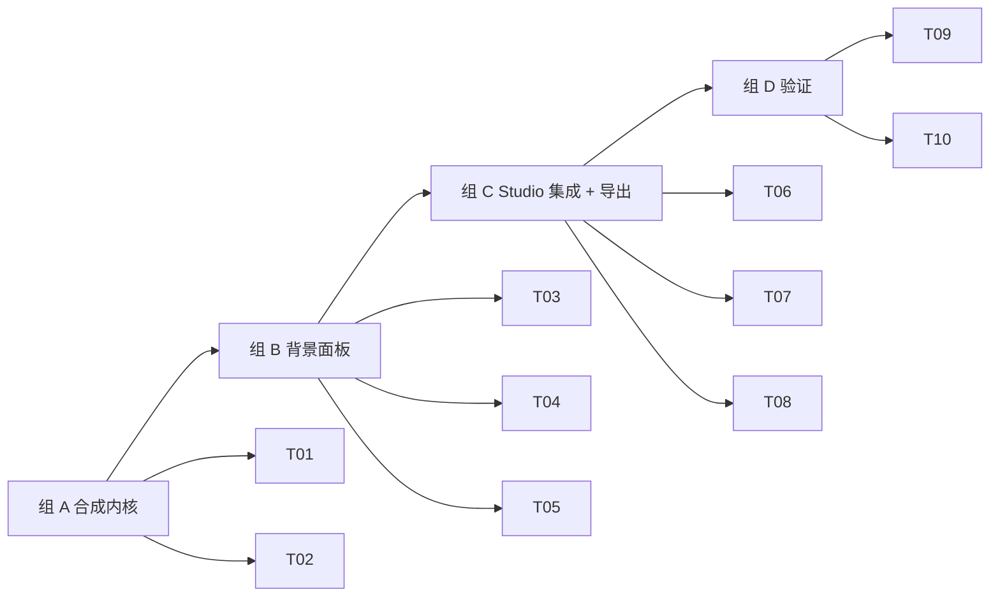

# M3 · 换底色 · 原子任务清单

> 目标：在 /studio 内增加「背景色」面板，用户能在 5 个预设色 / 自定义色 / 透明 之间实时切换，
> 性能 < 50ms / 切换；新增左右滑动对比预览；导出按钮升级为 PNG + JPG 双格式，
> 文件名遵循 PRD §5.8.4 规范。

依赖：[`PRD.md §5.3`](../PRD.md) · [`TECH_DESIGN.md §5.3`](../TECH_DESIGN.md) · [`DESIGN.md §5.2`](../DESIGN.md)

预估工时：0.5 周（4 个工作日，AI 助手节奏 1 天）

---

## 1. 任务依赖图

---

## 2. 任务清单

### 组 A · 合成内核（T01-T02）

#### M3-T01 · `composite()` 与抠出层缓存

- **位置**：`src/features/background/composite.ts`
- **DoD**：
  - `extractForeground(bitmap, mask) → ImageBitmap`：用 `destination-in` 把原图按 mask 抠出，得到一个 ImageBitmap（可被多次复用，免重复抠图）
  - `composite(foreground, w, h, bg) → ImageData | OffscreenCanvas`：把抠出层贴到背景上；`bg` 支持 `{kind: 'color', value: string}` 与 `{kind: 'transparent'}`
  - 纯函数 + 同步（不依赖 Worker）
  - 单元测试：透明色返回带 alpha 的图；纯色返回填充正确的图；前景像素位置不变
  - 在 happy-dom 测试环境用 canvas-2d polyfill 或者拆出纯函数 `compositeIntoImageData` 测试

#### M3-T02 · 背景 store（zustand slice）

- **位置**：`src/features/background/store.ts`
- **DoD**：
  - 状态字段：`currentColor: BgColor`（discriminated union: transparent / color），`recent: string[]`（最近使用，最多 8 个，去重）
  - actions：`setColor(BgColor)`，`addRecent(hex)`（去重 + LRU），`reset()`
  - persistence：`recent` 持久化到 `localStorage` key `pixfit.bg.recent`
  - 默认值：`{kind: 'transparent'}`
  - 单元测试：去重 / LRU / localStorage 读写（mock）

---

### 组 B · 背景面板（T03-T05）

#### M3-T03 · `ColorSwatch` 按钮组件

- **位置**：`src/features/background/color-swatch.tsx`
- **DoD**：
  - 圆形 36×36 色块；选中态加 emerald 双层环（`outline: 2px var(--color-primary)`）
  - 透明态用 checkerboard SVG 填充
  - keyboard：Enter / Space 触发
  - `aria-label` 带颜色名（i18n）
  - props：`color: BgColor | 'transparent'`，`selected: boolean`，`label: string`，`onClick`

#### M3-T04 · `BackgroundPanel` 主面板

- **位置**：`src/features/background/background-panel.tsx`
- **DoD**：
  - 5 个预设色（透明 / 标准白 / 标准蓝 #438EDB / 标准红 #D9342B / 浅灰 #F5F5F5）
  - HEX 输入框 + native `<input type="color">` 自定义色（输入合法 → addRecent + setColor）
  - 最近使用区：最多 8 个，倒序展示，空时显示 "无"
  - 三语 i18n：`Background.*` namespace
  - 切换色调用 store.setColor，触发 studio 重绘

#### M3-T05 · `BeforeAfterSlider` 对比预览

- **位置**：`src/features/background/before-after-slider.tsx`
- **DoD**：
  - 两个画布层叠（原图在底层、合成图在顶层），中间一条可拖动竖线
  - 拖动改变顶层 `clipPath: inset(0 X% 0 0)` 实现 wipe 效果
  - 支持键盘 ← / → 左右移动（1% step）
  - 默认 50% 位置
  - 移动端：触摸事件
  - 可被开关（默认关，开关在右侧面板）

---

### 组 C · Studio 集成 + 导出（T06-T08）

#### M3-T06 · Studio 顶栏 Tab 切换

- **位置**：`src/features/studio/studio-tabs.tsx`
- **DoD**：
  - 4 个 tab：背景 / 尺寸 / 排版 / 导出（仅"背景"和"导出"在 M3 可用，其余 disabled + tooltip "M4 / M6 即将上线"）
  - URL hash 或 zustand 控制当前 tab
  - keyboard ← / → 切换
  - 视觉：active tab 下划线 + 加粗

#### M3-T07 · `StudioWorkspace` 接入背景合成

- **修改**：`src/features/studio/studio-workspace.tsx`、`studio-preview.tsx`
- **DoD**：
  - `bitmap + mask` 抠图完成后，cache 一个 `foreground ImageBitmap`
  - `StudioPreview` 根据 `background-store.currentColor` 重画背景层 + 贴 foreground
  - 切换色仅触发画布重绘，不重新调推理；目标延迟 < 50ms（performance.mark 验证）
  - 当前 tab === '背景'：右侧渲染 `BackgroundPanel`
  - 当前 tab === '导出'：右侧渲染 `ExportPanel`（T08）

#### M3-T08 · `ExportPanel` 单张导出

- **位置**：`src/features/background/export-panel.tsx`
- **DoD**：
  - 三个按钮：PNG（保留透明 / 当前背景）、JPG（强制白底，质量 0.92）、复制到剪贴板
  - 文件名遵循 PRD §5.8.4：M3 阶段没有 photoSpec，用 `pixfit_{w}x{h}_{YYYYMMDD}.{ext}`
  - 显示当前文件预估大小（用 toBlob → size）
  - i18n: `Export.*`

---

### 组 D · 验证（T09-T10）

#### M3-T09 · 切换性能验证

- 在 `/dev/perf` 路由旁加一个 `/dev/bg-perf` 或直接复用 perf 工具：
  - 加载完抠图后，连续切换 10 次颜色，记录每次 raf 间隔
  - 上报 P50 / P95 切换时间
- DoD：P50 < 30ms，P95 < 50ms（与 TECH_DESIGN §5.3.3 一致）

#### M3-T10 · 文档收尾

- `docs/PLAN.md §1` 更新当前状态
- `docs/PLAN.md §3.2 M3` 勾交付物
- `docs/PLAN.md §6 决策日志` 增加：
  - 自定义色选择器选用 native `<input type="color">`（理由）
  - 抠出层缓存策略：`foreground` ImageBitmap 与 `mask` 同生命周期
- `docs/TODO.md` 更新

---

## 3. 任务状态

| ID  | 任务                           | 状态 | 完成日期   | 备注                                                  |
| --- | ------------------------------ | ---- | ---------- | ----------------------------------------------------- |
| T01 | `composite()` + 抠出层缓存     | [x]  | 2026-05-12 | 16 单测；纯函数 + canvas helper 拆分                  |
| T02 | 背景 store（zustand）          | [x]  | 2026-05-12 | 10 单测；LRU + localStorage 持久化                    |
| T03 | `ColorSwatch` 按钮组件         | [x]  | 2026-05-12 | 圆形 36×36 + 选中态 emerald 双环 + 透明 checkerboard  |
| T04 | `BackgroundPanel` 主面板       | [x]  | 2026-05-12 | 预设 + HEX/native picker + 最近 + 对比开关            |
| T05 | `BeforeAfterSlider` 对比预览   | [x]  | 2026-05-12 | pointer + 键盘 + 拇指 thumb，支持触摸                 |
| T06 | Studio 顶栏 Tab 切换           | [x]  | 2026-05-12 | 4 tab；Size/Layout 占位 + tooltip 提示"即将上线"      |
| T07 | `StudioWorkspace` 接入背景合成 | [x]  | 2026-05-12 | StudioPreview 重写为 foreground-cached 合成           |
| T08 | `ExportPanel` 单张导出         | [x]  | 2026-05-12 | PNG / JPG / Copy；文件名 `pixfit_{w}x{h}_{YYYYMMDD}`  |
| T09 | 切换性能验证                   | [x]  | 2026-05-12 | `/dev/bg-perf`；P50 8.3ms / P95 9.1ms（headless 148） |
| T10 | 文档收尾                       | [x]  | 2026-05-12 | PLAN §3/6/6.7/10 + 本表 + TODO 更新                   |

---

## 4. 完成后的动作

1. 把 `docs/TODO.md §3` M3 段勾掉
2. 在 `docs/PLAN.md`：
   - 总览表 M3 状态 → ✅
   - §3.2 M3 段补「实际工时 / 调整记录」
   - §6 决策日志增加：自定义色选择器、抠出层缓存策略
3. 启动 M4（照片规格 + 智能裁剪）的 task 文档撰写
