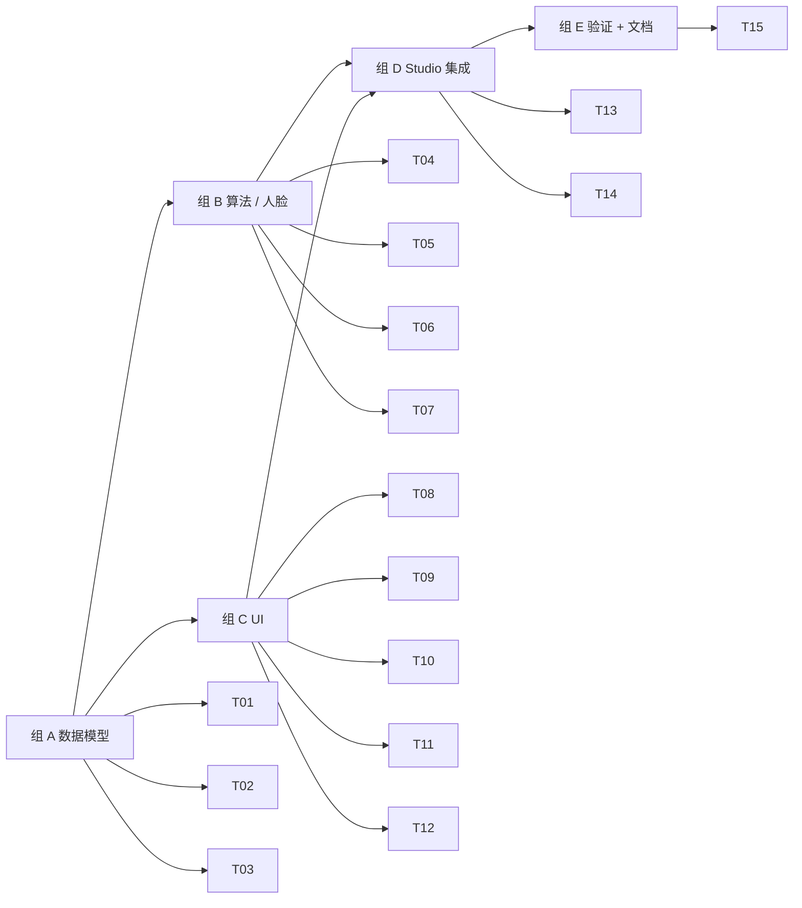

# M4 · 照片规格 + 智能裁剪 · 原子任务清单

> 目标：让用户在 /studio 选一个内置规格（28 条，PRD §9.1.3）→ 裁剪框按比例自动出现 → MediaPipe 检测人脸 → 头部自动居中 → 偏离规则给出警告；同时把 M3 导出文件名接入 `spec.id` 命名规范。

依赖：[`PRD.md §5.4 / §9.1 / §9.2`](../PRD.md) · [`TECH_DESIGN.md §5.4 / §5.7`](../TECH_DESIGN.md) · [`DESIGN.md §5.2`](../DESIGN.md)

预估工时：1.5 周（AI 助手节奏 1 天，但 MediaPipe 资源 + UI 拖拽量较大）。

---

## 1. 任务依赖图

---

## 2. 任务清单

### 组 A · 数据模型（T01-T03）

#### M4-T01 · `types/spec.ts` + zod schema + helper

- **位置**：`src/types/spec.ts`、`src/lib/spec-units.ts`
- **DoD**：
  - `PhotoSpec` / `PaperSpec` / `LayoutTemplate` / `Cell` 类型与 PRD §9 一致
  - zod schema：`PhotoSpecSchema` / `PaperSpecSchema` / `LayoutTemplateSchema`（仅 PhotoSpec / PaperSpec 在 M4 落地，LayoutTemplate 留到 M6）
  - helper：`mmToPx(mm, dpi)` / `pxToMm(px, dpi)` / `derivePixels(spec)`（缺 width_px/height_px 时由 mm+dpi 派生）
  - 单测：mm↔px 双向，舍入策略一致；zod 拒绝缺字段 / 负值；派生策略 idempotent

#### M4-T02 · 内置 `data/photo-specs.ts`（28 条）

- **位置**：`src/data/photo-specs.ts`
- **DoD**：
  - 28 条规格：中国证件 7 + 中国相纸 2 + 通行证 2 + 签证 14 + 考试 3
  - 每条包含 `id / builtin: true / category / region / name(3 lang) / width_mm / height_mm / dpi`
  - 签证条目带 `background.recommended`（PRD §9.1.3 大部分白底）
  - 考试条目带 `fileRules.maxKB` 与 `pixelRange`
  - 用 zod 在测试时跑一遍，确保格式合法
  - 单测：id 全局唯一、count = 28（允许小幅差异 ±1）、每个 category 至少 1 条

#### M4-T03 · 内置 `data/paper-specs.ts`（7 条）

- **位置**：`src/data/paper-specs.ts`
- **DoD**：
  - 7 条相纸：3R / 4R / 5R / 6R / 8R / A4 / A5（PRD §5.5.2）
  - 通过 zod；单测：id 全局唯一、count = 7

### 组 B · 算法 + 人脸检测（T04-T07）

#### M4-T04 · MediaPipe Tasks Vision 接入 + 资源策略

- **位置**：`src/features/crop/mediapipe-loader.ts`、`scripts/fetch-face-model.mjs`、`docs/DEPLOYMENT.md` 补段
- **DoD**：
  - `pnpm add @mediapipe/tasks-vision`
  - `loadFaceDetector()`：`FilesetResolver.forVisionTasks(MEDIAPIPE_WASM_BASE)` + `FaceDetector.createFromOptions(...)`
  - WASM 资源默认走 jsdelivr CDN（`https://cdn.jsdelivr.net/npm/@mediapipe/tasks-vision@x.x.x/wasm`，与 ORT 同策略）
  - 模型 `blaze_face_short_range.tflite`：脚本下载到 `public/_models/`，与 ORT 同 SHA-384 校验范式（暂不实现 integrity 强校验，先记 sha 到注释）
  - ENV：`NEXT_PUBLIC_MEDIAPIPE_BASE_URL`、`NEXT_PUBLIC_FACE_MODEL_URL`
  - 不在主 bundle 加载；只在 `face-detect.ts` 内 dynamic import

#### M4-T05 · `face-detect.ts` wrapper

- **位置**：`src/features/crop/face-detect.ts`、`face-detect.test.ts`
- **DoD**：
  - `detectFace(bitmap): Promise<FaceDetection | null>`：单次检测，返回 bbox + 6 个关键点
  - 单例 `FaceDetector` 引用计数 + lazy init（同抠图模型策略）
  - 错误分类（model-fetch / runtime / no-face）→ 复用 `Segmentation.errors` namespace？不，新建 `Crop.errors`
  - 单测：mock `FaceDetector.detect` → 返回 valid / empty 结果
  - DoD：≥ 5 单测

#### M4-T06 · `auto-center.ts` 算法

- **位置**：`src/features/crop/auto-center.ts`、`auto-center.test.ts`
- **DoD**：
  - 纯函数 `autoCenter(imgW, imgH, spec, face): CropFrame`，签名见 TECH_DESIGN §5.4.2
  - 输出 `{ x, y, w, h }` 永远完整落在图像内（`clampToImage`）
  - 当 face=null 时退化为按规格比例居中裁全图（fallback）
  - 单测矩阵：
    - 横/竖照、不同 spec、face 在中心 / 偏左 / 偏右下、face 大 / face 小
    - 至少 8 条断言

#### M4-T07 · 合规检查 `compliance.ts`

- **位置**：`src/features/crop/compliance.ts`、`compliance.test.ts`
- **DoD**：
  - `checkCompliance(frame, face, spec): { warnings: ComplianceWarning[] }`
  - `ComplianceWarning` 类型：`{ code: 'head-too-small'|'head-too-large'|'eye-too-high'|'eye-too-low'|'face-not-found'; severity: 'warn'|'error' }`
  - 单测覆盖每条 code 至少 1 个 case

### 组 C · UI（T08-T12）

#### M4-T08 · Spec store（zustand）

- **位置**：`src/features/crop/spec-store.ts`
- **DoD**：
  - state：`activeSpec: PhotoSpec | null`、`frame: CropFrame | null`、`faceDetection: FaceDetection | null`、`warnings: ComplianceWarning[]`
  - actions：`setSpec`、`setFrame`、`setFace`、`setWarnings`、`reset`
  - selector friendly（单字段）
  - 单测：基础 setter / reset

#### M4-T09 · `SpecPicker` 面板

- **位置**：`src/features/crop/spec-picker.tsx`
- **DoD**：
  - category chips（中/通行证/签证/考试/相纸）使用 horizontal scrollable 切换
  - 列表项含 `RegionFlag`（已有组件）+ spec 名称（i18n）+ 尺寸副标题
  - 选中态高亮 emerald；选择即 `setSpec`
  - 上方搜索框（按 spec.name 模糊匹配，i18n locale-aware）
  - i18n key 添加：`Crop.categories.*`、`Crop.search` 等

#### M4-T10 · `CropFrame` 组件

- **位置**：`src/features/crop/crop-frame.tsx`
- **DoD**：
  - 在主画布上覆盖一个可拖拽 / 8 个角与边把手 / 比例锁定的矩形
  - 拖动 / 缩放 throttled by `requestAnimationFrame`
  - 不可超出图像边界（clampToImage）
  - 键盘：方向键移动（1 px / shift+10 px），R 键复位居中
  - 视觉：透过黑色蒙版 + emerald 边框 + 把手
  - 操作即更新 `spec-store.frame`

#### M4-T11 · 参考线 overlay

- **位置**：`src/features/crop/guidelines.tsx`
- **DoD**：
  - SVG / canvas overlay：3 条横线（头顶 / 眼线 / 下颌），位置由 `spec.composition` 派生
  - 当 `frame` 或 `face` 更新时跟着移动
  - 颜色：emerald 半透明（不抢戏）
  - 可被开关（默认开），开关存 spec-store

#### M4-T12 · 合规警告 UI

- **位置**：`src/features/crop/compliance-banner.tsx`
- **DoD**：
  - 当 `warnings.length > 0` 时显示一条黄色/红色横幅（severity 决定）
  - i18n：`Crop.warnings.head-too-small` 等
  - 多警告时合并展示前 2 条 + "more N"

### 组 D · Studio 集成（T13-T14）

#### M4-T13 · `studio-tabs` 解锁 size + Studio 接入

- **修改**：`studio-tabs.tsx`、`studio-workspace.tsx`、`studio-preview.tsx`
- **DoD**：
  - "尺寸" tab 解锁，"排版" 仍 disabled
  - tab === 'size'：右侧渲染 `SpecPicker`；主画布渲染 `<StudioPreview>` + `<CropFrame>` + `<Guidelines>` overlay
  - 切到背景 tab 时保留裁剪框（visually fade，不抢戏）

#### M4-T14 · 端到端工作流串联

- **DoD**：
  - 用户选 spec → spec-store 触发 face-detect（如未检测过）→ 拿到 face → autoCenter → setFrame
  - 用户拖动 frame → checkCompliance → setWarnings → ComplianceBanner 跟着更新
  - 选 spec 后，如果 `spec.background.recommended` 存在且当前背景是 transparent → 自动 setColor（onboarding，弹一条 toast 提示"已为你套用建议背景"）
  - M3 ExportPanel 的文件名 prefix 改为 `spec.id`：`{spec.id}_{w}x{h}_{date}.{ext}`，无 spec 时 fallback 到 `pixfit`

### 组 E · 验证 + 文档（T15）

#### M4-T15 · 验证 + 文档收尾

- **DoD**：
  - `pnpm i18n:check` / `lint` / `typecheck` / `test` / `build` 全部绿
  - `docs/PLAN.md` §1 / §3.2 M4 / §6 决策日志（MediaPipe 资源策略、CropFrame 拖拽实现选型）/ §10 变更记录
  - `docs/TODO.md` 增 M4 完成栏 + 真机测试项
  - `docs/tasks/M4.md` 进度表全勾

---

## 3. 任务状态

| ID  | 任务                                   | 状态 | 完成日期   | 备注                               |
| --- | -------------------------------------- | ---- | ---------- | ---------------------------------- |
| T01 | `types/spec.ts` + zod + helper         | [x]  | 2026-05-12 | 8 个单测                           |
| T02 | `data/photo-specs.ts` 28 条            | [x]  | 2026-05-12 | 28 条；含签证 / 通行证 / 考试      |
| T03 | `data/paper-specs.ts` 7 条             | [x]  | 2026-05-12 | 3R / 4R / 5R / 6R / 8R / A4 / A5   |
| T04 | MediaPipe Tasks Vision 接入 + 资源策略 | [x]  | 2026-05-12 | 0.10.35；jsdelivr WASM + GCS 模型  |
| T05 | `face-detect.ts` wrapper               | [x]  | 2026-05-12 | 6 个单测；error 三态               |
| T06 | `auto-center.ts` 算法                  | [x]  | 2026-05-12 | 14 个单测；多 spec/face 位置       |
| T07 | 合规检查 `compliance.ts`               | [x]  | 2026-05-12 | 8 个单测；4 类警告码               |
| T08 | Spec store（zustand）                  | [x]  | 2026-05-12 |                                    |
| T09 | `SpecPicker` 面板                      | [x]  | 2026-05-12 | 类别 chip + 搜索 + 国旗            |
| T10 | `CropFrame` 组件                       | [x]  | 2026-05-12 | move + 4 corner resize + arrow key |
| T11 | 参考线 overlay                         | [x]  | 2026-05-12 | SVG headTop / eye / chin           |
| T12 | 合规警告 UI                            | [x]  | 2026-05-12 | Detecting / failed / warnings      |
| T13 | `studio-tabs` 解锁 size + Studio 接入  | [x]  | 2026-05-12 | size tab 解锁                      |
| T14 | 端到端工作流串联                       | [x]  | 2026-05-12 | useCropFlow + bg 联动 + 导出文件名 |
| T15 | 验证 + 文档收尾                        | [x]  | 2026-05-12 | 165 tests / build / lint 全绿      |

---

## 4. 完成后的动作

1. 把 `docs/TODO.md §4` M4 段从 in-progress 转 ✅
2. `docs/PLAN.md`：
   - 总览表 M4 状态 → ✅
   - §3.2 M4 段补「实际工时 / 调整记录」
   - §6 决策日志增加：MediaPipe 资源策略；CropFrame 拖拽实现选型
3. 启动 M5（导出 + 压缩）的 task 文档撰写
