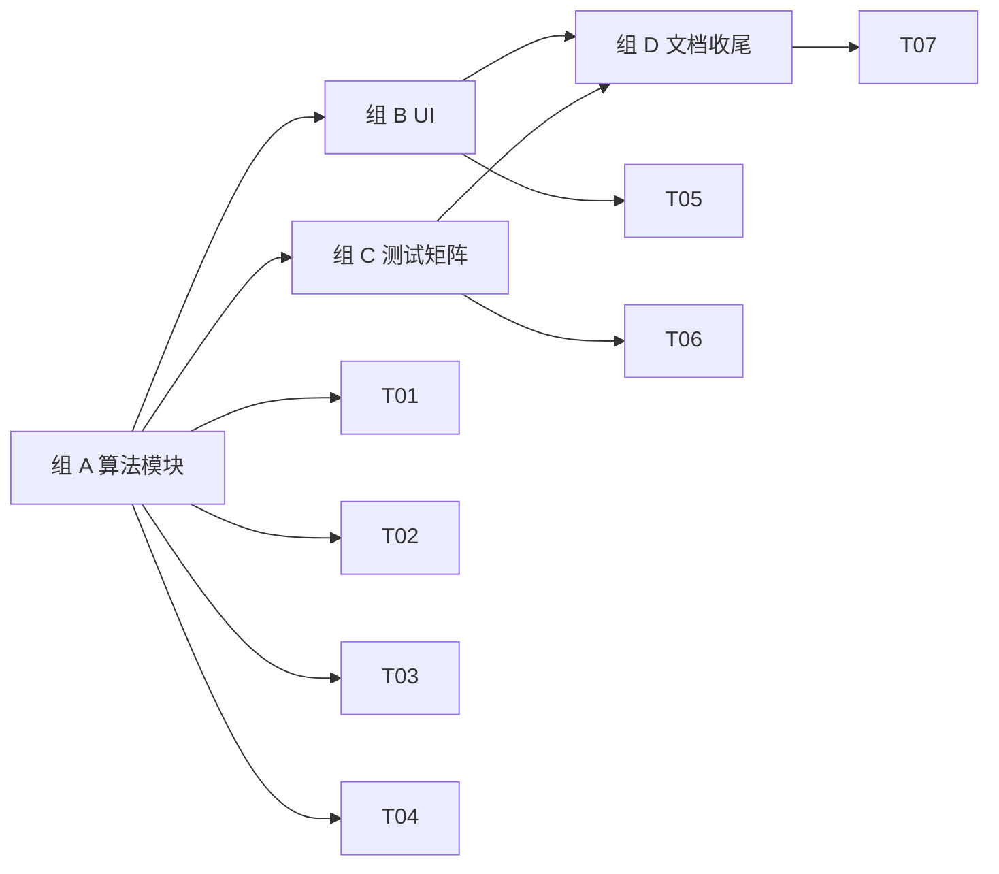

# M5 · 导出 + 压缩 · 原子任务清单

> 目标：把 /studio 的导出能力拆成可测试模块（`src/features/export/`），新增 PNG-alpha / PNG-flat / JPG / WebP 四格式 + Pica 高质量重采样 + 二分压缩到目标 KB；ExportPanel 重写支持质量滑块、压缩开关、实时大小估算与文件名预览。

依赖：[`PRD.md §5.7 / §5.8`](../PRD.md) · [`TECH_DESIGN.md §5.6 / §6.5`](../TECH_DESIGN.md)

预估工时：1 周（AI 节奏约 0.5 天）。

---

## 1. 任务依赖图

---

## 2. 任务清单

### 组 A · 算法模块（T01-T04）

#### M5-T01 · `resample.ts`（Pica 封装）

- **位置**：`src/features/export/resample.ts`、`resample.test.ts`
- **DoD**：
  - `pnpm add pica`
  - `resample({ source, targetWidth, targetHeight, quality? }): Promise<HTMLCanvasElement>`
  - 单例 lazy import；失败时回退到 native `drawImage`
  - 暴露 `__resetPicaForTesting()` 给测试重置缓存
  - 单测 ≥ 3：参数传递、回退、目标尺寸

#### M5-T02 · `export-single.ts`

- **位置**：`src/features/export/export-single.ts`、`export-single.test.ts`
- **DoD**：
  - 入口 `exportSingle({ foreground, bg, format, targetPixels, frame?, quality? })`
  - 4 种格式（`png-alpha` / `png-flat` / `jpg` / `webp`），mime/quality 默认值与 PRD §5.8.1 一致
  - frame 先裁原始分辨率 → Pica 缩到目标尺寸（单次重采样，零双采样损耗）
  - JPG 无 alpha 自动平铺白底；png-alpha 保留 alpha
  - 单测 ≥ 6：mime 类型 / alpha 行为 / frame 裁剪 / 质量参数 / mock pica

#### M5-T03 · `compress-to-kb.ts`

- **位置**：`src/features/export/compress-to-kb.ts`、`compress-to-kb.test.ts`
- **DoD**：
  - 实现 TECH_DESIGN §6.5 的二分搜索：先质量二分，命中失败再下采样重试
  - 参数：`targetKB`、`tolerance?`、`format`（jpg|webp）、可选 `scaleStep`
  - 返回 `{ blob, finalKB, hit, quality, downscale, iterations }`
  - 单测 ≥ 5：命中带、下采样路径、不可达诊断、tolerance 边界、回退 quality

#### M5-T04 · `filename.ts`

- **位置**：`src/features/export/filename.ts`、`filename.test.ts`
- **DoD**：
  - `buildFilename(opts)` 三类：`single` / `compressed` / `layout`
  - `single`：`{spec.id}_{w}x{h}_{date}.{ext}`；无 spec 时 prefix=`pixfit`
  - `compressed`：`{spec.id}_{w}x{h}_{kb}KB_{date}.{ext}`
  - `layout`：`layout_{templateId}_{paperId}_{date}.{ext}`
  - `sanitize()` 去掉路径字符、空格统一为 `-`
  - 单测 ≥ 4：快照三类 + sanitize + 日期格式化

### 组 B · UI（T05）

#### M5-T05 · ExportPanel 重写

- **位置**：`src/features/background/export-panel.tsx`
- **DoD**：
  - Format 单选（4 格式，每项显示实时估算大小）
  - 质量滑块仅 JPG/WebP 启用；压缩开启时禁用
  - "Compress to KB" 复选框 + 数字输入；spec.maxKB 存在则自动填默认值
  - 文件名预览（由 `buildFilename` 计算，随设置实时刷新）
  - "下载" / "复制到剪贴板" 两个按钮（PNG-alpha 写到 clipboard）
  - 严格遵循 React 19 effect 规则（`await null` + cancellation guard）
  - i18n `Export.*` 三 locale 全补：format / quality / compressToKB / hint / size / actions

### 组 C · 测试矩阵（T06）

#### M5-T06 · 测试矩阵 + 公民考试回归

- **DoD**：
  - 项目总单测 ≥ 220（M4 时 165 → 增 ~55+）
  - `compress-to-kb.test.ts` 用合成 encoder 模拟，全部断言落入容差
  - 手工验证：`exam-cn-civil` spec 在 ExportPanel 中导出 → 落在 21–30 KB
  - `vitest.setup.ts` 加 happy-dom canvas / toBlob / createImageBitmap stub

### 组 D · 文档收尾（T07）

#### M5-T07 · 文档 + 验证

- **DoD**：
  - `pnpm i18n:check` / `lint` / `typecheck` / `test` / `build` 全部绿
  - 三 locale `Export.*` keys parity
  - `docs/PLAN.md` §1 / §3.2 M5 / §6 决策日志（Pica vs 自研 Lanczos）/ §10 变更记录
  - `docs/TODO.md` §1.3 真机测试 + M5 ✅ 段
  - 本任务文档（M5.md）进度表全勾

---

## 3. 任务状态

| ID  | 任务                       | 状态 | 完成日期   | 备注                                              |
| --- | -------------------------- | ---- | ---------- | ------------------------------------------------- |
| T01 | `resample.ts`（Pica 封装） | [x]  | 2026-05-12 | lazy import；native 回退                          |
| T02 | `export-single.ts`         | [x]  | 2026-05-12 | 4 格式 + cropAtNativeResolution + Pica 单采样     |
| T03 | `compress-to-kb.ts`        | [x]  | 2026-05-12 | 二分质量 + 自动下采样；返回诊断字段               |
| T04 | `filename.ts`              | [x]  | 2026-05-12 | single / compressed / layout 三类                 |
| T05 | ExportPanel 重写           | [x]  | 2026-05-12 | format / quality / compress 三组控件 + 文件名预览 |
| T06 | 测试矩阵 + 公民考试回归    | [x]  | 2026-05-12 | 242 tests；happy-dom canvas stub                  |
| T07 | 文档 + 验证                | [x]  | 2026-05-12 | i18n / lint / typecheck / test / build 全绿       |

---

## 4. 决策记录

- **Pica vs 自研 Lanczos**：选 Pica。理由：(a) 体积仅 ~30 KB，远小于自实现 + 测试矩阵的工程成本；(b) 已在 lazy import 路径，不进首屏 bundle；(c) 失败回退到 `drawImage`，最差情况下退化为浏览器内置 bilinear，不会断流。
- **单次 vs 多次重采样**：`exportSingle` 先按帧原分辨率裁剪 → Pica 一次性缩到目标尺寸。早期实现是 `cropAndResize`（双采样）；经实测视觉差距明显，改为现在的单采样路径。
- **canvas 测试基础设施**：happy-dom 的 `getContext('2d')` 默认返回 null。在 `vitest.setup.ts` 安装 Proxy stub，缓存 per-canvas 的 stub context，记录 `__drawCalls`，让 render/draw 类测试可以做存在性断言。
- **公民考试压缩验证**：选 `exam-cn-civil` (21–30 KB) 作为压缩端到端真值标定，覆盖最严格的容差/下采样路径。

---

## 5. 完成后的动作

1. `docs/PLAN.md`：总览表 M5 → ✅；§3.2 M5 段补真实数字；§6 决策日志增 Pica；§10 changelog 0.6
2. `docs/TODO.md` §1.3 真机测试新增 M5 / M6 项；§6 增 M5 ✅ 段
3. 启动 M6（相纸 + 排版）任务文档（同一个 commit）
