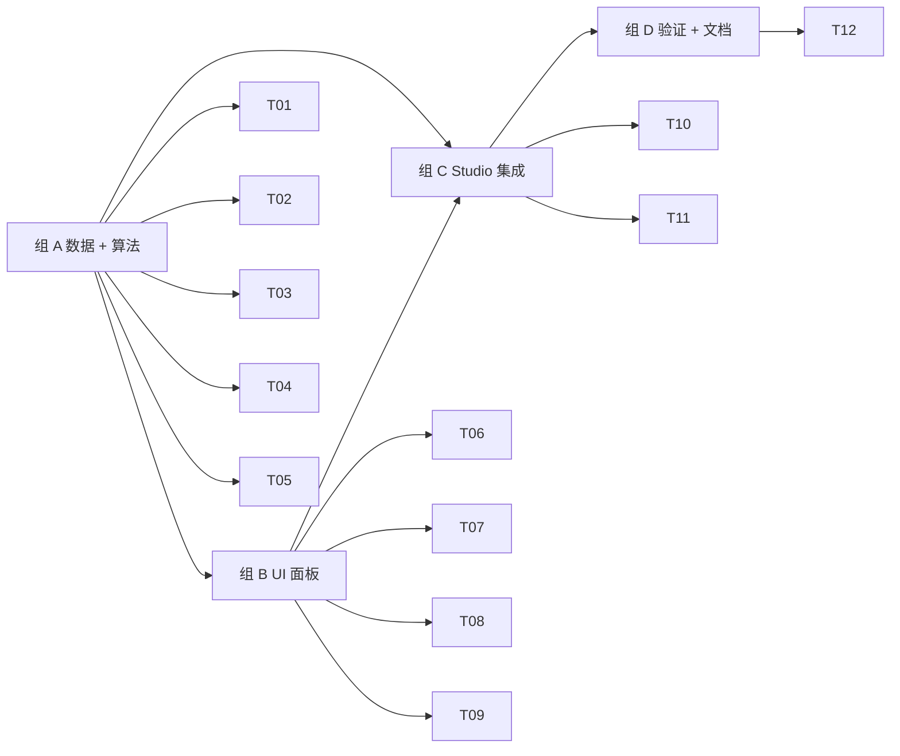

# M6 · 相纸 + 排版 · 原子任务清单

> 目标：让用户在 /studio 选相纸 (3R / 4R / 5R / 6R / 8R / A4 / A5) → 选拼版方案 (12 条内置) → 实时预览拼版结果（含分隔线 / 裁切标记） → 一键下载 PNG (位图) 或 PDF (jsPDF 矢量) → 文件名走 `buildFilename({ kind: 'layout' })`。

依赖：[`PRD.md §5.5 / §5.6 / §9.3`](../PRD.md) · [`TECH_DESIGN.md §5.5 / §6.4`](../TECH_DESIGN.md) · 已有 M5 `export-single` + `filename`

预估工时：1.5 周（AI 节奏约 1 天）。

---

## 1. 任务依赖图

---

## 2. 任务清单

### 组 A · 数据 + 算法（T01-T05）

#### M6-T01 · `data/layout-templates.ts`（≥ 12 条）

- **位置**：`src/data/layout-templates.ts`、`layout-templates.test.ts`
- **DoD**：
  - 12 条内置模板覆盖 PRD §5.6.2：5R 系（8×1 寸 / 9×身份证 / 4×护照 / 4×大 2 寸 / 1+2 混排 A / 小皮夹 ×2）+ 6R 系（16×1 寸 / 8×2 寸 / 1+2 混排 B / 1+2 混排 C / 大皮夹 ×2）+ A4 (1 寸最大化)
  - helper：`getLayoutTemplate(id)` / `getLayoutTemplatesForPaper(paperId)`
  - 单测 ≥ 7：≥12 条 / id 唯一 / zod 通过 / 每个 paperId 解析得到 / 每个 photoSpecId 解析得到 / 数量为正 / 每个 paper 至少 1 个 / 混排模板正确

#### M6-T02 · `auto-grid.ts`

- **位置**：`src/features/layout/auto-grid.ts`、`auto-grid.test.ts`
- **DoD**：
  - `packAutoGrid(paper, photo, count, options): GridFit`：枚举旋转 0/90，挑数量最多 + 最少留白的方案
  - `gridCells(fit, paper, photo, count, options): Cell[]`：materialize 坐标，含 rotation 字段
  - `gridCellsToCapacity(paper, photo, options): { capacity, fit }`：仅算容量
  - 单测 ≥ 8：5R 1 寸 / 5R ID 卡 / 6R 2 寸 / A4 1 寸 / 旋转优势 / margin/gap 失败 / count > capacity / 边界舍入

#### M6-T03 · `pack-mixed.ts`

- **位置**：`src/features/layout/pack-mixed.ts`、`pack-mixed.test.ts`
- **DoD**：
  - `packMixed(paper, items, options): MixedResult`：按面积排序、贪心 strip，逐项调 `packAutoGrid`，无法放下则记 overflow
  - `resolveLayoutCells(paper, items, options)`：单元素自动 fallback `packAutoGrid`，多元素走 `packMixed`
  - 单测 ≥ 4：2 项 / 3 项 / overflow / 旋转

#### M6-T04 · `cut-guides.ts` + `render-layout.ts`

- **位置**：`src/features/layout/cut-guides.ts`、`render-layout.ts`、`render-layout.test.ts`
- **DoD**：
  - `drawSeparator(ctx, x_mm, y_mm, w_mm, h_mm, dpi)`：cell 周围 1 px 虚线
  - `drawCutGuides(ctx, paper, placed, dpi)`：纸张 4 角 + cell 角的 tick
  - `drawPdfCutGuides(doc, placed)`：jsPDF 等价物（mm 单位）
  - `renderLayout({ paper, template, getSpec, getCellImage, settingsOverride?, dpi? }) → { canvas, placed, overflow }`
  - DPI override 必须重新计算 width_px/height_px（preview 走 150 DPI）
  - 单测 ≥ 4：canvas 尺寸 / 数量 / DPI override / 占位符 + 真实图像

#### M6-T05 · `export-pdf.ts`

- **位置**：`src/features/layout/export-pdf.ts`
- **DoD**：
  - `pnpm add jspdf`
  - `exportLayoutPdf({ paper, template, getSpec, getCellImageDataUrl, settingsOverride? }) → { blob, placedCount, overflow }`
  - 纸张尺寸用 mm；图像 `addImage(dataUrl, ...)`；分隔线 + 裁切标记走矢量 stroke
  - jsPDF 动态 import；不进首屏 bundle

### 组 B · UI 面板（T06-T09）

#### M6-T06 · 布局 store + PaperPicker

- **位置**：`src/features/layout/store.ts`、`paper-picker.tsx`
- **DoD**：
  - zustand store：`paper`、`template`、`settings`（含 margin / gap / showSeparator / showCutGuides / backgroundColor）
  - `setTemplate` 把 settings 重置为模板的默认值
  - `PaperPicker`：7 张相纸卡片，按比例显示缩略矩形 + mm 标签 + 选中态高亮
  - 新增 `lib/i18n-text.ts` 把 `zh-Hans` → `zh` 映射，专门给 I18nText payload 用

#### M6-T07 · LayoutTemplatePicker

- **位置**：`src/features/layout/layout-template-picker.tsx`
- **DoD**：
  - 列出当前 paper 兼容的模板
  - 当前 template 不属于新选的 paper 时，自动切到该 paper 的第一个模板（`await null` + cancellation guard）
  - 显示 template.name (locale-aware) + 总照片数

#### M6-T08 · MixedEditor

- **位置**：`src/features/layout/mixed-editor.tsx`
- **DoD**：
  - 列出当前 template 的 items，按行编辑：spec 选择 / 数量 ±1 / 删除
  - 编辑即把 template clone 成 `custom-mix-{paperId}` 自定义模板（不污染内置数据）
  - 同 spec 重复选择时合并数量
  - 至少 1 条规格 ≥ 1 时才提交，避免空模板

#### M6-T09 · LayoutSettings + LayoutActions

- **位置**：`src/features/layout/layout-settings.tsx`、`layout-actions.tsx`、`layout-panel.tsx`
- **DoD**：
  - LayoutSettings：margin / gap range（0–20 mm）+ separator / cut-guides toggle + 背景色 picker
  - LayoutActions：下载 PNG + PDF 两个按钮；文件名预览经 `buildFilename({ kind: 'layout' })`
  - LayoutPanel：组合 PaperPicker / LayoutTemplatePicker / MixedEditor / LayoutSettings / LayoutActions

### 组 C · Studio 集成（T10-T11）

#### M6-T10 · 解锁 layout tab + LayoutPreview

- **位置**：`src/features/studio/studio-tabs.tsx`、`src/features/layout/layout-preview.tsx`
- **DoD**：
  - `studio-tabs.tsx` 把 `layout` 设为 `available: true`
  - `LayoutPreview`：根据当前 paper / template / settings + 用户上传的照片 + 当前裁剪规格 → 调 `renderLayout` 在 150 DPI 预览
  - 单元图片策略：active cropSpec 用真实 cropFrame；其他 spec 用 `centerCrop` 兜底
  - overflow 列表用 inline warning 横幅展示

#### M6-T11 · studio-workspace 接入

- **位置**：`src/features/studio/studio-workspace.tsx`
- **DoD**：
  - `tab === 'layout'` 时主画布换成 `<LayoutPreview>`、右侧侧栏换成 `<LayoutPanel>`
  - bg / cropSpec / cropFrame 通过 props 传入，layout 始终读最新值

### 组 D · 验证 + 文档（T12）

#### M6-T12 · 验证 + 文档收尾

- **DoD**：
  - 单测总数 ≥ 240（M5 之后 ~220 + 本里程碑 ~25）
  - `pnpm i18n:check` 三 locale parity（Layout._ + Paper._ 全补）
  - `pnpm lint` / `typecheck` / `test` / `build` / 三 locale dev 200
  - `docs/PLAN.md` §1 / §3.2 M6 / §6 决策日志（jsPDF vs pdf-lib；auto-grid vs 手动；layout 内嵌 /studio）/ §10 0.6 段
  - `docs/TODO.md` §1.3 真机测试新增 PDF 校验项；§7 增 M6 ✅ 段
  - 本任务文档（M6.md）进度表全勾

---

## 3. 任务状态

| ID  | 任务                                 | 状态 | 完成日期   | 备注                                              |
| --- | ------------------------------------ | ---- | ---------- | ------------------------------------------------- |
| T01 | `data/layout-templates.ts` ≥ 12 条   | [x]  | 2026-05-12 | 12 条；含混排 A/B/C + A4 fallback                 |
| T02 | `auto-grid.ts`                       | [x]  | 2026-05-12 | rotation/capacity；≥ 11 case 断言                 |
| T03 | `pack-mixed.ts`                      | [x]  | 2026-05-12 | 贪心 strip + overflow                             |
| T04 | `cut-guides.ts` + `render-layout.ts` | [x]  | 2026-05-12 | DPI override 强制 derivePixels 重算               |
| T05 | `export-pdf.ts` (jsPDF)              | [x]  | 2026-05-12 | dynamic import；不入首屏 bundle                   |
| T06 | store + PaperPicker                  | [x]  | 2026-05-12 | 含 `localizeText` 修复 zh-Hans → zh 映射          |
| T07 | LayoutTemplatePicker                 | [x]  | 2026-05-12 | paper 切换时自动选首个兼容模板                    |
| T08 | MixedEditor                          | [x]  | 2026-05-12 | clone 成 `custom-mix-{paperId}`，不污染内置数据   |
| T09 | LayoutSettings + LayoutActions       | [x]  | 2026-05-12 | PNG + PDF 两个下载入口，文件名走 buildFilename    |
| T10 | 解锁 tab + LayoutPreview             | [x]  | 2026-05-12 | 150 DPI preview；centerCrop fallback              |
| T11 | studio-workspace 接入                | [x]  | 2026-05-12 | bg/spec/frame props 透传                          |
| T12 | 验证 + 文档收尾                      | [x]  | 2026-05-12 | 242 tests / build / lint / 三 locale dev 200 全绿 |

---

## 4. 决策记录

- **jsPDF vs pdf-lib**：选 jsPDF。理由：(a) jsPDF 自带 `addImage` API（已经接收 dataURL），最少胶水代码；(b) 体积可 dynamic import 隔离；(c) pdf-lib 强项是 form-fill，对纯图像 pagination 优势不大。
- **auto-grid vs 手动定位**：M6 只做 `arrangement: 'auto-grid'` 路径；`'manual'` 留给后续，但接口已经在 `LayoutTemplate` schema 里预留，`renderLayout` / `exportLayoutPdf` 都已经分支处理 `manual.cells` 路径。
- **layout 内嵌 /studio vs 新建 /print**：选内嵌。用户上传一次照片后流转到不同 tab（背景 → 尺寸 → 排版 → 导出）认知开销最小；如果未来要离线打印批处理再独立 /print 路由。
- **DPI override 必须 reset px**：`PaperSpec` 自带 `width_px` / `height_px`（300 DPI 预计算），preview 走 150 DPI 时必须丢掉这些字段让 `derivePixels` 重算；否则画布永远会渲染到 300 DPI 实际像素，浏览器很卡。
- **i18n 字段映射**：`I18nText` 用 `zh` / `zh-Hant` / `en` 三键，但 next-intl locale 是 `zh-Hans` / `zh-Hant` / `en`。M4 直接 `name[locale]` 在 `zh-Hans` 下永远落到 `en`。新建 `lib/i18n-text.ts` 集中处理这个映射。
- **混排单元图片策略**：当前 cropSpec 用用户精确 frame；其他 spec 走 `centerCrop` 兜底，不让用户在每个 spec 上重复手工裁。后续可加"全局 face detection 一次、每 spec 复用"，但 M6 范围内 centerCrop 已经达标。

---

## 5. 完成后的动作

1. `docs/PLAN.md`：总览表 M6 → ✅；§3.2 M6 补真实数字；§6 决策日志增 jsPDF / auto-grid / DPI；§10 changelog 0.6
2. `docs/TODO.md` §7 增 M6 ✅ 段；§1.3 真机测试新增 PDF / 拼版正确性 / 裁切标记三项
3. M5 + M6 一次性合并到主分支（同一个 commit）
4. M7 占位：`/specs` 路由与自定义规格管理预留给另一名 agent
