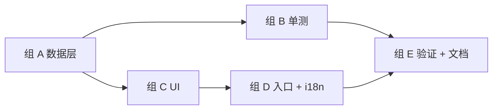

# M7 · 规格管理 · 原子任务清单

> 目标：让用户自定义 PhotoSpec / PaperSpec / LayoutTemplate（CRUD + localStorage 持久化 + JSON 导入导出 + 反向校验），构建一个 `/specs` 页面统一管理。内置规格只读，可"复制为自定义"派生用户副本。

依赖：[`PRD.md §5.7 / §9.4`](../PRD.md) · [`TECH_DESIGN.md §5.7`](../TECH_DESIGN.md)

预估工时：0.5 周（数据层 + 单测 + 单页 UI）。

---

## 1. 任务依赖图

---

## 2. 任务清单

### 组 A · 数据层（T01-T04）

#### M7-T01 · `schema.ts` + `storage.ts`

- **位置**：`src/features/spec-manager/schema.ts`、`storage.ts`
- **DoD**：
  - `SpecsV1Schema` zod，`{ version: 1, photoSpecs, paperSpecs, layoutTemplates }`，PRD §9.4.1 一致
  - `SPECS_STORAGE_KEY = 'pixfit:specs:v1'`
  - `loadSpecs()` 容错：缺 key / corrupt JSON / 版本不匹配 / schema 失败 → 全部回退 `makeEmptySpecsV1()`，且 `console.warn`
  - `saveSpecs()` 写入前再次过 `safeParse`，拒绝非法 payload
  - `clearSpecs()` 测试 + 真实流程都能复位

#### M7-T02 · `merge.ts`

- **位置**：`src/features/spec-manager/merge.ts`
- **DoD**：
  - `mergeById(builtins, user)` 纯函数：用户同 id 项原地替换内置项，全新 id 追加到末尾
  - 同时导出 `mergePhotoSpecs / mergePaperSpecs / mergeLayoutTemplates` 三个语义包装
  - 内置项的 `builtin: true` 不会被覆盖（用户重写 → `builtin: false` 一并写入，便于删除保护）

#### M7-T03 · `crud.ts`

- **位置**：`src/features/spec-manager/crud.ts`
- **DoD**：
  - `createPhotoSpec / updatePhotoSpec / deletePhotoSpec` + 同形 paper / layout 共 9 个动作
  - 返回 `CrudResult<T[]>` discriminated union，错误码：`validation-failed | id-conflict | not-found | builtin-protected`
  - 更新时强制 pin `id` + `builtin: false`，避免误改 id 引起 layout dangling
  - 删除内置项一律拒绝（即使 list 来自外部）

#### M7-T04 · `import-export.ts` + `dependency-check.ts`

- **位置**：`src/features/spec-manager/import-export.ts`、`dependency-check.ts`
- **DoD**：
  - `exportToJSON(SpecsV1): Blob`（application/json，2-space pretty）
  - `exportFilename(date)` 生成 `pixfit-specs-YYYYMMDD.json`
  - `parseSpecsJson(raw)` / `importFromJSON(file)` 返回 `ImportResult`，错误码：`empty-input | invalid-json | invalid-schema | unsupported-version`
  - `findDependents({kind, id}, templates)` 支持 photo（含 items + manual cells）与 paper（paperId）
  - `findDependentsByPhotoSpec / findDependentsByPaperSpec` 单独导出供调用方使用

### 组 B · 单测（T05）

#### M7-T05 · ≥30 单测覆盖 5 模块

- **位置**：`storage.test.ts` / `merge.test.ts` / `crud.test.ts` / `import-export.test.ts` / `dependency-check.test.ts` / `store.test.ts`
- **DoD**：
  - storage：empty / round-trip / corrupt JSON / 未知版本 / 错误 shape / 拒绝非法写入 / clear
  - merge：builtin-only / user-only / id 覆盖 / 追加 / 空 / alias 函数
  - crud：create (valid + dup + builtin + schema-fail) / update (替换 / not-found / builtin / 强制 builtin=false) / delete (allow / not-found / builtin-protected) / paper CRUD smoke
  - import-export：日期格式 / 文件名 / round-trip / 4 类错误（empty / json / version / schema）+ blob round-trip
  - dependency-check：0 / 1 / N 依赖 / paper 依赖 / dispatch
  - store：未 hydrate / hydrate / createPersist / 拒绝删 builtin / replaceAll / 内置导出 sanity
  - 实际 50 单测（远超 30 要求）

### 组 C · UI（T06-T08）

#### M7-T06 · `store.ts` zustand store

- **位置**：`src/features/spec-manager/store.ts`
- **DoD**：
  - state：`customPhotoSpecs / customPaperSpecs / customLayoutTemplates / hydrated`
  - actions：9 个 CRUD + `rehydrate` + `replaceAll`，每次成功后 `saveSpecs`
  - selectors hook：`useEffectivePhotoSpecs / useEffectivePaperSpecs / useEffectiveLayoutTemplates` 返回合并视图
  - 不会 SSR 误触发 localStorage（hydrated 标记 + `await null` 微任务边界）

#### M7-T07 · `photo-spec-form.tsx` + `paper-spec-form.tsx`

- **位置**：`src/features/spec-manager/photo-spec-form.tsx`、`paper-spec-form.tsx`
- **DoD**：
  - 字段：id（创建时可写、编辑时只读）/ category / 名称三语 / 宽高 mm / DPI / region / 推荐底色（photo）/ alias（paper）
  - `<input type="number" min="1" step="0.1">` 走 native 校验
  - 父组件通过 `invalidPaths` 传入 zod issues 的字段路径，输入框点亮 `aria-invalid`
  - 重置 draft 当 prop `initial` 切换：`await null` + cancellation，遵循 React 19 lint

#### M7-T08 · `spec-manager-shell.tsx`

- **位置**：`src/features/spec-manager/spec-manager-shell.tsx`
- **DoD**：
  - 顶部三 tab（Photo / Paper / Layout）切换；Layout tab 暂不可新建（M6 上线后再开放）
  - 工具条：Import JSON / Export JSON / New
  - 左列：分组列出 builtin + custom；builtin 行有 `Duplicate to customise`，custom 行有 Edit / Delete
  - 右列：idle / view / create / edit 四态；view 是只读卡片，edit 是表单
  - Delete 走 Dialog，列出 `findDependents` 结果
  - Toast：create / update / delete / duplicate / export / import / saveFailed / deleteFailed / importFailed / validationError

### 组 D · 入口 + i18n（T09-T10）

#### M7-T09 · `/specs` 路由

- **位置**：`src/app/[locale]/specs/page.tsx`
- **DoD**：
  - 三语 SSG，`generateMetadata` 走 `SpecManager.title / subtitle`
  - 复用 `SiteHeader` / `SiteFooter`
  - 仅托管 `SpecManagerShell` client component

#### M7-T10 · 三语 `SpecManager.*` keys + 入口链接

- **位置**：`src/i18n/messages/{zh-Hans, zh-Hant, en}.json`、`src/components/site-footer.tsx`
- **DoD**：
  - 新增 `SpecManager.*` 命名空间约 50 个 key，三语完全对齐
  - 不修改 `Background.* / Crop.* / Studio.* / Export.* / Layout.* / Paper.*` 等其他 namespace
  - `SiteFooter` 在「隐私 / 服务条款 / 开源」之前插入 `SpecManager.footerLink`，链接到 `/specs`
  - `pnpm i18n:check` 三语 190 keys 完全匹配

### 组 E · 验证 + 文档（T11）

#### M7-T11 · 验证 + 文档收尾

- **DoD**：
  - `pnpm lint / typecheck / test / i18n:check / build` 全部绿
  - `/{en,zh-Hans,zh-Hant}/specs` curl 200，且各自命中本地化标题
  - `docs/PLAN.md` §1 / §3.1 / §3.2 M7 / §6 决策日志 / §10 变更记录
  - `docs/TODO.md` 新增 M7 完成栏
  - `docs/tasks/M7.md` 进度表全勾

---

## 3. 任务状态

| ID  | 任务                                       | 状态 | 完成日期   | 备注                                        |
| --- | ------------------------------------------ | ---- | ---------- | ------------------------------------------- |
| T01 | `schema.ts` + `storage.ts`                 | [x]  | 2026-05-12 | 7 单测；4 类容错路径                        |
| T02 | `merge.ts`                                 | [x]  | 2026-05-12 | 6 单测；用户原地覆盖 builtin 行为           |
| T03 | `crud.ts`                                  | [x]  | 2026-05-12 | 14 单测；4 类错误码；photo + paper + layout |
| T04 | `import-export.ts` + `dependency-check.ts` | [x]  | 2026-05-12 | 9 + 7 单测；blob round-trip 验证            |
| T05 | ≥30 单测覆盖                               | [x]  | 2026-05-12 | 实际 50 个新单测（215 - 165）               |
| T06 | zustand `store.ts`                         | [x]  | 2026-05-12 | 7 单测；hydrated 标记防 SSR                 |
| T07 | `photo-spec-form` + `paper-spec-form`      | [x]  | 2026-05-12 | aria-invalid + native number 校验           |
| T08 | `spec-manager-shell.tsx`                   | [x]  | 2026-05-12 | 4 态 editor + dependents Dialog             |
| T09 | `/specs` 三语路由                          | [x]  | 2026-05-12 | SSG，三 locale 各 200                       |
| T10 | `SpecManager.*` i18n + Footer 入口         | [x]  | 2026-05-12 | 190 keys 三语对齐                           |
| T11 | 验证 + 文档收尾                            | [x]  | 2026-05-12 | lint / typecheck / 215 tests / build 全绿   |

---

## 4. 完成后的动作

1. 把 `docs/TODO.md` 新增 M7 ✅ 段
2. `docs/PLAN.md`：
   - §1 状态行加 M7 ✅
   - §3.1 总览表 M7 状态 → ✅
   - §3.2 M7 补「实际工时 / 调整记录」
   - §6 决策日志：localStorage key 命名、zod 写入再校验、override 优先策略
   - §10 变更记录新增 0.7
3. 真机回填：用户在浏览器跑一次"创建 → 导出 → 清缓存 → 导入 → 验证"流程，回填到 §1.3
