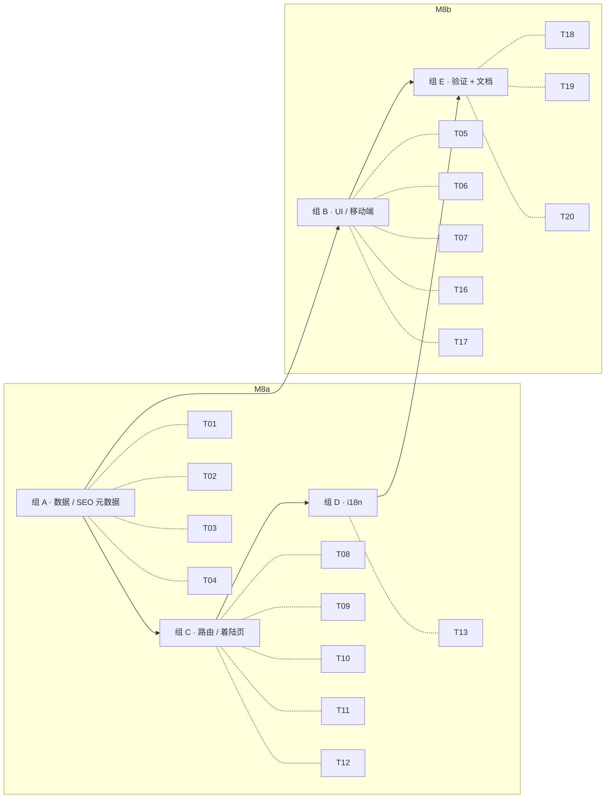

# M8 · SEO + 移动端 + 打磨 · 原子任务清单

> 目标：把 Pixfit 从「能用」推进到「能上线」。补齐三张 SEO 着陆页（`/sizes` / `/paper` / `/templates`）+ 隐私 / 服务条款实际路由 + sitemap / robots / metadata + JSON-LD；让 `/studio` 在 ≤ 768px 完整可用；把 tab 状态写到 URL；微信浏览器适配；不漏掉 404 / 错误页。详情页 (`/sizes/[id]` 等) 与历史会话 / 撤销重做留到 V1.1。

依赖：[`PRD.md §5.11 / §6.1 / §6.3`](../PRD.md) · [`TECH_DESIGN.md §5.9 / §7 / §10`](../TECH_DESIGN.md) · [`DESIGN.md §5.4 / §9`](../DESIGN.md)

预估工时：1.5 周（拆为 M8a SEO + 路由、M8b 移动 + 打磨两轮 commit）。

---

## 1. 任务依赖图

> 切分原因：M8a 全部是 SSG/SEO 与静态着陆页（不动 Studio），M8b 全部围绕 `StudioWorkspace` 重构 + 打磨。两轮独立可 review、commit message 也更聚焦。

---

## 2. 任务清单

### 组 A · 数据 / SEO 元数据（T01-T04，M8a）

#### M8-T01 · `lib/seo/site-config.ts` + canonical / OG helper

- **位置**：`src/lib/seo/site-config.ts`、`src/lib/seo/metadata.ts`、`src/lib/seo/metadata.test.ts`
- **DoD**：
  - `SITE_URL = process.env.NEXT_PUBLIC_SITE_URL ?? 'https://pix-fit.com'`；本地构建保留 `http://localhost:3000` 兜底
  - `buildAlternateLanguages(path)` 生成 `{ 'zh-Hans', 'zh-Hant', 'en', 'x-default' }` map
  - `buildCanonical(path, locale)` 返回绝对 URL
  - `buildMetadata({ locale, path, title, description, image? })` 返回 Next `Metadata`：含 `title.absolute / description / openGraph / twitter / alternates`
  - `buildOgImageUrl(slug?)` 暂时落到 `/og/default.png`（图后续 user-pending）
  - 单测 ≥ 6：URL 拼装边界（`/` / `/studio` / 带 trailing slash）、三 locale 都进 `alternates.languages`、`x-default = zh-Hans`、OG 字段齐全

#### M8-T02 · `app/sitemap.ts` + `app/robots.ts`

- **位置**：`src/app/sitemap.ts`、`src/app/robots.ts`
- **DoD**：
  - `sitemap()` 返回 `MetadataRoute.Sitemap`，覆盖 `/`、`/studio`、`/specs`、`/sizes`、`/paper`、`/templates`、`/privacy`、`/terms`，每条 ×3 locale；`lastModified = new Date()`；`changeFrequency = 'monthly'`
  - 每条带 `alternates.languages`（next-intl 不自动写，得手工）
  - `robots()`：`User-agent: *` allow `/`、disallow `/dev/`；`sitemap: ${SITE_URL}/sitemap.xml`
  - `pnpm build` 后 `.next/server/app/sitemap.xml.body` 存在且含 24 条以上 URL
  - 测试：单独抽取 `buildSitemapEntries()` 纯函数并 ≥ 3 单测

#### M8-T03 · JSON-LD 组件 + 默认 WebApplication

- **位置**：`src/components/jsonld.tsx`、`src/lib/seo/jsonld.ts`、`jsonld.test.ts`
- **DoD**：
  - `<JsonLd data={...} />` 渲染为 `<script type="application/ld+json">`，escape `<`
  - `webApplicationSchema(locale)` 返回 schema.org `WebApplication`（name / url / applicationCategory / inLanguage / offers.price = 0）
  - `itemListSchema({ url, name, items })` 返回 `ItemList`（M8a 给 `/sizes`、`/paper`、`/templates` 用）
  - 注入位置：首页 layout 注入 WebApplication；`/sizes` `/paper` `/templates` 注入 ItemList
  - 单测 ≥ 3：纯函数返回值快照 + escape 行为

#### M8-T04 · 详情页延后决策同步到 PLAN §6

- **位置**：`docs/PLAN.md §6`、`docs/TODO.md §9`
- **DoD**：明确写入「`/sizes/[id]` `/paper/[id]` `/templates/[id]` 详情页延后至 V1.1，理由：M8 时间盒内列表页 + JSON-LD ItemList 已能让爬虫覆盖全部 spec id，详情页价值密度低且 28 + 7 + 12 = 47 页 i18n 三语 = 141 张文案不可控；先观察自然流量再决定」
- 其余延后项：撤销重做（zundo）、历史会话（IndexedDB）—— 同样写入决策日志

### 组 B · UI / 移动端（T05-T07, T16-T17，M8b）

#### M8-T05 · `studio-tabs` 顶部 → 底部 nav（≤ 768px）

- **位置**：`src/features/studio/studio-tabs.tsx`、`src/features/studio/studio-workspace.tsx`
- **DoD**：
  - ≤ 768px 时 `StudioTabs` 不渲染顶部 segmented control，改为 fixed bottom tab bar（高 60px，4 icons + 文案；图标走 lucide：`Palette / Crop / LayoutGrid / Download`）
  - `safe-area-inset-bottom` 兜底（iOS）
  - 主画布在 mobile 下铺满宽度；右侧面板的 spec-picker / background-panel / layout-panel 改用 Sheet（`@radix-ui/react-dialog` 走 bottom sheet 模式）
  - 桌面端布局完全不变；用 `lg:hidden` / `lg:flex` 分流
  - 单测：smoke 渲染（mobile vs desktop layout 切换无报错）
  - 真机标准：iPhone 13 Safari 模拟器宽度 390px 下 4 tab 全可点

#### M8-T06 · `CropFrame` 触摸把手 ≥ 44×44

- **位置**：`src/features/crop/crop-frame.tsx`
- **DoD**：
  - 4 角把手 `touch-action: none`、padding 增大到 44×44 命中区（视觉小但触摸区大；CSS `::after` 透明扩展）
  - `pointerdown / pointermove / pointerup` 已经有；仅扩 hit-area 并加 `touch-action`
  - mobile UA / `(pointer: coarse)` media query 下把手视觉直径 +4px
  - 既有 pointer 测试若有需求继续过；新增 1 个把手命中区 sanity 测试

#### M8-T07 · `/studio?tab=...` deeplink

- **位置**：`src/features/studio/studio-tab-store.ts`、`src/features/studio/studio-workspace.tsx`、`src/features/studio/tab-deeplink.ts`
- **DoD**：
  - 新增 `useTabDeeplink()` hook：挂载时读 `searchParams.tab`，合法值（`background | size | layout | export`）则同步到 store；用户切 tab 时 `router.replace` 更新 URL（避免推历史栈）
  - SSR 阶段不写 URL，仅 client hydration 完成后启用
  - 单测：纯函数 `parseTabParam` ≥ 4：合法 / 非法 / 空 / 大小写
  - 真机：`/zh-Hans/studio?tab=size` 进来直接落到尺寸 tab；切换到 export tab 后 URL 变 `?tab=export`

#### M8-T16 · ExportPanel 微信浏览器长按提示

- **位置**：`src/features/background/export-panel.tsx`、`src/lib/ua.ts`、`src/lib/ua.test.ts`
- **DoD**：
  - `isWeChatBrowser(ua: string)`：匹配 `/MicroMessenger/i`，4 单测
  - hook `useIsWeChat()`（client only，挂载后用 `navigator.userAgent`）
  - WeChat / iOS 触摸设备下 ExportPanel 底部出现 hint：「在微信内长按图片可保存到相册」（三语完整）
  - 不影响桌面端

#### M8-T17 · 友好 404 / error 页面

- **位置**：`src/app/[locale]/not-found.tsx`、`src/app/[locale]/error.tsx`、`src/app/not-found.tsx`（顶级兜底）
- **DoD**：
  - `[locale]/not-found.tsx`：三语，含 Logo + 简短文案 + CTA "回工作台" / "回首页"
  - `[locale]/error.tsx`（client component）：捕获 React 渲染错误，显示 reset 按钮 + 错误码（dev mode 显示堆栈，prod 不显示）
  - 顶级 `app/not-found.tsx`：locale 解析失败时兜底（重定向到 `/zh-Hans`）
  - 所有 metadata `noindex` for 404 / error
  - 单测：组件 smoke render
  - 真机：`curl http://localhost:3000/en/no-such-page` → 200 + 404 文案；`/no-such-page` → 重定向到 `/zh-Hans`（next-intl 默认）

### 组 C · 路由 / 着陆页（T08-T12，M8a）

#### M8-T08 · `/sizes` SEO 列表页

- **位置**：`src/app/[locale]/sizes/page.tsx`、`src/features/seo/spec-list-page.tsx`、`src/features/seo/spec-list-page.test.tsx`
- **DoD**：
  - 三语 SSG，`generateMetadata` 含 title / description / canonical / alternates / OG
  - 注入 `itemListSchema`（28 条 PhotoSpec，按 category 分组）
  - 列出 BUILTIN_PHOTO_SPECS 全部，按 category 分卡片；每条行：国旗 + 名称 + 物理尺寸 + 像素 + DPI + 「在工作台使用 →」CTA → `/studio?tab=size&spec=<id>` deeplink
  - 主体走 server component；CTA 用 `next-intl/navigation` `<Link>`
  - 三语完整覆盖；不读 localStorage（不渲染自定义规格）
  - 单测 ≥ 2：按 category 分组的纯函数 + 渲染 smoke

#### M8-T09 · `/paper` SEO 列表页

- **位置**：`src/app/[locale]/paper/page.tsx`
- **DoD**：同 T08，但展示 BUILTIN_PAPER_SPECS 7 条；CTA → `/studio?tab=layout`；含 alias / 物理 / 像素 / DPI
- 注入 ItemList JSON-LD

#### M8-T10 · `/templates` SEO 列表页

- **位置**：`src/app/[locale]/templates/page.tsx`
- **DoD**：同 T08，但展示 BUILTIN_LAYOUT_TEMPLATES 12 条；按 paperId 分组（5R / 6R / A4）；每条显示 items + count + CTA → `/studio?tab=layout&template=<id>`（template deeplink 同 T07 hook 同样消费）
- 注入 ItemList JSON-LD

#### M8-T11 · `/privacy` 三语隐私政策

- **位置**：`src/app/[locale]/privacy/page.tsx`、`src/features/legal/privacy-content.tsx`
- **DoD**：
  - 三语 SSG（必须人工写三份）；内容点：数据流向（照片不离设备）/ localStorage 用途 / 不收集 PII / 不用 cookie 追踪 / Cloudflare Web Analytics（计划接入，无 cookie）/ 第三方资源（模型、字体）通过自家 CDN / 用户权利 / 联系方式占位
  - 标记最后更新日期（2026-05-12）
  - `noindex` 不需要；走 SEO 友好的 article 结构
  - 单测：smoke render

#### M8-T12 · `/terms` 三语服务条款

- **位置**：`src/app/[locale]/terms/page.tsx`、`src/features/legal/terms-content.tsx`
- **DoD**：
  - 三语 SSG；内容点：免费无登录 / 用户对上传内容合法性负责 / 不得上传他人照片 / 软件按现状提供 / 责任限制 / 知识产权 / 服务变更与终止 / 适用法律
  - 标记最后更新日期
  - 单测：smoke render

### 组 D · i18n（T13，M8a）

#### M8-T13 · 新增三语 namespace

- **位置**：`src/i18n/messages/{zh-Hans, zh-Hant, en}.json`
- **DoD**：新增以下 namespace（三语完全对齐，简繁人工双写）：
  - `Sizes.*`（页面标题、副标题、空状态、CTA、按 category 的描述文案）
  - `Paper.*`（扩展原有 namespace；新增 list page 标题副标题 + alias / dimensions 标签）
  - `Templates.*`（页面标题副标题 + paperGroup 标签 + CTA）
  - `Legal.privacy.*`（h1 / sections / lastUpdated 等；约 12 段）
  - `Legal.terms.*`（同 privacy；约 10 段）
  - `Studio.mobile.*`（底部 tab a11y label / 抽屉打开关闭 / 微信长按提示）
  - `Errors.notFound.*` / `Errors.runtime.*`
  - `Nav.privacy` / `Nav.terms`（顶栏不放，仅供 SiteFooter / 链接用）
  - `pnpm i18n:check` 三语 key 完全对齐

### 组 E · 验证 + 文档（T14-T20）

#### M8-T14 · Footer + Header polish（M8a）

- **位置**：`src/components/site-footer.tsx`、`src/components/site-header.tsx`
- **DoD**：
  - Footer：增加 "Pages" 列（按 group）：Product（Studio / Specs）· Browse（Sizes / Paper / Templates）· Legal（Privacy / Terms）· About（GitHub）
  - mobile 下 Footer 由 row → column；间距收紧
  - Header：保持现有 `/sizes` `/paper` `/templates` `/studio` 4 链接；mobile 下隐藏 nav（已经隐藏），加移动汉堡按钮（暂用 Sheet 抽屉列出 4 链接 + 语言切换）
  - GitHub 链接保留；OpenStudio CTA 在 mobile 下变 icon-only（`Wand2`）
  - 不破坏现有桌面 layout

#### M8-T15 · README "Pages" 段（M8a）

- **位置**：`README.md`
- **DoD**：新增 "## Pages" 段落，列出所有正式路由（不含 `/dev/*`），三语前缀说明，加 sitemap.xml 链接

#### M8-T18 · Lighthouse / 性能基线回填（M8b）

- **位置**：`docs/PLAN.md §6.8`（新节）
- **DoD**：
  - 在 PLAN 新增 §6.8 Lighthouse 跑分；记录 headless 跑分（chrome-headless-shell 或 `pnpm dlx lighthouse` 都可，AI 这里跑的话用最简的：`pnpm dlx lighthouse http://localhost:3000/en --preset=desktop --output=json --quiet --chrome-flags="--headless --no-sandbox"`，如果环境没装 chrome 就跳过并标 [user-pending]）
  - 至少回填首屏 JS bundle / 路由数 / 静态页数（从 `pnpm build` 输出读取）
  - 真机跑分 [user-pending]

#### M8-T19 · 移动端 a11y / 触摸 / 字体打磨（M8b）

- **位置**：`src/features/crop/crop-frame.tsx`、`src/features/background/background-panel.tsx`、`src/features/background/export-panel.tsx`
- **DoD**：
  - 所有按钮 `aria-label` 在 icon-only 模式下必填
  - `touch-action: manipulation` 加到主交互按钮（避免双击放大）
  - `:focus-visible` 在所有 form 控件上明显（emerald `shadow-glow`）
  - 字体 `next/font` 已 swap，验证 globals.css 没有 `font-display: block`
  - 单测：组件 smoke 不报错

#### M8-T20 · 最终验证 + 文档（M8b）

- **DoD**：
  - `pnpm lint / typecheck / test / i18n:check / build`（含 `NEXT_PUBLIC_ENABLE_DEV_PAGES=1`）全绿
  - `pnpm dev` 起来后 curl smoke 三 locale × 7 路由（`/`、`/studio`、`/specs`、`/sizes`、`/paper`、`/templates`、`/privacy`、`/terms`）全 200
  - `/sitemap.xml`、`/robots.txt` 各 200，sitemap 含 24+ 条 URL
  - PLAN §1 / §3.1 / §3.2 M8 / §6 决策日志（≥ 5 条新决策）/ §10 变更记录（0.8 行）全部 patch 完
  - TODO.md §9 / §1.2 同步勾选 / 移动
  - `docs/tasks/M8.md` 全勾

---

## 3. 任务状态

| ID  | 任务                                | 状态 | 完成日期   | 备注                                            |
| --- | ----------------------------------- | ---- | ---------- | ----------------------------------------------- |
| T01 | seo/site-config + metadata helper   | [x]  | 2026-05-12 | 5 单测；canonical / alternates / OG / Twitter   |
| T02 | sitemap.ts + robots.ts              | [x]  | 2026-05-12 | 24 条 URL × 3 locale；hreflang alternates 齐全  |
| T03 | JsonLd 组件 + WebApplication schema | [x]  | 2026-05-12 | 首页 WebApp + 三列表页 ItemList + Breadcrumb    |
| T04 | 详情页延后决策入 PLAN §6            | [x]  | 2026-05-12 | 决策日志 +9 条                                  |
| T05 | StudioTabs mobile bottom nav        | [x]  | 2026-05-12 | StudioBottomTabs + Sheet drawer 承载面板        |
| T06 | CropFrame 触摸把手扩 44             | [x]  | 2026-05-12 | size-11 hit area + ::before 视觉点 + +4px       |
| T07 | /studio?tab=... deeplink            | [x]  | 2026-05-12 | parseTabParam（4 单测）+ useTabDeeplink hook    |
| T08 | /sizes 列表页                       | [x]  | 2026-05-12 | 28 条 PhotoSpec / category 分组 / 国旗 / DPI    |
| T09 | /paper 列表页                       | [x]  | 2026-05-12 | 7 条 PaperSpec / alias / 像素                   |
| T10 | /templates 列表页                   | [x]  | 2026-05-12 | 12 条 LayoutTemplate / paperId 分组             |
| T11 | /privacy 三语                       | [x]  | 2026-05-12 | 9 sections × 三语                               |
| T12 | /terms 三语                         | [x]  | 2026-05-12 | 10 sections × 三语                              |
| T13 | 三语 namespace 新增                 | [x]  | 2026-05-12 | 345 keys 全语 parity                            |
| T14 | Footer + Header polish              | [x]  | 2026-05-12 | Footer 4 栏 + Sheet 汉堡 + icon CTA             |
| T15 | README Pages 段                     | [x]  | 2026-05-12 | 路由地图表 + dev 路由说明                       |
| T16 | ExportPanel 微信长按提示            | [x]  | 2026-05-12 | isWeChatBrowser + useIsWeChat（4 单测）         |
| T17 | not-found / error 页                | [x]  | 2026-05-12 | [locale]/{not-found,error} + 顶级 app/not-found |
| T18 | Lighthouse 基线 PLAN §6.8           | [x]  | 2026-05-12 | 构建包基线已回填；真机 [user-pending]           |
| T19 | a11y / 触摸打磨                     | [x]  | 2026-05-12 | touch-action: manipulation / none 全覆盖        |
| T20 | 最终验证 + 文档                     | [x]  | 2026-05-12 | lint / typecheck / 325 测 / i18n / build 全绿   |

合计：**20 个原子任务**（M8a 13 个、M8b 7 个）。两轮 commit：

- **M8a · feat(seo)**：T01 / T02 / T03 / T04 / T08 / T09 / T10 / T11 / T12 / T13 / T14 / T15 + 中间验证
- **M8b · feat(studio)**：T05 / T06 / T07 / T16 / T17 / T18 / T19 / T20

---

## 4. 关键决策（同步至 PLAN §6）

1. **`/sizes/[id]` `/paper/[id]` `/templates/[id]` 详情页延后到 V1.1**：M8 时间盒里列表页 + JSON-LD ItemList 已能让爬虫抓 47 条 spec id；详情页价值密度低且 141 张文案不可控，等真自然流量再决定。
2. **`x-default` hreflang 用 `zh-Hans`**：与 `routing.defaultLocale = 'zh-Hans'` 对齐；项目首批主流量国内。
3. **`/studio?tab=` deeplink 用 `router.replace`**：不推浏览器历史栈，否则用户在 tab 间切几次就再也回不到落地页。
4. **Mobile 把右侧面板装进 Radix Dialog bottom sheet**：单源 transition + a11y 自带；不再自研抽屉。
5. **微信浏览器 hint 只在 ExportPanel 显示**：用户分享 Studio 链接给朋友最常见的反馈是「保存不下来」；其他面板加 hint 是 UI 噪音。
6. **404 / error 走三语 `[locale]/not-found.tsx`**：顶级 `app/not-found.tsx` 仅承担 locale 解析失败 fallback；不重复维护。
7. **Lighthouse 真机分数 [user-pending]**：M8 内不强制达到 90/95（headless WebGPU 与真机存在系统级差异，user 跑生产域名后再回填到 §6.8）。
8. **撤销 / 重做 + 历史会话延后到 V1.1**：M8 时间盒不动 Studio 数据流；引入 zundo 会牵动 background / crop / layout 三 store 的中间件改造。
9. **`/privacy`、`/terms` 用三语 SSG（不用通用 MDX 组件）**：法务文案三语差异度高，分页面写两份 component 比共享 MDX 模板省得维护更少 i18n 字段。

---

## 5. 完成后的动作

1. `docs/PLAN.md`：
   - §1 状态行加 M8 ✅
   - §3.1 总览 M8 状态 → ✅
   - §3.2 M8 deliverables 全勾
   - §6 决策日志：上述 9 条决策
   - §6.8 新增 Lighthouse 基线（M8-T18）
   - §10 changelog 加 0.8 行
2. `docs/TODO.md`：
   - §1.2 Lighthouse 跑分（真机）保持 [user-pending]
   - §9 把 `/sizes` / `/paper` / `/templates` 列表 / `/privacy` / `/terms` / `/studio?tab=` / 微信适配勾掉；撤销重做 / 历史会话 / `face-detect 性能基准` / 详情页一律移到「V1.1 池」分类。
3. `README.md` 新增 "Pages" 段落
4. `docs/tasks/M8.md` 全勾
5. commit：`feat(seo): M8a SEO + routes` 与 `feat(studio): M8b mobile polish`

---

## 6. [question] 标注（实施时按判断兜底）

- **OG image**：M8 时没有美术资源做 1200×630 OG image，落到默认占位 `/og/default.png`（不实际创建 PNG，仅在 metadata 写引用；CF 部署后用户补图）。
- **Cloudflare 部署 / GitHub Actions secrets / R2 实际接入**：均 [user-pending]，不在本里程碑触发。
- **历史会话 IndexedDB**：PRD §5.9 写「页面关闭即清空」，所以「持久化的撤销 / 重做」属于 V1.1 需求。本里程碑明确不做。
